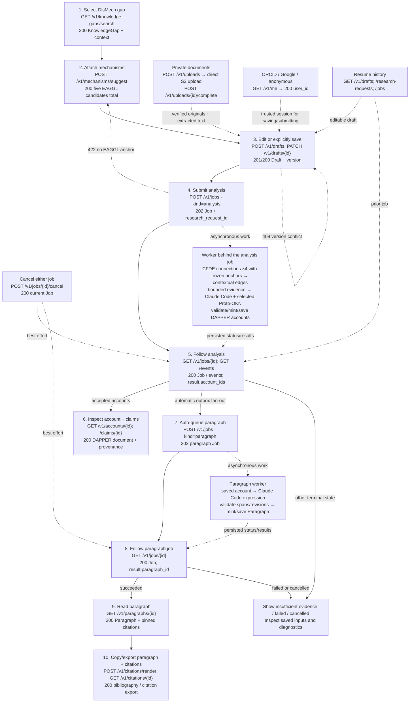

# User interaction and endpoint flow

Open [the interactive diagram](flow.html) to select any step and inspect its exact request/response or error examples. The diagram is documentation, not a running research interface.

The ten numbered steps are the main path. Login, saved history, cancellation and recovery are supporting paths. Backend worker calls appear separately from the public REST contract.

## Complete endpoint and exchange mapping

### 1. Find a DisMech knowledge gap

Type to search; select an exact source question on the same page.

**Request:** q, fuzzy mode by default, source=dismech and filters.

**Response:** GapSearchResults / GapRecord with exact source detail and scoped account count; AccountList with original author attribution.

- `GET /v1/knowledge-gaps/search` — [request request/response](examples/searchKnowledgeGaps.request.json)
- `GET /v1/knowledge-gaps` — [request request/response](examples/listKnowledgeGaps.request.json)
- `GET /v1/knowledge-gaps/{gap_id}` — [request request/response](examples/getKnowledgeGap.request.json)
- `GET /v1/knowledge-gaps/{gap_id}/accounts` — [request request/response](examples/listKnowledgeGapAccounts.request.json)

- Search text is not a new inquiry. Trending entries disappear while typing.
- Trending defaults to explicitly published account counts across users. Workspace scope counts the authenticated owner accounts. Count ties shuffle per new browse with a signed cursor seed preserving that order across pages.
- The selected gap lists authorized scientific accounts with pagination; original author attribution does not change when ownership transfers.
- Question input and scope selector remain fixed while the paginated gap list scrolls; source order is preserved without editorial selection.

### 2. Choose mechanism anchors

Review up to five mapped EAGGL mechanism chips; edit anchors, not linked DisMech context.

**Request:** SelectedGap, manual factors, dismissals and optional mechanism subquery.

**Response:** Suggestions and Mechanism records with DAPPER Mechanism, native CFDE ID and catalog File.

- `POST /v1/mechanisms/suggest` — [dismech context request/response](examples/suggestMechanisms.dismech_context.json)
- `GET /v1/mechanisms/search` — [request request/response](examples/searchMechanisms.request.json)
- `GET /v1/mechanisms/{source_id}` — [request request/response](examples/getMechanism.request.json)

- Search existing EAGGL label embeddings; join the populated exact-trait/factor-number CFDE crosswalk before selecting five. Ignore label/gene differences.
- Five total, maximum cosine across linked mechanisms, deterministic native-ID deduplication; fewer if needed. At least one resolved cfde-inc-v2 anchor is required.
- Existing ranked GeneSet links resolve through aliases to DAPPER objects. Missing summary links do not disable a mapped factor.

### 3. Edit or explicitly save a named draft

Open a temporary gap editor; hold edits locally until explicit Save or submission.

**Request:** Trusted session, Composer including private researcher text and ready upload IDs, expected_version and Idempotency-Key.

**Response:** Owned temporary or saved Draft with confirmed revision and lifecycle.

- `POST /v1/drafts` — [question and anchor request/response](examples/createDraft.question_and_anchor.json)
- `PATCH /v1/drafts/{draft_id}` — [save revision two request/response](examples/updateDraft.save_revision_two.json)
- `GET /v1/drafts/{draft_id}` — [request request/response](examples/getDraft.request.json)
- `DELETE /v1/drafts/{draft_id}` — [delete saved draft request/response](examples/deleteDraft.delete_saved_draft.json)

- Temporary editors expire after 24 hours and do not appear in Saved Drafts. Legacy drafts remain saved.
- Save supplies a name and promotes the editor. Researcher direction, context and hypotheses remain distinct from the canonical DisMech question.
- Rename and delete use optimistic versions. Deleting editable state preserves frozen requests, active runs and results.

### 4. Submit the current gap analysis

Freeze the current editor snapshot and queue analysis; unsaved edits do not overwrite the saved draft.

**Request:** AnalysisJobInput: kind=analysis, draft ID/version, bounded budgets.

**Response:** 202 Job and immutable ResearchRequest.

- `POST /v1/jobs` — [analysis request/response](examples/createJob.analysis.json)

- Freeze source/mapping runs, native CFDE IDs, researcher text and exact original/extraction storage references.
- Later edits, upload removal or draft deletion do not change the submitted request.

**Worker processing behind the job:**

- Resolve frozen DisMech context; four same-seed CFDE connections plus contextual edges and BioIndex queries.
- Build, validate and freeze the evidence package with exact source artifacts and supplied documents for the agent and independent reviewer.
- Fresh verified DAPPER clone, Claude Code in Box, selected Proto-OKN tools.
- Trusted assembly, minting, final lint plus grounding/ledger/ownership checks.

### 5. Prepare evidence and observe research

Evidence preparation followed by public agent/tool activity; Stop stays available.

**Request:** Job ID and event cursor.

**Response:** JobEvent.detail with counts/call state/artifacts; EvidencePackageResult for inspection.

- `GET /v1/jobs/{job_id}` — [request request/response](examples/getJob.request.json)
- `GET /v1/jobs/{job_id}/events` — [request request/response](examples/getJobEvents.request.json)
- `GET /v1/jobs/{job_id}/events` — [sse request/response](examples/getJobEvents.sse.json)
- `GET /v1/jobs/{job_id}/evidence-package` — [request request/response](examples/getEvidencePackage.request.json)
- `POST /v1/jobs/{job_id}/retry-review` — [saved output request/response](examples/retryJobReview.saved_output.json)

- One active loading state; no private reasoning.
- Package is the schema-current captured input; account fixture is separately authored, not its accepted agent output.
- Completed activity compresses into Gap analysis complete.
- Budget failures expose phase, cap and recorded spend. Incomplete independent review can be retried against verified saved output, without launching the research agent.

### 6. Read the scientific account

Read closing remarks; open associated claims on demand.

**Request:** Exact account/claim/GeneSet/object ID and optional payload/traversal bounds.

**Response:** DAPPER document, payload checksums, coverage, artifacts and research_statement state.

- `GET /v1/accounts/{dapper_id}` — [request request/response](examples/getAccount.request.json)
- `GET /v1/claims/{dapper_id}` — [request request/response](examples/getClaim.request.json)
- `GET /v1/gene-sets/{dapper_id}` — [request request/response](examples/getGeneSet.request.json)
- `GET /v1/objects/{dapper_id}` — [request request/response](examples/resolveDapperObject.request.json)
- `GET /v1/artifacts/{sha256}` — [request request/response](examples/downloadArtifact.request.json)
- `GET /v1/accounts/{dapper_id}/publication` — [request request/response](examples/getAccountPublication.request.json)
- `POST /v1/accounts/{dapper_id}/publication` — [publish request/response](examples/updateAccountPublication.publish.json)
- `POST /v1/accounts/{dapper_id}/publication` — [unpublish request/response](examples/updateAccountPublication.unpublish.json)

- Conclusions and Research statement are divider tabs.
- Claims open inline; no auto-opened first claim. Dedicated claim page has Assessment, Proposition, Evidence and Provenance tabs.
- Partial provenance and unavailable downloads remain explicit.
- Accounts remain private until the owner publishes a frozen snapshot with an optimistic version and idempotency key. Later accepted statements require an explicit publication update; unpublishing revokes public access. Public readers cannot access job telemetry or research writes.

### 7. Generate the cited statement automatically

Each accepted account independently queues a paragraph; explicit endpoint supports retry/alternate focus.

**Request:** Saved account payload, citation revisions, settings and skill version.

**Response:** Paragraph Job; account remains usable independently.

- `POST /v1/jobs` — [paragraph request/response](examples/createJob.paragraph.json)

- Unique outbox key prevents duplicate automatic work.
- No fresh KG research or invented claims.

**Worker processing behind the job:**

- Author segments using saved claims/gap.
- Backend assembles citation occurrences and validates exact registry revisions/code-point spans.
- Persist Paragraph and expression provenance.

### 8. Follow paragraph generation

Show pending/failed/ready research statement without blocking conclusions.

**Request:** Separate paragraph job ID.

**Response:** ParagraphResult with account and Paragraph IDs.

- `GET /v1/jobs/{job_id}` — [paragraph request/response](examples/getJob.paragraph.json)

- Shared events/cancel apply to both job kinds.
- Paragraph failure does not change analysis success.

### 9. Read the research statement

Render Paragraph text, markers and complete references.

**Request:** Exact Paragraph ID and payload observation.

**Response:** ParagraphObjectResult and pinned citation metadata.

- `GET /v1/paragraphs/{dapper_id}` — [request request/response](examples/getParagraph.request.json)

- Offsets are Unicode code points, not UTF-16 indices.
- Do not substitute latest registry revision when a pin is missing.

### 10. Copy or download

Copy hyperlinked rich text for Word, or download Markdown, LaTeX and BibTeX.

**Request:** Paragraph ID/format; citation target ID/revision/style/locale.

**Response:** ParagraphExport or CitationRendering and native citation formats.

- `POST /v1/citations/render` — [apa request/response](examples/renderCitations.apa.json)
- `GET /v1/citations/{dapper_id}` — [request request/response](examples/getCitation.request.json)
- `GET /v1/citations/{dapper_id}` — [bibtex request/response](examples/getCitation.bibtex.json)
- `GET /v1/citations/{dapper_id}` — [biblatex request/response](examples/getCitation.biblatex.json)
- `GET /v1/citations/{dapper_id}` — [csl-json request/response](examples/getCitation.csl-json.json)
- `GET /v1/citations/{dapper_id}` — [apa request/response](examples/getCitation.apa.json)
- `GET /v1/citations/{dapper_id}` — [mla request/response](examples/getCitation.mla.json)
- `GET /v1/paragraphs/{dapper_id}/export` — [request request/response](examples/exportParagraph.request.json)
- `GET /v1/paragraphs/{dapper_id}/export` — [latex request/response](examples/exportParagraph.latex.json)
- `GET /v1/paragraphs/{dapper_id}/export` — [bibtex request/response](examples/exportParagraph.bibtex.json)
- `GET /v1/paragraphs/{dapper_id}/export` — [rich-text request/response](examples/exportParagraph.rich-text.json)

- LaTeX includes cite commands; remind users to download references.bib.
- Exports share exact Paragraph and registry pins. Rendering does not launch an agent.

### 11. Read and share an explored analysis

Preserve a scoped insufficient-evidence investigation and explicitly publish its record when useful.

**Request:** An owned job outcome, or an authorized private/public outcome ID.

**Response:** AnalysisOutcome and compact exact-gap outcome summaries; explicit publication state.

- `GET /v1/analysis-outcomes/{outcome_id}` — [request request/response](examples/getAnalysisOutcome.request.json)
- `GET /v1/jobs/{job_id}/outcome` — [request request/response](examples/getJobAnalysisOutcome.request.json)
- `GET /v1/knowledge-gaps/{gap_id}/outcomes` — [request request/response](examples/listKnowledgeGapOutcomes.request.json)
- `GET /v1/analysis-outcomes/{outcome_id}/publication` — [request request/response](examples/getOutcomePublication.request.json)
- `POST /v1/analysis-outcomes/{outcome_id}/publication` — [publish request/response](examples/updateOutcomePublication.publish.json)
- `POST /v1/analysis-outcomes/{outcome_id}/publication` — [unpublish request/response](examples/updateOutcomePublication.unpublish.json)

- A scoped exploration is not a ScientificAccount and never increases scientific-account popularity counts.
- Captured reasons remain attributed to the original investigation; unavailable sources do not establish global absence.
- Publication is explicit and revocable. Job logs, private requests and the complete private evidence package remain private.

### Registered or anonymous ownership

Gateway establishes trusted session and resolves a stable application UUID.

**Request:** Registered or anonymous gateway assertion.

**Response:** Me with principal_kind and optional workspace expiry.

- `GET /v1/me` — [request request/response](examples/getMe.request.json)

- Browser OAuth/bootstrap and service provisioning are separately specified in docs/gateway-contract.md.
- No bearer is not anonymous write permission.

### Your gaps, scientific accounts and explorations

Avatar opens a personal dashboard with knowledge gaps, scientific accounts and completed explorations.

**Request:** Trusted owner session, exact gap filters and pagination.

**Response:** Exploration/account summaries; saved drafts and immutable request/job history.

- `GET /v1/me/explorations` — [request request/response](examples/listExplorations.request.json)
- `POST /v1/me/explorations` — [selected gap request/response](examples/recordExploration.selected_gap.json)
- `GET /v1/accounts` — [request request/response](examples/listAccounts.request.json)
- `GET /v1/analysis-outcomes` — [request request/response](examples/listAnalysisOutcomes.request.json)
- `GET /v1/drafts` — [request request/response](examples/listDrafts.request.json)
- `GET /v1/research-requests` — [request request/response](examples/listResearchRequests.request.json)
- `GET /v1/research-requests/{request_id}` — [request request/response](examples/getResearchRequest.request.json)
- `GET /v1/jobs` — [request request/response](examples/listJobs.request.json)

- Before-session visits remain local; record after trusted bootstrap.
- Anonymous recovery requires session possession. Verified sign-in preserves durable access and original authorship.

### Stop or recover

Request cancellation or recover from stale save/event cursor.

**Request:** Owned job ID or current cursor/version.

**Response:** Authoritative Job or typed Problem.

- `POST /v1/jobs/{job_id}/cancel` — [request request/response](examples/cancelJob.request.json)

- Stopping is not stopped; committed results win cancellation races.
- Browser disconnect does not cancel. Resume with monotonic event IDs.

### Live workspace changes

Subscribe once per workspace provider and apply committed invalidations.

**Request:** Trusted owner session and optional signed reconnect cursor.

**Response:** WorkspaceEvent SSE messages and explicit ready/resync/access controls.

- `GET /v1/me/workspace/events` — [request request/response](examples/subscribeWorkspaceEvents.request.json)

- Redis Pub/Sub wakes authorized RDS replay after commit; there are no periodic workspace list refreshes.
- Reconnect with the signed cursor. Reload authorized collections only when an explicit resync is required.

### Vote on a gap or public scientific account

Read public totals and let a signed-in user upvote, downvote or clear their own choice.

**Request:** A canonical gap or currently public account ID; registered session and Idempotency-Key for writes.

**Response:** VoteState with upvotes, downvotes, net score and the current registered viewer’s vote.

- `GET /v1/knowledge-gaps/{gap_id}/vote` — [request request/response](examples/getGapVote.request.json)
- `POST /v1/knowledge-gaps/{gap_id}/vote` — [upvote request/response](examples/setGapVote.upvote.json)
- `POST /v1/knowledge-gaps/{gap_id}/vote` — [downvote request/response](examples/setGapVote.downvote.json)
- `POST /v1/knowledge-gaps/{gap_id}/vote` — [clear request/response](examples/setGapVote.clear.json)
- `GET /v1/accounts/{account_id}/vote` — [request request/response](examples/getAccountVote.request.json)
- `POST /v1/accounts/{account_id}/vote` — [upvote request/response](examples/setAccountVote.upvote.json)
- `POST /v1/accounts/{account_id}/vote` — [downvote request/response](examples/setAccountVote.downvote.json)
- `POST /v1/accounts/{account_id}/vote` — [clear request/response](examples/setAccountVote.clear.json)

- Each registered user has one mutable choice per canonical target. Anonymous readers see totals only.
- Private account votes are unavailable; independently published copies share the same canonical account totals.
- Gap browsing can rank by net votes; committed changes invalidate catalog views through existing events.

### Inspect public community contributions

Rank the complete public population and inspect the exact records behind each measure.

**Request:** Researcher, account or dataset view; view-specific ranking; all or supporting evidence; signed continuation cursor.

**Response:** Shared ranks, raw measures, score components, public eligibility counts, methodology and paginated public records.

- `GET /v1/leaderboard` — [request request/response](examples/getLeaderboard.request.json)
- `GET /v1/leaderboard/{view}/{entry_id}/records` — [request request/response](examples/getLeaderboardRecords.request.json)

- Only active frozen publications count. Private work and demo/test fixtures contribute nothing.
- Original registered attribution earns researcher credit; conflicting attribution remains uncredited. Researcher recognition excludes own ballots.
- Explicit evidence paths establish dataset use. Supporting concerns the claim proposition, not scientific endorsement.
- Publication and vote changes expire cursors. Responses are never cached.

### Attach private research documents

Upload exact bytes directly to a short-lived S3 staging destination, then verify and retain original plus extracted text.

**Request:** Owned draft, filename, media type, byte size, SHA-256 and initiation idempotency key.

**Response:** Owner-scoped upload metadata and transfer ticket; completion returns pinned original/extraction storage references.

- `POST /v1/uploads` — [example request/response](examples/createUpload.example.json)
- `GET /v1/uploads` — [request request/response](examples/listUploads.request.json)
- `GET /v1/uploads/{upload_id}` — [request request/response](examples/getUpload.request.json)
- `DELETE /v1/uploads/{upload_id}` — [request request/response](examples/removeUpload.request.json)
- `POST /v1/uploads/{upload_id}/complete` — [request request/response](examples/completeUpload.request.json)
- `POST /v1/uploads/{upload_id}/content` — [example request/response](examples/uploadLocalContent.example.json)
- `GET /v1/uploads/{upload_id}/download` — [request request/response](examples/downloadUpload.request.json)

- Retry initiation refreshes transfer credentials and returns current metadata. Ready files can be reused by same-owner editor clones.
- Select up to five files, 8 MB per file, 16 MB total and 1 MB extracted JSON. Replacement staging has a separate bounded allowance.
- Saved/frozen references prevent removal. Temporary metadata expires; shared immutable blobs are retained.
- User hypotheses are unverified context. Supplied evidence requires exact source locators and retains the existing CFDE requirements.
- Results based on private researcher inputs cannot be published until a deliberate disclosure workflow exists.

## Evidence and validation

Requests/responses are taken from the existing validated OpenAPI exchange library. The CADinT2D analysis/paragraph sequence is internally linked. The CAD source-selected gap now frames the request and account. The evidence package is a separate captured input; the authored account is not its validated agent output. Semantic scores and agent outputs remain illustrative fixtures.

The mapping covers 56 operations and all 73 exchanges. OpenAPI SHA-256: `a203980ac0105f1bc8c3e9e3032fdc4d226979f3a2a00808e6f111adaf80e88a`. No endpoints or payloads were changed to build this diagram.
