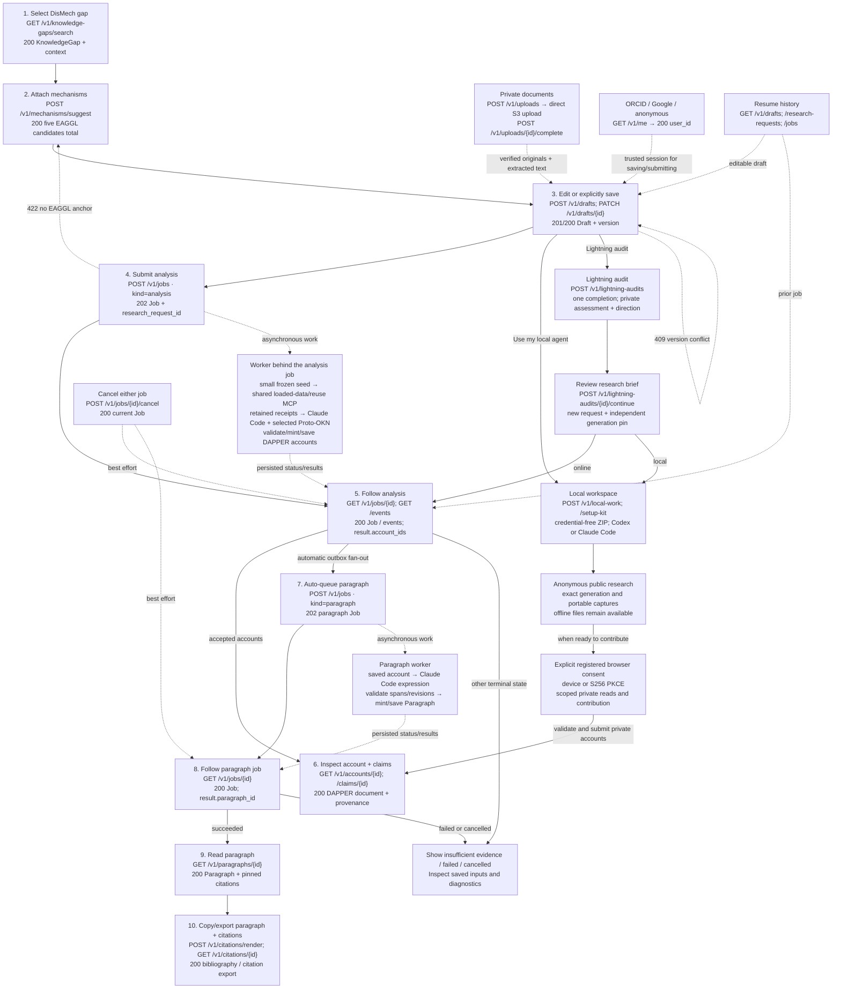

# User interaction and endpoint flow

Open [the interactive diagram](flow.html) to select any step and inspect its exact request/response or error examples. The diagram is documentation, not a running research interface.

The numbered steps describe online research. Local workspaces, public captures, OAuth, history and recovery are supporting paths. Backend worker calls appear separately from the public REST contract.

## Complete endpoint and exchange mapping

### 1. Find a DisMech knowledge gap

Type to search; select an exact source question on the same page.

**Request:** q, fuzzy mode by default, source=dismech and filters.

**Response:** GapSearchResults / GapRecord with exact source detail and scoped account count; AccountList with original author attribution.

- `GET /v1/knowledge-gaps/search` — [request request/response](examples/searchKnowledgeGaps.request.json)
- `GET /v1/knowledge-gaps` — [request request/response](examples/listKnowledgeGaps.request.json)
- `GET /v1/knowledge-gaps/{gap_id}` — [request request/response](examples/getKnowledgeGap.request.json)
- `GET /v1/knowledge-gaps/{gap_id}/accounts` — [request request/response](examples/listKnowledgeGapAccounts.request.json)

- Search text is not a new inquiry. Trending entries disappear while typing.
- Trending defaults to explicitly published account counts across users. Workspace scope counts the authenticated owner accounts. Count ties shuffle per new browse with a signed cursor seed preserving that order across pages.
- The selected gap lists authorized scientific accounts with pagination; original author attribution does not change when ownership transfers.
- Question input and scope selector remain fixed while the paginated gap list scrolls; source order is preserved without editorial selection.

### 2. Choose mechanism anchors

Review up to five mapped EAGGL mechanism chips; edit anchors, not linked DisMech context.

**Request:** SelectedGap, manual factors, dismissals and optional mechanism subquery.

**Response:** Suggestions and Mechanism records with DAPPER Mechanism, native CFDE ID and catalog File.

- `POST /v1/mechanisms/suggest` — [dismech context request/response](examples/suggestMechanisms.dismech_context.json)
- `GET /v1/mechanisms/search` — [request request/response](examples/searchMechanisms.request.json)
- `GET /v1/mechanisms/{source_id}` — [request request/response](examples/getMechanism.request.json)
- `GET /v1/mechanisms/{source_id}` — [kpn factor request/response](examples/getMechanism.kpn_factor.json)

- Search existing EAGGL label embeddings; join the populated exact-trait/factor-number CFDE crosswalk before selecting five. Ignore label/gene differences.
- Five total, maximum cosine across linked mechanisms, deterministic native-ID deduplication; fewer if needed. At least one resolved anchor of the active reference model is required.
- Existing ranked GeneSet links resolve through aliases to DAPPER objects. Missing summary links do not disable a mapped factor.
- After a reference reload, anchors come from the active eaggl-capped-v1 generation; superseded anchors return 409 on write and 410 on read.

### 3. Edit or explicitly save a named draft

Open a temporary gap editor; hold edits locally until explicit Save or submission.

**Request:** Trusted session, Composer including private researcher text and ready upload IDs, expected_version and Idempotency-Key.

**Response:** Owned temporary or saved Draft with confirmed revision and lifecycle.

- `POST /v1/drafts` — [question and anchor request/response](examples/createDraft.question_and_anchor.json)
- `PATCH /v1/drafts/{draft_id}` — [save revision two request/response](examples/updateDraft.save_revision_two.json)
- `GET /v1/drafts/{draft_id}` — [request request/response](examples/getDraft.request.json)
- `DELETE /v1/drafts/{draft_id}` — [delete saved draft request/response](examples/deleteDraft.delete_saved_draft.json)

- Temporary editors expire after 24 hours and do not appear in Saved Drafts. Legacy drafts remain saved.
- Save supplies a name and promotes the editor. Researcher direction, context and hypotheses remain distinct from the canonical DisMech question.
- Rename and delete use optimistic versions. Deleting editable state preserves frozen requests, active runs and results.

### 4. Submit the current gap analysis

Freeze the current editor snapshot and queue analysis; unsaved edits do not overwrite the saved draft.

**Request:** AnalysisJobInput: kind=analysis, draft ID/version, bounded budgets.

**Response:** 202 Job and immutable ResearchRequest.

- `POST /v1/jobs` — [analysis request/response](examples/createJob.analysis.json)

- Freeze source/mapping runs, native CFDE IDs, researcher text and exact original/extraction storage references.
- Later edits, upload removal or draft deletion do not change the submitted request.

**Worker processing behind the job:**

- Prepare a small immutable seed from frozen selections and authoring-kit bytes; no eager source crawl.
- Hosted agent uses the shared loaded-reference/reuse MCP service and exact work/request-scoped evidence receipts. Only the gated small-model phenotype tools may query BioIndex.
- Verified DAPPER runtime and Claude Code in Box with an execution-fenced trusted proxy.
- Trusted assembly, minting, final lint/source/ledger/ownership checks; persist eligible new or reused accounts.

### 5. Prepare evidence and observe research

Evidence preparation followed by public agent/tool activity; Stop stays available.

**Request:** Job ID and event cursor.

**Response:** JobEvent.detail with counts/call state/artifacts; EvidencePackageResult for inspection.

- `GET /v1/jobs/{job_id}` — [request request/response](examples/getJob.request.json)
- `GET /v1/jobs/{job_id}/events` — [request request/response](examples/getJobEvents.request.json)
- `GET /v1/jobs/{job_id}/events` — [sse request/response](examples/getJobEvents.sse.json)
- `GET /v1/jobs/{job_id}/evidence-package` — [request request/response](examples/getEvidencePackage.request.json)
- `POST /v1/jobs/{job_id}/retry-review` — [saved output request/response](examples/retryJobReview.saved_output.json)

- One active loading state; no private reasoning.
- Package is the schema-current captured input; account fixture is separately authored, not its accepted agent output.
- Completed activity compresses into Gap analysis complete.
- Budget failures expose phase, cap and recorded spend. Output retained after an incomplete legacy review can be validated and saved without launching another research agent or AI reviewer.

### 6. Read the scientific account

Read closing remarks; open associated claims on demand.

**Request:** Exact account/claim/GeneSet/object ID and optional payload/traversal bounds.

**Response:** DAPPER document, payload checksums, coverage, artifacts and research_statement state; provenance wrappers, traces and distinct claim reuse totals.

- `GET /v1/accounts/{dapper_id}` — [request request/response](examples/getAccount.request.json)
- `GET /v1/accounts/{account_id}/provenance` — [request request/response](examples/getAccountProvenance.request.json)
- `GET /v1/claims/{dapper_id}` — [request request/response](examples/getClaim.request.json)
- `GET /v1/gene-sets/{dapper_id}` — [request request/response](examples/getGeneSet.request.json)
- `GET /v1/objects/{dapper_id}` — [request request/response](examples/resolveDapperObject.request.json)
- `GET /v1/artifacts/{sha256}` — [request request/response](examples/downloadArtifact.request.json)
- `GET /v1/accounts/{dapper_id}/publication` — [request request/response](examples/getAccountPublication.request.json)
- `POST /v1/accounts/{dapper_id}/publication` — [publish request/response](examples/updateAccountPublication.publish.json)
- `POST /v1/accounts/{dapper_id}/publication` — [unpublish request/response](examples/updateAccountPublication.unpublish.json)
- `GET /v1/reference-factors/{archive_id}` — [request request/response](examples/getArchivedReferenceFactor.request.json)

- Conclusions and Research statement are divider tabs.
- An account built on a superseded reference generation carries archive: show its original anchors from the frozen reference factors and offer a new analysis on the gap with current factors.
- Claims open inline; no auto-opened first claim. Dedicated claim page has Assessment, Proposition, Evidence and Provenance tabs.
- Partial provenance and unavailable downloads remain explicit.
- Accounts remain private until the owner publishes a frozen snapshot with an optimistic version and idempotency key. Later accepted statements require an explicit publication update; unpublishing revokes public access. Public readers cannot access job telemetry or research writes.
- Account provenance is a REST application view over unchanged scientific records. Trace pages repeat full-account totals; incomplete lineage produces explicit lower-bound counts.

### 7. Generate the cited statement automatically

New accepted online accounts queue paragraphs; local submissions and reused accounts require an explicit request.

**Request:** Saved account payload, citation revisions, settings and skill version.

**Response:** Paragraph Job; account remains usable independently.

- `POST /v1/jobs` — [paragraph request/response](examples/createJob.paragraph.json)

- Unique outbox key prevents duplicate automatic work.
- No fresh KG research or invented claims.

**Worker processing behind the job:**

- Author segments using saved claims/gap.
- Backend assembles citation occurrences and validates exact registry revisions/code-point spans.
- Persist Paragraph and expression provenance.

### 8. Follow paragraph generation

Show pending/failed/ready research statement without blocking conclusions.

**Request:** Separate paragraph job ID.

**Response:** ParagraphResult with account and Paragraph IDs.

- `GET /v1/jobs/{job_id}` — [paragraph request/response](examples/getJob.paragraph.json)

- Shared events/cancel apply to both job kinds.
- Paragraph failure does not change analysis success.

### 9. Read the research statement

Render Paragraph text, markers and complete references.

**Request:** Exact Paragraph ID and payload observation.

**Response:** ParagraphObjectResult and pinned citation metadata.

- `GET /v1/paragraphs/{dapper_id}` — [request request/response](examples/getParagraph.request.json)

- Offsets are Unicode code points, not UTF-16 indices.
- Do not substitute latest registry revision when a pin is missing.

### 10. Copy or download

Copy hyperlinked rich text for Word, or download Markdown, LaTeX and BibTeX.

**Request:** Paragraph ID/format; citation target ID/revision/style/locale.

**Response:** ParagraphExport or CitationRendering and native citation formats.

- `POST /v1/citations/render` — [apa request/response](examples/renderCitations.apa.json)
- `GET /v1/citations/{dapper_id}` — [request request/response](examples/getCitation.request.json)
- `GET /v1/citations/{dapper_id}` — [bibtex request/response](examples/getCitation.bibtex.json)
- `GET /v1/citations/{dapper_id}` — [biblatex request/response](examples/getCitation.biblatex.json)
- `GET /v1/citations/{dapper_id}` — [csl-json request/response](examples/getCitation.csl-json.json)
- `GET /v1/citations/{dapper_id}` — [apa request/response](examples/getCitation.apa.json)
- `GET /v1/citations/{dapper_id}` — [mla request/response](examples/getCitation.mla.json)
- `GET /v1/paragraphs/{dapper_id}/export` — [request request/response](examples/exportParagraph.request.json)
- `GET /v1/paragraphs/{dapper_id}/export` — [latex request/response](examples/exportParagraph.latex.json)
- `GET /v1/paragraphs/{dapper_id}/export` — [bibtex request/response](examples/exportParagraph.bibtex.json)
- `GET /v1/paragraphs/{dapper_id}/export` — [rich-text request/response](examples/exportParagraph.rich-text.json)

- LaTeX includes cite commands; remind users to download references.bib.
- Exports share exact Paragraph and registry pins. Rendering does not launch an agent.

### 11. Read and share an explored analysis

Preserve a scoped insufficient-evidence investigation and explicitly publish its record when useful.

**Request:** An owned job outcome, or an authorized private/public outcome ID.

**Response:** AnalysisOutcome and compact exact-gap outcome summaries; explicit publication state.

- `GET /v1/analysis-outcomes/{outcome_id}` — [request request/response](examples/getAnalysisOutcome.request.json)
- `GET /v1/jobs/{job_id}/outcome` — [request request/response](examples/getJobAnalysisOutcome.request.json)
- `GET /v1/knowledge-gaps/{gap_id}/outcomes` — [request request/response](examples/listKnowledgeGapOutcomes.request.json)
- `GET /v1/analysis-outcomes/{outcome_id}/publication` — [request request/response](examples/getOutcomePublication.request.json)
- `POST /v1/analysis-outcomes/{outcome_id}/publication` — [publish request/response](examples/updateOutcomePublication.publish.json)
- `POST /v1/analysis-outcomes/{outcome_id}/publication` — [unpublish request/response](examples/updateOutcomePublication.unpublish.json)

- A scoped exploration is not a ScientificAccount and never increases scientific-account popularity counts.
- Captured reasons remain attributed to the original investigation; unavailable sources do not establish global absence.
- Publication is explicit and revocable. Job logs, private requests and the complete private evidence package remain private.

### Registered or anonymous ownership

Gateway establishes trusted session and resolves a stable application UUID.

**Request:** Registered or anonymous gateway assertion.

**Response:** Me with principal_kind and optional workspace expiry.

- `GET /v1/me` — [request request/response](examples/getMe.request.json)

- Browser OAuth/bootstrap and service provisioning are separately specified in docs/gateway-contract.md.
- No bearer is not anonymous write permission.

### Your gaps, scientific accounts and explorations

Avatar opens a personal dashboard with knowledge gaps, scientific accounts and completed explorations.

**Request:** Trusted owner session, exact gap filters and pagination.

**Response:** Exploration/account summaries; saved drafts and immutable request/job history.

- `GET /v1/me/explorations` — [request request/response](examples/listExplorations.request.json)
- `POST /v1/me/explorations` — [selected gap request/response](examples/recordExploration.selected_gap.json)
- `GET /v1/accounts` — [request request/response](examples/listAccounts.request.json)
- `GET /v1/analysis-outcomes` — [request request/response](examples/listAnalysisOutcomes.request.json)
- `GET /v1/drafts` — [request request/response](examples/listDrafts.request.json)
- `GET /v1/research-requests` — [request request/response](examples/listResearchRequests.request.json)
- `GET /v1/research-requests/{request_id}` — [request request/response](examples/getResearchRequest.request.json)
- `GET /v1/jobs` — [request request/response](examples/listJobs.request.json)

- Before-session visits remain local; record after trusted bootstrap.
- Anonymous recovery requires session possession. Verified sign-in preserves durable access and original authorship.

### Stop or recover

Request cancellation or recover from stale save/event cursor.

**Request:** Owned job ID or current cursor/version.

**Response:** Authoritative Job or typed Problem.

- `POST /v1/jobs/{job_id}/cancel` — [request request/response](examples/cancelJob.request.json)

- Stopping is not stopped; committed results win cancellation races.
- Browser disconnect does not cancel. Resume with monotonic event IDs.

### Live workspace changes

Subscribe once per workspace provider and apply committed invalidations.

**Request:** Trusted owner session and optional signed reconnect cursor.

**Response:** WorkspaceEvent SSE messages and explicit ready/resync/access controls.

- `GET /v1/me/workspace/events` — [request request/response](examples/subscribeWorkspaceEvents.request.json)

- Redis Pub/Sub wakes authorized RDS replay after commit; there are no periodic workspace list refreshes.
- Reconnect with the signed cursor. Reload authorized collections only when an explicit resync is required.

### Vote on a gap or public scientific account

Read public totals and let a signed-in user upvote, downvote or clear their own choice.

**Request:** A canonical gap or currently public account ID; registered session and Idempotency-Key for writes.

**Response:** VoteState with upvotes, downvotes, net score and the current registered viewer’s vote.

- `GET /v1/knowledge-gaps/{gap_id}/vote` — [request request/response](examples/getGapVote.request.json)
- `POST /v1/knowledge-gaps/{gap_id}/vote` — [upvote request/response](examples/setGapVote.upvote.json)
- `POST /v1/knowledge-gaps/{gap_id}/vote` — [downvote request/response](examples/setGapVote.downvote.json)
- `POST /v1/knowledge-gaps/{gap_id}/vote` — [clear request/response](examples/setGapVote.clear.json)
- `GET /v1/accounts/{account_id}/vote` — [request request/response](examples/getAccountVote.request.json)
- `POST /v1/accounts/{account_id}/vote` — [upvote request/response](examples/setAccountVote.upvote.json)
- `POST /v1/accounts/{account_id}/vote` — [downvote request/response](examples/setAccountVote.downvote.json)
- `POST /v1/accounts/{account_id}/vote` — [clear request/response](examples/setAccountVote.clear.json)

- Each registered user has one mutable choice per canonical target. Anonymous readers see totals only.
- Private account votes are unavailable; independently published copies share the same canonical account totals.
- Gap browsing can rank by net votes; committed changes invalidate catalog views through existing events.

### Inspect public community contributions

Rank the complete public population and inspect the exact records behind each measure.

**Request:** Researcher, account or dataset view; view-specific ranking; all or supporting evidence; signed continuation cursor.

**Response:** Shared ranks, raw measures, score components, public eligibility counts, methodology and paginated public records.

- `GET /v1/leaderboard` — [request request/response](examples/getLeaderboard.request.json)
- `GET /v1/leaderboard/{view}/{entry_id}/records` — [request request/response](examples/getLeaderboardRecords.request.json)

- Only active frozen publications count. Private work and demo/test fixtures contribute nothing.
- Original registered attribution earns researcher credit; conflicting attribution remains uncredited. Researcher recognition excludes own ballots.
- Explicit evidence paths establish dataset use. Supporting concerns the claim proposition, not scientific endorsement.
- Publication and vote changes expire cursors. Responses are never cached.

### Attach private research documents

Upload exact bytes directly to a short-lived S3 staging destination, then verify and retain original plus extracted text.

**Request:** Owned draft, filename, media type, byte size, SHA-256 and initiation idempotency key.

**Response:** Owner-scoped upload metadata and transfer ticket; completion returns pinned original/extraction storage references.

- `POST /v1/uploads` — [example request/response](examples/createUpload.example.json)
- `GET /v1/uploads` — [request request/response](examples/listUploads.request.json)
- `GET /v1/uploads/{upload_id}` — [request request/response](examples/getUpload.request.json)
- `DELETE /v1/uploads/{upload_id}` — [request request/response](examples/removeUpload.request.json)
- `POST /v1/uploads/{upload_id}/complete` — [request request/response](examples/completeUpload.request.json)
- `POST /v1/uploads/{upload_id}/content` — [example request/response](examples/uploadLocalContent.example.json)
- `GET /v1/uploads/{upload_id}/download` — [request request/response](examples/downloadUpload.request.json)

- Retry initiation refreshes transfer credentials and returns current metadata. Ready files can be reused by same-owner editor clones.
- Select up to five files, 8 MB per file, 16 MB total and 1 MB extracted JSON. Replacement staging has a separate bounded allowance.
- Saved/frozen references prevent removal. Temporary metadata expires; shared immutable blobs are retained.
- User hypotheses are unverified context. Supplied evidence requires exact source locators and retains the existing CFDE requirements.
- Results based on private researcher inputs cannot be published until a deliberate disclosure workflow exists.

### Inspect factors and gene-set provenance

Open an exact reference factor, search its retained loadings, and follow a gene set to imported collection provenance.

**Request:** Source identity and revision, generation pin, loading kind and metric, literal search text, offset and bounded page size.

**Response:** Factor metadata, separate score ranges, loading pages and exact imported GeneSet with source provenance.

- `GET /v1/factors/{source_id}` — [request request/response](examples/getFactorDetail.request.json)
- `GET /v1/factor-loadings` — [request request/response](examples/getFactorLoadings.request.json)
- `GET /v1/catalog/gene-sets/{gene_set_id}` — [request request/response](examples/getCatalogGeneSet.request.json)

- Factor revision and generation mismatches return 409 before loadings are read.
- Gene sets retain the top 50 projections by joint or marginal rank; absent weights are never treated as zero.
- Public reference reads expose imported catalog data only; account gene-set permissions are unchanged.

### Download and resume local research

Prepare a frozen workspace, explore public science anonymously and inspect accepted/reused results in Research runs.

**Request:** Owned exact draft revision; selected Codex or Claude Code client; idempotency key for lifecycle writes.

**Response:** Frozen local work, package/manifest metadata, credential-free ZIP and durable submission summaries.

- `POST /v1/local-work` — [saved draft request/response](examples/createLocalWork.saved_draft.json)
- `GET /v1/local-work` — [request request/response](examples/listLocalWork.request.json)
- `GET /v1/local-work/{work_id}` — [request request/response](examples/getLocalWork.request.json)
- `GET /v1/local-work/{work_id}/package` — [request request/response](examples/getLocalWorkPackage.request.json)
- `POST /v1/local-work/{work_id}/close` — [close request/response](examples/closeLocalWork.close.json)
- `DELETE /v1/local-work/{work_id}/grants/{grant_id}` — [request request/response](examples/revokeLocalResearchGrant.request.json)
- `POST /v1/local-work/{work_id}/setup-kit` — [codex request/response](examples/downloadLocalWorkspace.codex.json)
- `POST /v1/local-work/{work_id}/setup-kit` — [claude code request/response](examples/downloadLocalWorkspace.claude_code.json)

- Both clients start from exact retained inputs using the same local stdio helper; no credential or hosted job is issued by download.
- Default launch is anonymous; offline mode uses downloaded files. Explicit sign-in is required for private reads, server validation, uploads and submission.
- Local accepted accounts stay private, optional paragraph generation is explicit and validation-only candidate IDs are not saved accounts.

### Approve scoped agent access

Use registered browser identity to explicitly approve one agent connection for one owned open research run.

**Request:** Public-client resource binding; S256 PKCE or device code; registered Google/ORCID browser identity and explicit work selection.

**Response:** Trusted consent details, exact registered callback or device approval, scoped access/rotating refresh tokens, revocation.

- `GET /.well-known/oauth-authorization-server` — [request request/response](examples/getResearchAuthorizationMetadata.request.json)
- `GET /.well-known/oauth-protected-resource` — [request request/response](examples/getResearchProtectedResourceMetadata.request.json)
- `GET /.well-known/oauth-protected-resource/mcp` — [request request/response](examples/getResearchMcpProtectedResourceMetadata.request.json)
- `POST /oauth/register` — [public client request/response](examples/registerResearchOAuthClient.public_client.json)
- `GET /oauth/authorize` — [request request/response](examples/authorizeResearchOAuthClient.request.json)
- `POST /oauth/device_authorization` — [launcher request/response](examples/startResearchDeviceAuthorization.launcher.json)
- `POST /oauth/token` — [authorization code request/response](examples/exchangeResearchOAuthToken.authorization_code.json)
- `POST /oauth/token` — [device request/response](examples/exchangeResearchOAuthToken.device.json)
- `POST /oauth/token` — [refresh request/response](examples/exchangeResearchOAuthToken.refresh.json)
- `POST /oauth/revoke` — [refresh request/response](examples/revokeResearchOAuthConnection.refresh.json)
- `GET /v1/research-oauth/consent` — [request request/response](examples/getResearchOAuthConsent.request.json)
- `POST /v1/research-oauth/consent` — [approve request/response](examples/decideResearchOAuthConsent.approve.json)
- `POST /v1/research-oauth/consent` — [decline request/response](examples/decideResearchOAuthConsent.decline.json)

- Reading or refreshing consent never grants access; provider sign-in is not approval.
- An anonymous browser may explicitly move its own workspace after verified sign-in; device codes and work IDs are not ownership proofs.
- Names are self-reported; show the device code, resource, scopes, callback and work. Never forward provider tokens.
- Device/token/revoke requests use form encoding directly to the backend. Access lasts at most 15 minutes; rotating refresh families are bounded by work lifetime and 30 days.

### Download retained public reference evidence

Download exact bytes from an anonymous MCP reference query before its stated expiry.

**Request:** Public capture ID and artifact hash returned by get_public_capture; no bearer.

**Response:** Verified public reference bytes with explicit content disposition and no-store.

- `GET /v1/public-research/captures/{capture_id}/artifacts/{artifact_sha256}` — [request request/response](examples/downloadPublicResearchArtifact.request.json)

- Default public retention is 7 days; each capture states its expiry. No private research, uploaded evidence or scientific reuse closure is served here.
- After sign-in, attach_public_captures verifies same frozen generation and server-retained exact bytes without a source query. Existing authenticated attachments outlive public expiry.

### Legacy connection compatibility

Retain deprecated compatibility only where existing issuance records prove registered authorization; anonymous-issued or unmarked credentials require fresh consent.

**Request:** Owned legacy grant request or already-issued setup ticket.

**Response:** Legacy scoped bearer/connection metadata or ticket revocation.

- `POST /v1/local-work/{work_id}/grants` — [connect request/response](examples/issueLocalResearchGrant.connect.json)
- `POST /v1/research-setup/exchange` — [redeem request/response](examples/exchangeResearchSetup.redeem.json)
- `DELETE /v1/local-work/{work_id}/setup-tickets` — [request request/response](examples/revokeLocalSetupTickets.request.json)

- Deprecated for new setup: v2 archives issue neither setup tickets nor manual bearer credentials.
- New clients use anonymous public access and explicit browser OAuth consent.

### Inspect retained scientific records as an administrator

Use a separately provisioned administrator read key to inspect saved scientific results across owners.

**Request:** QA administrator science:read bearer; visibility (private by default), bounded pagination, or exact owner-specific record identity.

**Response:** Owner identity, current account or scoped exploration summary, and exact stored scientific/provenance envelopes on detail reads.

- `GET /v1/admin/accounts` — [request request/response](examples/listAdminAccounts.request.json)
- `GET /v1/admin/accounts/{record_id}` — [request request/response](examples/getAdminAccount.request.json)
- `GET /v1/admin/explorations` — [request request/response](examples/listAdminExplorations.request.json)
- `GET /v1/admin/explorations/{record_id}` — [request request/response](examples/getAdminExploration.request.json)

- This separate credential authorizes only these four GET operations. Workspace, gateway and service credentials are rejected; administrator read keys cannot mutate, publish, run research, access MCP, internal administration or download raw artifacts.
- Private selects currently unpublished records. Use all plus has_unpublished_changes to find a published account with newer unpublished statement work. Results retain owners and historical authorship separately.
- An account record ID distinguishes owner-specific copies of the same DAPPER scientific account; exploration IDs refer to saved insufficient-evidence outcomes, not visits or bookmarks.
- Stored coverage, hashes and source locators remain exact. Artifact download URLs are null; these reads never re-query scientific sources. All responses are private and no-store.
- Cursors bind credential, resource, visibility and collection revision. Restart pagination if any of those change.

### Assess CFDE support before research

Automatically request an advisory prediction once the selected gap and mechanism suggestions are ready and current composer edits have settled for 1.5 seconds.

**Request:** Owned registered or anonymous workspace session, exact draft revision, complete Composer and Idempotency-Key.

**Response:** Asynchronous assessment state; distinct yes/no likelihood, reported confidence, three relationship-support scores, coverage and blockers.

- `POST /v1/drafts/{draft_id}/cfde-assessments` — [current composer request/response](examples/createCfdeAssessment.current_composer.json)
- `GET /v1/drafts/{draft_id}/cfde-assessments/{assessment_id}` — [request request/response](examples/getCfdeAssessment.request.json)

- No draft save, scientific record or research job is created. The automatic advisory check does not block local or hosted research; CFDE grounding is encouraged, not mandatory.
- The editor sends at most one automatic POST per input binding. Failure or interruption requires an explicit retry; reading a draft, polling an assessment and restarting the service never dispatch provider work.
- The service retains exact pinned top-50 gene and GeneSet loadings, bounded source context and provenance for audit. Jev receives a simple projection of names, loadings, source labels and researcher context; source IDs, hashes and provenance graphs stay server-side. Missing input remains unknown. Oversized input is an operational failure, never a no prediction.
- Choice likelihoods preserve provider values and rounded probability mass; reported confidence and relationship-support scores remain separate and uncalibrated. Predictions are not scientific evidence or validation.
- Default inputs with the same source gap, selected factor references, reference model and selected graphs share forecasts only when researcher direction, context, hypotheses and uploads are absent. Concurrent requests share pending work; successful forecasts are reused for up to seven days unless the reference generation, assessment model or rubric changes. Each owner receives a separate assessment UUID and draft revision binding. Notes and uploads use private caching only.
- Shared forecasts expose no other owner, draft or assessment IDs. created_at identifies the current owner receipt; updated_at and expires_at retain the original forecast update and operation deadline. Responses remain authorized and private/no-store.
- Idempotency keys recover the original assessment and reject changed bodies. Failed or interrupted work is never a no prediction; explicit retries use a new key. Polling and process restart never repeat provider calls automatically. An operation has a 120-second deadline, and owner daily quotas bound new model work.
- Changed inputs invalidate the displayed assessment; preserve stale results only as labeled historical predictions. Owner authorization and private no-store responses apply to both operations.

### Assess evidence with Lightning and choose a research direction

Explicitly request one preliminary completion, review the saved direction, then choose local or online research.

**Request:** Owned draft/version and Idempotency-Key; continuation adds the edited research direction and chosen mode.

**Response:** Private structured audit with source references, coverage and provenance; a continuation has a new frozen request, run ID and generation pin.

- `POST /v1/lightning-audits` — [draft request/response](examples/createLightningAudit.draft.json)
- `GET /v1/lightning-audits` — [request request/response](examples/listLightningAudits.request.json)
- `GET /v1/lightning-audits/{audit_id}` — [request request/response](examples/getLightningAudit.request.json)
- `POST /v1/lightning-audits/{audit_id}/continue` — [online request/response](examples/continueLightningAudit.online.json)
- `POST /v1/lightning-audits/{audit_id}/continue` — [local request/response](examples/continueLightningAudit.local.json)

- Lightning performs one Claude completion against bounded stored evidence. No fresh graph or literature queries and no agent loop run during the audit.
- Every assessment is advisory. Missing evidence or an unsupported direction can still lead to a user-requested investigation.
- Reads never dispatch model work. Same-key replays recover the original submission. Failures require a new explicit audit.
- Continuation preserves exact preliminary artifacts separately from original researcher instructions and eligible scientific evidence. Normal agent authorization and validation remain in force.
- Audits are private history independent of draft deletion. Retained superseded generations can be continued within the explicit retention window; parent and child pins release independently.

## Evidence and validation

Requests/responses are taken from the existing validated OpenAPI exchange library. The CADinT2D analysis/paragraph sequence is internally linked. The CAD source-selected gap now frames the request and account. The evidence package is a separate captured input; the authored account is not its validated agent output. Semantic scores and agent outputs remain illustrative fixtures.

The mapping covers 92 operations and all 115 exchanges. OpenAPI SHA-256: `ccd6b8b237e66de99ffe937638693cd18a85198cf3fabde6c6ba7a00005e50d4`. No endpoints or payloads were changed to build this diagram.
