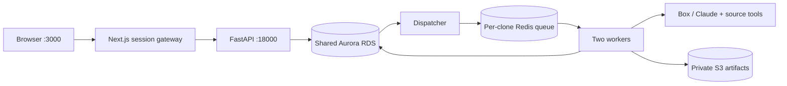

# Learn the REVEAL API locally

Start the stack using [README.local.md](../README.local.md). The contract is [api/openapi.json](../api/openapi.json), with 42 scientific/application operations, schemas and paired request/response examples. Health, internal auth provisioning and administrator endpoints are separate from that public scientific contract.

## Request path



The browser calls `/api/backend/v1/...`. Next.js verifies its registered or anonymous session and signs a short-lived API assertion. The backend independently authorizes the application user. Never put the gateway secret, database password or provider API keys into browser code. A direct API request does not accept a NextAuth cookie as a bearer token.

## Read-only first checks

```sh
curl --fail http://127.0.0.1:18000/healthz
curl --fail http://127.0.0.1:18000/readyz
curl --fail 'http://localhost:3000/api/backend/v1/knowledge-gaps?limit=3'
```

The first catalog request can be slow over remote RDS. Readiness currently loads reference records and stored vector blobs into memory; suggestions use a NumPy similarity index. Database vector CPU settings do not turn this into native SQL vector search.

Browse the offline API viewer in a separate terminal:

```sh
python3 -m http.server 8765 --bind 127.0.0.1 --directory api
```

Open `http://127.0.0.1:8765` and the **Flow** view. Its examples are fixtures, with illustrative IDs and timestamps. Copy the shape and substitute actual IDs returned by your instance. The viewer is documentation; authenticated calls should go through the application gateway. Do not paste server secrets into Swagger's authorization box.

## Inspect your own workspace

In the application, continue anonymously or sign in, then open browser developer tools → Console:

```js
await fetch('/api/backend/v1/me').then(r => r.json())
await fetch('/api/backend/v1/drafts?limit=10').then(r => r.json())
await fetch('/api/backend/v1/jobs?limit=10').then(r => r.json())
await fetch('/api/backend/v1/accounts?limit=10').then(r => r.json())
```

If you want to learn the session handshake from a terminal, the following explicitly creates an anonymous workspace (a small shared dev database write, with no paid job):

```sh
mkdir -p .runtime/api-learning
chmod 700 .runtime/api-learning
umask 077
curl --fail --cookie-jar .runtime/api-learning/cookies.txt \
  -X POST http://localhost:3000/api/session/anonymous \
  -H 'Origin: http://localhost:3000' \
  -H "Idempotency-Key: $(python3 -c 'import uuid; print(uuid.uuid4())')"
curl --fail --cookie .runtime/api-learning/cookies.txt \
  http://localhost:3000/api/backend/v1/me
```

That cookie file is a credential. It stays ignored under `.runtime/`. Mutation requests require the matching browser `Origin`; idempotent operations also require `Idempotency-Key`. Reuse the same key and body when retrying an uncertain request; a different body requires a new key. Draft edits/deletion carry `expected_version` to reject stale writes.

## Scientific workflow

| Step | Main operations | Meaning |
| --- | --- | --- |
| Discover | `GET /v1/knowledge-gaps`, `/search`, `/{gap_id}` | Exact imported DisMech question and context |
| Choose anchors | `POST /v1/mechanisms/suggest`, `GET /v1/mechanisms/search` | Native CFDE mechanisms mapped from EAGGL; saved selections pin source revisions |
| Save work | `POST /v1/drafts`, `PATCH /v1/drafts/{draft_id}` | Mutable, owner-scoped composer state |
| Execute | `POST /v1/jobs` | Freezes the request; `kind=analysis` or `paragraph` |
| Observe | `GET /v1/jobs/{job_id}`, `/{job_id}/events` | Persisted state and reconnectable server-sent events |
| Inspect | `GET /v1/accounts/{dapper_id}`, `/claims/{dapper_id}`, `/analysis-outcomes/{outcome_id}` | Accepted scientific account or saved insufficient-evidence outcome |
| Download | `GET /v1/artifacts/{sha256}` | Authorized short-lived S3 redirect to exact retained bytes |
| Publish | Account/outcome `/publication` operations | Explicit visibility change; scientific identities stay immutable |

Use actual response IDs, encoded with `encodeURIComponent` when placed in URL segments. Follow cursor pagination. A job requires a selected gap and 1–10 valid native anchors. Running a job calls live paid providers; reading the contract and browsing existing records does not launch one. Examples for exact payloads live in [api/examples/exchanges.json](../api/examples/exchanges.json).

Research passes through frozen evidence collection, Box authoring, trusted deterministic identity, provenance, source and tool-policy validation, then saving of passing accounts. No second AI review runs. An accepted account can trigger a separate cited-statement job. A completed attempt may instead record `insufficient_evidence`. Validation failure preserves drafts and captures; it does not publish a scientific account. See [scientific linting](scientific-account-linting.md), [retired review design](scientific-review.md), and [exploration outcomes](exploration-outcomes.md).

For an existing job, inspect its events without submitting more work:

```js
const jobId = 'replace-with-your-job-id';
const stream = new EventSource(`/api/backend/v1/jobs/${encodeURIComponent(jobId)}/events`);
// The contract lists named event types. Network → EventStream also shows them.
stream.addEventListener('status', event => console.log(JSON.parse(event.data)));
// When finished:
stream.close();
```

The backend saves ordered event IDs. Streams periodically reconnect; use `Last-Event-ID` to resume in nonbrowser clients. `GET /v1/jobs/{id}` is the authoritative recovery view. Review retries have an explicit endpoint and eligibility checks; they are not equivalent to silently accepting failed output.

## Where to read the code

- [app.py](../services/backend/src/reveal_backend/app.py): HTTP routes, validation and owner checks.
- [gateway.ts](../services/frontend/src/lib/gateway.ts) and [gateway route](../services/frontend/src/app/api/backend/%5B...path%5D/route.ts): browser/API trust boundary.
- [jobs.py](../services/backend/src/reveal_backend/jobs.py), [dispatcher.py](../services/backend/src/reveal_backend/dispatcher.py), [worker.py](../services/backend/src/reveal_backend/worker.py): durable outbox, Redis delivery, RDS leases and execution.
- [acceptance.py](../services/backend/src/reveal_backend/acceptance.py) and [source_validation.py](../services/backend/src/reveal_backend/source_validation.py): final assembly and the checks shared with the agent linter.
- [artifact_store.py](../services/backend/src/reveal_backend/artifact_store.py): versioned, checksum-verified S3 storage.

Run `.venv/bin/python -m pip install pytest` and `.venv/bin/python -m pytest services/backend/tests` for offline backend tests (live integrations remain opt-in). For frontend changes, install Node 22, then `npm --prefix services/frontend ci`, `npm --prefix services/frontend test`, and `npm --prefix services/frontend run build`. Contract regeneration commands are in [api/README.md](../api/README.md).
