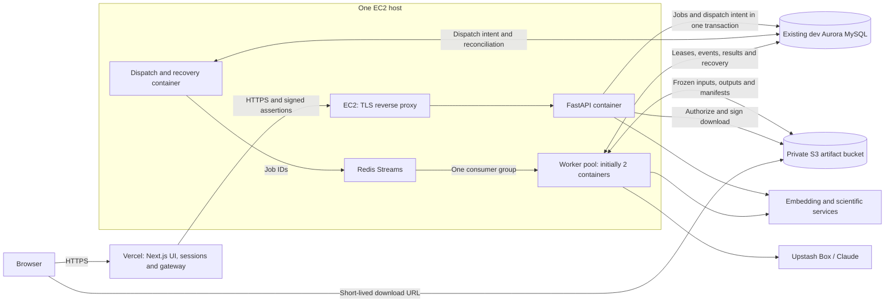

# REVEAL deployment plan

> Durable workflow migration: the supported target is now the HTTP-only service described in [durable-workflow-runtime.md](durable-workflow-runtime.md). The worker/Redis Streams instructions below are retained as historical migration and rollback guidance; they do not describe the new default `deploy/compose.yaml`. Live release status must be verified separately.

**Current deployment route:** use the [DIG service platform](platform-deployment.md) HTTP-only Workflow service. The QA backend is deployed and its public HTTPS and managed callback checks passed; production and frontend promotion remain pending. The dedicated EC2 worker architecture below is the earlier plan; its provisioning is on hold. Vercel, existing RDS data, and S3 remain requirements.

Historical plan prepared September 29, 2026. Its original target was one deployed environment using the existing RDS/Aurora database, with EC2 compute, S3 files, Vercel and Redis job delivery. The current DIG manifest instead isolates QA from production and uses Workflow for execution; the remaining sections retain the earlier design rationale and rollout instructions.

**Recommended architecture: one EC2 host running the FastAPI API, a dispatch/recovery process, a pool of worker containers, and Redis; private S3 for all durable artifacts; existing Aurora MySQL for application state, job state, and recovery records; Vercel for Next.js and its authentication gateway.**

The local implementation is available in [the deployment guide](local-deployment.md): a common backend Compose stack, two Redis Streams workers, an RDS dispatch outbox, real AWS S3 artifacts/checkpoints, and a local frontend at `http://localhost:3000`. The primary application uses the original `reveal_*` tables in the existing dev RDS, preserving users and publications. Earlier failure drills used an isolated namespace, which remains inactive; disruptive verification is blocked against the primary tables. The S3 bucket `cyaka-reveal-data` is provisioned. The personal Vercel project now exists with assigned hostname `reveal-mechanisms.vercel.app`, but has not been deployed. EC2 provisioning is blocked by AWS IAM/ECR permissions despite the user's approval of the dedicated runtime role. See [the current cloud rollout runbook](cloud-deployment.md) and [administrator handoff](../deploy/aws/README.md) for verified resources, exact commands, and remaining acceptance steps. Sections below and the EC2 cloud runbook retain the original design rationale. The platform deployment guide is the current hosting handoff; local colleague setup is in [README.local.md](../README.local.md).

## 1. Target architecture



The browser's ordinary application requests remain same-origin through Vercel. Only authorized artifact downloads go directly to S3. Vercel does not connect to RDS or Redis and receives no database credentials. Scientific execution remains in Upstash Box; the EC2 worker collects evidence, coordinates execution, validates results, and persists them.

Proposed addresses, to replace with the chosen domain:

- `https://<domain>` — Vercel application, login, and browser API gateway.
- `https://api.<domain>` — AWS backend reached by the Vercel server.
- Redis — private Docker network on EC2; no published port.
- S3 — private bucket in the backend region; no static website hosting or public bucket policy.

The example database hostname indicates `us-east-1`; verify the actual region, VPC, subnet routes, and security groups before provisioning. Place Vercel server functions near the backend, normally `iad1` for this region. [Vercel function regions](https://vercel.com/docs/functions/configuring-functions/region).

Start with one API process, one dispatch/recovery process, and **two worker containers**, each processing one job at a time. Both workers consume the same Redis stream using the same consumer group and distinct consumer IDs. Initially allow two concurrent jobs across the pool; evaluate four workers after measuring capacity and provider limits. A single host is an explicit initial availability tradeoff; RDS and S3 preserve application state if that host is replaced.

## 2. Original implementation gaps (resolved by local deployment)

The following describes the initial inspection at commit `4d666bc`, before the S3/Redis/local-deployment implementation. These are historical motivations, not a statement that the deployment modules are still absent. The current checkout includes substantial existing uncommitted work; review and record the selected source state and immutable image digest before cloud release.

- [compose.yaml](../compose.yaml) runs an API and a worker from the same [backend Dockerfile](../services/backend/Dockerfile). It currently mounts a shared local artifact directory, DAPPER, DisMech source files, and an RDS CA bundle.
- [worker.py](../services/backend/src/reveal_backend/worker.py) writes evidence, outputs, diagnostics, and dispatch manifests to filesystem paths. Recovery restores frozen inputs from those paths. Changing an environment variable to an S3 URI will not replace this behavior.
- [app.py](../services/backend/src/reveal_backend/app.py) serves artifact bytes from an absolute path stored in RDS and verifies SHA-256. [publication.py](../services/backend/src/reveal_backend/publication.py) copies artifact metadata into publication snapshots; [analysis_outcomes.py](../services/backend/src/reveal_backend/analysis_outcomes.py) also retains paths. All these read paths need the storage migration.
- [jobs.py](../services/backend/src/reveal_backend/jobs.py) implements a MySQL-backed queue with leases, fenced writes, cancellation, and events. `jobs.claim()` currently scans nonterminal jobs without an environment partition. Preserve its correctness properties while replacing how a worker receives a job.
- [gateway.ts](../services/frontend/src/lib/gateway.ts) signs five-minute HS256 assertions and uses a distinct service credential for internal identity operations. Keep this authorization boundary.
- [The frontend proxy](../services/frontend/src/app/api/backend/[...path]/route.ts) currently streams upstream bodies and lets fetch follow redirects by default. S3 download redirects need deliberate handling so Vercel does not fetch the entire object itself.
- [Activity.tsx](../services/frontend/src/components/Activity.tsx) already supports SSE reconnection with a cursor. The backend rechecks authorization during streaming. Jobs run independently of browser connections.
- `/healthz` checks API liveness; `/readyz` checks the database and scientific catalog. Frontend `/api/health` only reports frontend liveness. Add separate storage, queue, dispatcher, and worker readiness/telemetry.

## 3. Make S3 the durable storage layer

**Every file required to inspect, download, validate, or resume a job must exist in S3 before the database reports that checkpoint or result as available.** EC2 has no persistent application artifact directory. Replacing the instance must not require copying its disk.

The Python/DAPPER/Box integration currently expects file paths for subprocesses and bundle assembly. Adapt these boundaries using a bounded RAM-backed `tmpfs` workspace for temporary files, then clean it after each attempt. Stream large objects where possible and enforce input/output limits; do not silently spill oversized work onto durable local disk. These temporary bytes are not a recovery dependency. Immutable application code and verified source assets may be packaged into the image; downloadable versioned source bundles can also be staged from S3 into tmpfs. Audit temporary directories and libraries so the intended no-disk behavior is actually enforced for job data.

### Storage contract

Introduce an `ArtifactStore` abstraction with S3 as the deployed implementation. A filesystem implementation may remain for isolated tests. New deployed storage records contain a storage reference, not an absolute path:

```json
{
  "store": "s3",
  "bucket": "cyaka-reveal-data",
  "key": "prod/artifacts/sha256/<prefix>/<sha256>",
  "version_id": "<S3-version-id>",
  "sha256": "<full-content-sha256>",
  "size_bytes": 12345,
  "content_type": "application/json"
}
```

Keep canonical scientific bytes, content IDs, and citation revisions unchanged. Physical location and download URLs are transport metadata. Preserve logical relative filenames inside frozen bundles; record a manifest mapping those names to S3 objects so a worker can reconstruct the exact bundle in an empty tmpfs directory.

Local Compose uses the same private bucket with `local/`; EC2 uses `prod/`. Prefixes do not change application URLs. Configure IAM access per prefix and explicitly migrate object references if promoting local records into the production application namespace.

Store all required evidence packages, source captures, authoring inputs, remote tool outputs, ledgers, accepted documents, review/lint results, runtime manifests, diagnostics, and frozen dispatch inputs. Retain small queryable scientific documents and operational records already in RDS where needed; S3 replaces file storage, not relational ownership or query state.

### Commit and recovery ordering

1. Prepare or receive bytes in memory/tmpfs, calculate the existing full-content SHA-256, upload the immutable object, and verify successful storage.
2. Persist its bucket/key/version/checksum reference in the corresponding RDS transaction under the existing attempt fence.
3. Freeze the complete input manifest in S3 and commit its reference before launching a paid remote execution.
4. Persist remote handles and event cursors in RDS as execution advances. Upload all artifacts needed for the next recoverable stage before advancing that checkpoint.
5. Upload and verify accepted outputs before committing result availability or a successful terminal status. Keep S3 network calls outside long-held database write locks; recheck the fence in the final commit.
6. On recovery, reconstruct from S3 and verify checksums. Never recollect a frozen scientific input simply because the worker restarted.

An S3 failure must not produce a database record claiming success. An upload followed by a failed database commit may leave an orphan object; retry idempotently and clean only verified unreferenced objects after a grace period. Do not use an S3 ETag as the application's SHA-256. For multipart uploads, distinguish composite transport checksums from the full-object application checksum. [AWS object integrity documentation](https://docs.aws.amazon.com/AmazonS3/latest/userguide/checking-object-integrity-upload.html).

### Download flow

Preserve the existing owner/publication authorization checks at `/v1/artifacts/{sha256}`. Resolve a known verified S3 object/version, then return a short-lived redirect, initially 60 seconds, with `Cache-Control: private, no-store` and a signed content-disposition value. Never accept a client-supplied bucket/key as authority to read an object.

Change the Vercel gateway to avoid automatically following this artifact redirect, validate that its Location targets the configured S3 bucket endpoint, and forward it to the browser without gateway credentials. Update the contract, generated client types, and download UI as needed. Ordinary navigation/download links need no JavaScript access to the S3 response; if the UI fetches bytes, configure exact-origin S3 CORS accordingly.

Do not persist expiring URLs in scientific results or log their query strings. Short-lived URLs are bearer capabilities; an already issued URL can remain usable until expiry after visibility changes. Recheck authorization on every newly requested URL. S3 stays private. [AWS presigned URL behavior](https://docs.aws.amazon.com/AmazonS3/latest/userguide/using-presigned-url.html).

### Existing data migration

Inventory file references in artifact rows, publication snapshots, analysis outcomes, dispatch checkpoints, and saved manifests. Upload the corresponding local bytes with their original hashes. Introduce a central storage locator keyed by the existing checksum where practical, so old snapshots resolve without rewriting scientific content. Support versioned operational metadata during the transition.

Validate every retained reference and identify any files that are already missing. Inventory saved localhost transport links and generate canonical application links at read time where appropriate. An old scientific document containing an origin must not be silently reminted to fix hosting; handle it through the resolver/transport layer or explicitly flag the unresolved case before launch.

Do the final backfill with writers quiesced. The deployed application fails closed if an S3 locator is missing; it must not fall back to a developer's filesystem. Enable S3 Block Public Access, encryption, versioning, and policies that retain every referenced version. Lifecycle cleanup applies only to safely unreferenced content and transient data. [S3 versioning](https://docs.aws.amazon.com/AmazonS3/latest/userguide/Versioning.html).

## 4. Use Redis Streams for job delivery

**Use Redis Streams with a consumer group for work distribution. Use Pub/Sub only as an optional notification hint.** Plain Pub/Sub delivers at most once and can lose a message while a subscriber is disconnected; it also broadcasts rather than assigning a job to one worker. [Redis Pub/Sub semantics](https://redis.io/docs/latest/develop/pubsub/), [Redis consumer groups](https://redis.io/docs/latest/develop/use-cases/streaming/).

RDS remains authoritative for job status, ownership, attempt budgets, cancellation, leases, event history, and recovery. Redis carries small envelopes such as `job_id`, `dispatch_id`, `environment`, and message schema version. It carries no evidence bundles, credentials, or full user payloads.

### Submission, dispatch, and acknowledgment

1. In the existing job-creation RDS transaction, write the job and a uniquely identified **dispatch outbox record**. The same operation must cover automatically enqueued paragraph jobs. A committed job is accepted even if Redis is temporarily unavailable; expose queue unavailability/backpressure accurately and preserve idempotency keys.
2. A separate dispatcher publishes outstanding intent with `XADD` to `reveal:jobs`, then records delivery bookkeeping in RDS. A crash between publish and bookkeeping can create duplicate messages; duplicates must be harmless. Do not assume database and Redis writes are atomic. [Transactional outbox pattern](https://docs.aws.amazon.com/prescriptive-guidance/latest/cloud-design-patterns/transactional-outbox.html).
3. Workers use `XREADGROUP` in one `reveal:workers` consumer group. Replace the scan-based claim with `claim_by_id(...)`: validate environment and message generation, load the job, and acquire its existing RDS lease/fencing token before any paid work. A Redis delivery alone is not execution authority.
4. Maintain the RDS heartbeat during the entire job. Preserve cancellation checks and fenced result writes. Reclaimed or duplicate messages must not displace a healthy lease. Do not mistake a long-running valid job for an abandoned Redis message.
5. Acknowledge with `XACK` after terminal state and required S3 checkpoints are committed, or after a durable retry handoff is recorded in RDS. Do not acknowledge immediately upon receipt. Redis acknowledgment is not the job's success record.
6. Use pending-entry inspection and reclaim for abandoned deliveries, always checking the database lease first. Record bounded retries with backoff and attempt budgets. Persist exhausted/poison-message status in RDS for inspection; a Redis dead-letter stream can be a secondary view.
7. Reconcile nonterminal eligible jobs against dispatch bookkeeping on startup and periodically, including jobs previously marked delivered whose Redis entries have disappeared. Republish safely after a Redis reset. Recreate consumer groups and process the recovered backlog.

Define duplicate, pending-entry, retry, acknowledgment, and stream-retention behavior in tests. Do not trim unacknowledged work blindly. Bound stream memory and retain operational history in RDS rather than treating Redis as a permanent audit log. [XREADGROUP](https://redis.io/docs/latest/commands/xreadgroup/), [XAUTOCLAIM](https://redis.io/docs/latest/commands/xautoclaim/).

Redis Streams provides redelivery, not exactly-once scientific execution. Preserve the remote-handle recovery path. Before starting Box, persist launch intent and use provider idempotency or lookup if supported; a timeout after a potentially successful launch must be reconciled, not blindly retried as a new paid run. If the remote launch outcome cannot be established, surface it for intervention.

### Redis placement and persistence

For this initial deployment, run a pinned Redis container on the same EC2 instance. Use a private Docker network, authentication/ACLs, a memory limit, `noeviction`, and explicit RDB/AOF disablement. There is no durable queue file on the host. This is safe only because the RDS outbox and reconciliation process rebuild delivery state, and that behavior is a release gate. Until reconstruction passes, this queue design is not ready to deploy. [Redis persistence options](https://redis.io/docs/latest/operate/oss_and_stack/management/persistence/).

If Redis is unavailable, new work remains recorded as queued in RDS; workers can finish already owned jobs if RDS/S3/provider access remains healthy, then reconcile acknowledgments later. Apply admission limits if the backlog exceeds the configured capacity. Redis, API, and workers share a host failure domain; managed ElastiCache can be introduced later for availability without changing the job protocol.

Keep existing RDS sequenced events as the replay source for SSE. Optional Redis Pub/Sub messages can tell the API that events changed, after their database commit. Lost notifications merely delay the next catch-up; they never lose job history or determine job completion.

### EC2 worker pool

Run replicas of the existing worker entrypoint, `python -m reveal_backend.worker`, after implementing the Redis/S3 changes. Each replica is a separate container/process with its own consumer identity, database pool, bounded tmpfs workspace, and resource limits. This fits the current worker's one-job-at-a-time execution model without introducing concurrent jobs inside one process. Workers expose no host ports and must not set a fixed Compose `container_name`, so the service can be replicated.

The proposed deployment file should support the following command after it exists and its initial configuration has passed acceptance:

```bash
docker compose -f deploy/compose.yaml up -d --scale worker=2
```

Workers take new deliveries only when they have an available execution slot; avoid prefetching a backlog into one worker. Consumer groups distribute deliveries, while the RDS lease/fence remains the authority to execute each job. One shared group is required: assigning a different group to each worker would give each group the full stream.

**Capacity controls:** start with two replicas and an independently enforced global limit of two running jobs. Implement that limit atomically alongside acquisition of unexpired RDS execution leases, so it holds across every replica and any later hosts. Keep it separate from `REVEAL_MAX_ACTIVE_JOBS`, which currently limits nonterminal jobs per principal, including queued jobs; that setting is not a pool-size control. Cover automatic paragraph jobs with the same execution limit. Enforce provider request/token limits across workers as well as per-job cost caps; a worker slot alone is not a complete rate limit.

Begin host capacity testing at **4 vCPU and 16 GiB RAM** for the combined API, dispatcher, Redis, and two workers. This is a sizing hypothesis, not a measured requirement. Reserve resources for API latency and Redis before allocating worker limits. Use `baseline memory + replicas × (peak worker memory + peak tmpfs usage) + headroom` to establish the safe replica count. CPU, database connections, the repository's serialized write transactions, and provider limits can bind before memory does. Four workers do not guarantee twice the throughput.

Scale up only when queue age warrants it and those budgets permit it. Scale down or deploy through a **drain operation**: mark selected workers as not accepting new claims, let their active jobs finish while renewing leases, then stop them. The current worker's SIGTERM path requests cancellation of active execution; a 120-second container grace period does not drain a job that can run for 900 seconds. Add an explicit drain mechanism before relying on routine scale-down. Abrupt failures use the existing fenced recovery path and S3 checkpoints.

Track each worker's heartbeat, current job, RSS/tmpfs use, lease age, and completed/failed counts. Validate with both workers busy, then terminate one deliberately and verify that the surviving worker remains healthy and recovers eligible work without a duplicate paid launch.

This pool scales within one EC2 host initially. A later pool across multiple EC2 instances must use a common private Redis endpoint, such as managed ElastiCache, plus the same RDS/S3 protocol and globally enforced limits; starting an independent Redis queue on every host is not that design.

## 5. Implementation order and deliverables

**Phase A — S3 storage and data compatibility.** Implement storage references, uploads, input recovery, authorized direct downloads, and legacy-reference resolution. Add the S3 SDK dependency and failure tests. Build a dry-run inventory/backfill tool that reports missing files and validates checksums before any metadata updates.

**Phase B — Redis dispatch and recovery.** Add a Redis client, dispatch outbox records and necessary indexes, a dispatcher/reconciler process, and claim-by-ID worker consumption. Add environment/generation validation, explicit retry behavior, global execution limits, worker draining, and replay/duplicate/crash tests across multiple workers. Keep the existing lease and cancellation semantics. Use a distinct dispatch record type so it cannot conflict with existing records named `outbox`.

**Phase C — Deployable release.** Commit the selected changes and API contract; build one immutable `linux/amd64` backend image and record its ECR digest. Package the locked DAPPER runtime, exact DisMech source inputs, and trusted RDS CA certificate. Verify source assets against the import manifests; `.runtime` is currently excluded from builds. Preserve expected paths for immutable code assets, but put mutable job work on bounded tmpfs.

**Phase D — Infrastructure and Vercel.** Provision the host, bucket, roles, secrets, domains, logging, and Vercel project. Deploy API/dispatcher/worker/Redis via the deployment Compose file, with worker/dispatcher initially stopped. Complete the controlled database handoff before enabling them.

**Phase E — Live acceptance and recovery drill.** Exercise a bounded real research workflow, auth, download, interruption, and empty-host recovery. Open the deployment to its intended users after those checks pass.

Suggested files to add during implementation:

- `services/backend/src/reveal_backend/artifact_store.py`, a dispatch transport module, and `dispatcher.py`.
- Additive schema migration(s), a storage backfill command, and queue/S3 failure tests.
- `infra/aws/` for EC2, security groups, IAM, ECR, S3, secret references, and monitoring.
- `deploy/compose.yaml`, reverse-proxy configuration, and a host service unit.
- A release workflow plus deployment/rollback scripts and a restore runbook.

These files were originally proposed here; deployment implementations now exist under `deploy/`, `scripts/`, and the backend modules. Validate the frontend with its existing tests, typecheck, and production build; run backend unit/contract/security tests and deployment-specific storage/queue tests. Validate the container image with the same source bundles, tmpfs limits, and credentials mechanism used on EC2.

## 6. AWS configuration

Reference the existing database and VPC in infrastructure as code; do not recreate the shared RDS infrastructure. Confirm current subnet routing and database accessibility from the target host.

- **EC2:** begin capacity testing with one x86-64 host with 4 vCPU and 16 GiB RAM for the two-worker pool. This is an initial hypothesis, not measured sizing. Account for the API's in-memory catalog, Redis, every worker, and every tmpfs allocation jointly; increase memory or reduce concurrency if the acceptance workload requires it. No GPU is required on this host.
- **Containers:** API, two worker replicas, dispatcher/reconciler, and Redis. Use one immutable backend image digest for the Python services, a pinned Redis image, restart policies, health checks, and `init: true`. Keep the existing 120-second graceful shutdown period; normal releases must use the new drain mechanism before sending termination signals. Supervise the stack across host reboot.
- **Storage:** root disk holds the OS, images, and bounded operational logs only. Mutable job files go to tmpfs and durable objects to S3. Ship logs off-host and rotate local buffers. No EBS artifact volume, shared filesystem mount, or artifact backup-sync process is required.
- **Public ingress:** simplest initial arrangement is a public subnet and stable IP with a TLS reverse proxy on the host. Allow 443, plus 80 if used for certificate issuance/redirect. API listens on `127.0.0.1:8000`; Redis is internal to Docker. Do not publish 22, 8000, 6379, or 3306 to the internet.
- **Database:** allow TCP 3306 from the backend host security group; preserve existing authorized access. Use private VPC connectivity and certificate/hostname verification. A new application database user should have schema-scoped runtime privileges, with a separate privileged migration identity.
- **Outbound:** provide routes and DNS for RDS, S3, ECR, secrets, logs, Box, Anthropic, embeddings, GitHub where required, and scientific APIs. Use an S3 gateway endpoint if available/appropriate for the VPC. A private-host design instead needs suitable endpoints/NAT and an ingress service; price those separately.
- **TLS:** `api.<domain>` points to the host. The proxy supports SSE and authenticated `/internal/v1/*` gateway routes. Keep detailed readiness diagnostics private. All application identity checks remain enforced by the API; browser CORS is unnecessary for its ordinary same-origin gateway traffic.
- **Access:** administer with Systems Manager Session Manager. Scope IAM to this deployment's image pulls, secret reads, bucket prefixes/versions, and logs. Materialize secrets into restricted runtime files/tmpfs, never into the image or repository. Separate API read permissions from worker upload and migration/delete permissions as practical; do not expose instance credentials to remote Box execution. [Session Manager](https://docs.aws.amazon.com/systems-manager/latest/userguide/session-manager.html).

Ordinary Vercel egress is not assumed to have a fixed IP. If network allowlisting is required, configure a supported static-egress option rather than guessing addresses.

Monitor API readiness, worker/dispatcher heartbeat, oldest queued job, outbox lag, pending Redis deliveries, retries, S3 errors, checksum failures, Redis memory, host/tmpfs memory, and provider failures. An empty queue does not prove a worker is alive. Health responses and logs must not expose secrets or private evidence.

## 7. Vercel and environment configuration

Create one `reveal` Vercel project. Configure Root Directory `services/frontend`, Next.js preset, Node 22.x, install `npm ci`, build `npm run build`, and default framework output settings. Attach `<domain>` to the stable deployment. Use this project's Production environment for the canonical domain. This is the only deployed application environment; do not provision a separate staging project or database now. [Vercel monorepo setup](https://vercel.com/docs/monorepos).

Generated API types already live in the frontend source. The normal build does not need to run the generator that reads `../../api/openapi.json`; contract generation belongs in CI.

**Vercel-only configuration**

- `AUTH_SECRET` and `NEXTAUTH_SECRET`: the same new deployment session secret for NextAuth compatibility.
- `REVEAL_API_URL=https://api.<domain>`.
- Enabled Google/ORCID client IDs and secrets, plus the intended ORCID issuer.
- `ADMIN_EMAILS`: approved verified-email identities; `DISABLE_ADMIN_LOGIN=false`.

**Shared gateway configuration**

- `REVEAL_GATEWAY_SECRET`: deployment signing/verification secret, shared between Vercel and the API, distinct from the other secrets.
- `REVEAL_GATEWAY_SERVICE_TOKEN`: separate credential for gateway-only internal operations.
- `REVEAL_GATEWAY_ISSUER=reveal-nextjs`, `REVEAL_GATEWAY_AUDIENCE=reveal-api`, matching on both sides.
- `NEXTAUTH_URL=https://<domain>` on Vercel and any backend code constructing frontend links; `REVEAL_CANONICAL_URL` uses the same origin on the backend.

**Backend configuration already supported**

- Existing `REVEAL_MYSQL_*` values with the application runtime user and trusted CA path.
- `REVEAL_ENVIRONMENT=production`, `REVEAL_EXECUTION_MODE=box`. The production runtime setting keeps development-only execution disabled; it does not introduce a second environment.
- DAPPER/DisMech source locations, mapping run ID, and any selected DisMech embedding run ID.
- Box/Anthropic/embedding credentials and the working model/service settings, scoped to the services needing them.
- Explicit time, turn, authoring/review cost, and admission limits. Current defaults include 1,800 seconds (30 minutes) and a $3 authoring cap per job; paragraph work and scientific review add separate usage. These are not a total per-submission price guarantee.
- `REVEAL_MAX_ACTIVE_JOBS` (per-principal nonterminal admission limit), `REVEAL_ANONYMOUS_ANALYSES_PER_DAY`, `REVEAL_ANONYMOUS_PROVISIONS_PER_HOUR`; keep database pools bounded, currently four connections per process by default. Budget the sum across API, dispatcher, and all worker processes, plus other database users and connections outside that pool.

**New configuration to implement**

- `REVEAL_ARTIFACT_STORE=s3`, `REVEAL_S3_BUCKET`, `REVEAL_S3_PREFIX=prod/`, and `AWS_REGION`. Use IAM roles, not static AWS keys.
- `REVEAL_WORK_DIR=/work` for the bounded tmpfs workspace; replace the persistent meaning of `REVEAL_ARTIFACTS_DIR` in the deployed application.
- `REVEAL_JOB_TRANSPORT=redis`, `REVEAL_REDIS_URL`, `REVEAL_JOB_NAMESPACE=reveal`, and validated consumer-group/retry/reconciliation settings.
- `REVEAL_WORKER_REPLICAS=2` for the deployment configuration and `REVEAL_MAX_RUNNING_JOBS=2` for the global execution limit. Increasing replicas must not silently increase provider budgets or override the global limit.
- These names are proposed implementation interfaces, not settings the current application already understands.

No secret uses `NEXT_PUBLIC_`. Store deployment values in the Vercel project's Production scope and redeploy after changes. Keep Development/Preview configuration separate from access to this live backend; that does not require another deployed environment. Keep RDS, Redis, S3, Box, and Anthropic access out of the frontend runtime. [Vercel environment variables](https://vercel.com/docs/environment-variables).

Register exact callback URLs: `https://<domain>/api/auth/callback/google` and `https://<domain>/api/auth/callback/orcid`. Leave arbitrary PR previews without backend credentials initially: current CSRF logic is origin-specific, and unconfigured previews must not submit work into the shared database. Configure access and search indexing for the intended application audience.

Preserved verified issuer/subject identities can resolve to existing registered users. Localhost anonymous cookies do not transfer to the new hostname; use the supported sign-in/claim flow beforehand for workspaces that must follow their owners.

Configure Vercel SSE duration explicitly within the selected plan's limits. For example, use a 240-second stream window and a 300-second function limit where supported, then reconnect with the last event cursor and a fresh assertion. Keep JSON polling available as a fallback. Direct S3 downloads remove large file bodies from Vercel's proxy path; test them at representative sizes. [Function limits](https://vercel.com/docs/functions/limitations), [duration configuration](https://vercel.com/docs/functions/configuring-functions/duration).

## 8. Controlled cutover on the existing dev database

The new Redis namespace does not isolate the old database-polling worker. Treat the first launch as a handoff of the active application environment.

1. Inventory all running local workers and submissions against this database. Select and record the exact release image, configuration revision, source bundles, and schema changes.
2. Stop new submissions and let local analysis/paragraph jobs finish. Record and explicitly resolve queued, cancel-requested, interrupted, and ambiguous remote attempts. Do not automatically adopt or relaunch an old paid job just because a new queue is available.
3. Stop every local worker using this application schema. Keep them disabled after cutover unless they are upgraded to compatible storage, queue, and environment rules.
4. Take an RDS checkpoint and complete the final artifact backfill to S3. Validate all retained object references and version IDs. Keep the original files until the migration and restore drill pass; the deployed system does not depend on them.
5. Apply only reviewed additive migrations using a tracked migration step. Inventory existing tables/indexes, including `007_admin_telemetry_indexes.sql`: the existing repository migration command applies only `005_application.sql`, not all migrations. No database reset, `prisma db push`, catalog reimport, or embedding regeneration is part of deployment.
6. Backfill environment/storage versions for deliberately adopted jobs and create dispatch intent only for eligible work. Deploy the S3-capable API first, then the compatible dispatcher and two-worker pool with its global execution limit. Reconcile from RDS into the empty Redis stream.
7. Deploy the matching Vercel revision to the stable domain and run acceptance with a test principal and bounded paid usage. Open access after it passes.
8. If simultaneous local development is required, use an isolated application schema/database on the same RDS cluster with appropriate data access, or implement comprehensive environment isolation. Prefixing Redis keys alone does not isolate ownership, publications, or other shared application records.

## 9. Release, acceptance, and rollback

Use the repository's CI provider. If it is GitHub, use Actions with AWS OIDC scoped to the approved repository and deployment workflow, build once, push to ECR, and deploy the recorded digest via Systems Manager. Couple API/worker/dispatcher releases and deploy a compatible frontend afterward. [AWS ECR/GitHub Actions pattern](https://docs.aws.amazon.com/prescriptive-guidance/latest/patterns/build-and-push-docker-images-to-amazon-ecr-using-github-actions-and-terraform.html).

The release is ready only when these tests have evidence:

- Anonymous and enabled OAuth login, draft save/reload, source selection, ownership boundaries, admin access, and CSRF/JWT rejection work on the canonical application origin.
- A real Box analysis and its paragraph workflow complete, or report their distinct failures correctly. Accepted output has verified S3 objects and usable citations; deterministic test results are not presented as live scientific work.
- Existing and new private/public artifact downloads preserve authorization, checksum identity, filename, expiry, and publication behavior. Large downloads bypass Vercel; an expired signed URL fails.
- S3 upload failure cannot commit available output; failed database commit leaves only harmless/reconcilable uploads; tmpfs exhaustion produces an operational failure without corrupting accepted content.
- Duplicate Redis delivery, publish/bookkeeping crash, worker failure before acknowledgment, cancellation/reclaim races, and lost acknowledgment do not create duplicate accepted results or uncontrolled paid retries.
- Run two jobs concurrently on distinct workers, verify that additional work stays queued at the global limit, and cover automatic paragraph jobs. Verify deliberate worker draining does not cancel active work, and an abrupt loss of one worker does not interrupt the other or cause duplicate execution. Measure contention before approving four replicas.
- Restart Redis with all its data lost. Previously published but unfinished jobs are reconstructed from RDS; completed jobs are skipped; legitimate active leases remain respected.
- Replace EC2 with a fresh instance, empty Redis, and empty tmpfs. Recover only from release/configuration, RDS, and S3. Verify downloads of old results and recovery of a pending attempt without the former disk or recollection of frozen inputs.
- SSE reconnects across its duration window and token expiry with no missing events. Browser refresh/disconnect does not cancel execution; explicit cancellation remains authoritative in RDS even if notifications are lost.
- Worker/dispatcher health and queue/storage alarms work; measured host/Redis/tmpfs memory fits configured limits with headroom.

Redis reconstruction is a mandatory part of correctness, not an optional disaster-recovery exercise. A passing local build does not certify these distributed failure cases.

Keep RDS backup/PITR enabled and preserve S3 versions referenced by checkpoints. Test a coordinated restore into an isolated environment. Redis is rebuilt rather than restored, and the EC2 root disk is not the application backup. S3 versioning alone does not protect against every administrative deletion; define retention and restricted delete permissions to match the recovery objective.

**Routine rollback:** stop submissions; drain every worker or explicitly resolve active work; stop dispatch/worker consumption; restore the prior S3/Redis-compatible image and frontend revision; verify readiness and object compatibility; resume one dispatcher and the configured worker pool with its global limit. Keep additive schema changes, object versions, and secrets compatible.

The first storage/queue migration is a compatibility boundary. Rolling back to the old disk-only worker after new S3 jobs exist is unsafe. Retain an S3-capable rollback release; if one does not exist yet, use maintenance mode and a fix-forward release, or an explicitly planned coordinated data restore. Never solve an application regression by restoring the shared dev database over newer work without a separate incident decision.

## 10. Inputs, sequencing, and expected effort

Before provisioning, supply the AWS account/role and RDS network identifiers, chosen domain/DNS authority, Vercel team/project and plan, release repository/branch, OAuth provider credentials, and the artifact inventory. These are execution inputs; the plan is complete without guessing their values.

Budget approximately **5–8 engineering days** for the S3 migration, Redis dispatch/recovery, infrastructure setup, controlled backfill, and acceptance. This is a planning estimate assuming ready account access and source data. Missing artifacts, ambiguous provider recovery, authentication setup delays, or failed recovery tests extend it.

Price the actual region/account configuration before creating resources: 730 EC2 instance-hours/month, root volume, public IPv4, S3 storage/versions/requests, ECR, Secrets Manager, CloudWatch, transfer, and Vercel usage. Include the existing RDS baseline and incremental workload, plus Box/Anthropic/embedding usage separately. Redis shares EC2 for the initial deployment; managed Redis, an ALB, or NAT would be additional line items if chosen later. Configure spend alerts and admission/provider budgets before opening access.

There is one deployed environment for now, using the existing database and canonical public domains. If separate staging and production environments are introduced later, isolate their databases, secrets, queue namespaces, and artifact storage then; keep the current public domains attached to the primary application. No parallel environment is a prerequisite for this launch.
