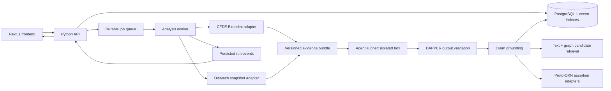
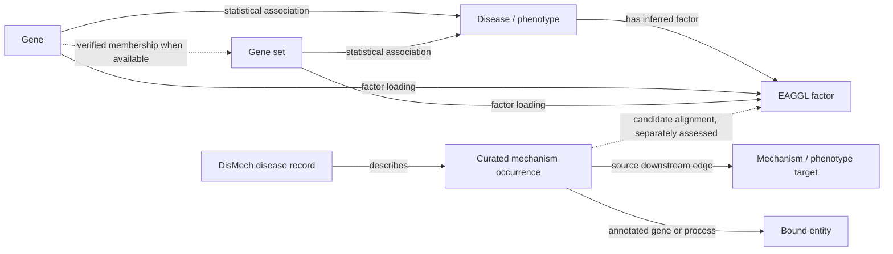

> **Historical plan.** Superseded by the [consolidated v12 plan](design-plan.md). Retained for decision history; not an implementation specification.

# CFDE REVEAL Mechanisms — design plan

**Status:** proposal for review before writing the implementation specification.  
**Date:** 2026-09-15.  
**Starting point:** this repository previously contained only a README. This phase adds source snapshots, repeatable extraction scripts, API findings, and a product/architecture plan. Application implementation follows the specification.

## 1. Product outcome

A researcher asks an open-ended question, attaches disease mechanisms as chips, and receives a small set of inspectable claims. Each claim exposes the source assertions that support or challenge it, the graph paths used to construct it, and any gaps in evidence.

The core interaction is:

1. Ask a question in natural language.
2. Search and attach EAGGL factors or DisMech mechanisms.
3. Resolve the disease/phenotype context and retrieve relevant factors.
4. Expand the selected context into genes, mechanisms, gene sets, and diseases/phenotypes.
5. Give a bounded evidence package to an agent running in an isolated box.
6. Generate structured candidate claims through a versioned claim-authoring skill, provisionally called DAPPER.
7. Retrieve candidate Proto-OKN assertions using identifiers, text embeddings, and graph embeddings; verify actual assertions and their context.
8. Present grounded claims, disagreements, and unresolved hypotheses with source links.

Initial research question for the vertical slice: **“Which mechanisms connect insulin resistance to type 2 diabetes, and which genes and gene sets support them?”** T2D is the first complete worked example; the factor picker draws from the full downloaded `cfde-inc-v2` catalog.

## 2. Decisions and boundaries

### Proposed defaults

- **Frontend:** Next.js App Router with TypeScript, owning the question composer, mechanism picker, run status, graph exploration, and claim/evidence views.
- **Backend:** a separately deployable Python FastAPI service, with a separate Python worker process for graph expansion, agent execution, and grounding. Python keeps ingestion and later embedding experiments close to the biomedical tooling.
- **Storage:** PostgreSQL for application records, normalized entities/assertions, full-text search, and vector search via pgvector. Store source payloads and immutable run bundles as compressed objects. Add a dedicated graph engine only if traversal measurements justify it.
- **CFDE model:** `cfde-inc-v2`, explicitly present in every applicable query, cache key, factor identifier, graph expansion, and run manifest.
- **Agent boundary:** a provider-independent `AgentRunner` interface. For this proposal, “box-based” means a sandbox/container. The exact runtime is an open decision; Box AI is not assumed.
- **Claim contract:** a small provisional envelope around DAPPER output. DAPPER’s ontology, acronym expansion, and final semantics remain undefined.
- **Research output:** distinguish statistically inferred associations, DisMech source assertions, and new agent hypotheses in both the graph and the claims view.

Next.js can provide a thin same-origin proxy/session layer. Long-running analysis belongs to the worker; hosting constraints can terminate long requests, so the browser should consume persisted run events. See [Next.js backend-for-frontend guidance](https://nextjs.org/docs/app/guides/backend-for-frontend).

### This phase includes

- Extraction of all mechanism records and observed vocabularies from the local DisMech KB, plus schema enum definitions and their constraints.
- Download of all advertised phenotype/factor queries for `cfde-inc-v2`.
- Complete available T2D factor and disease association responses, with representative second-hop queries.
- API recipes, source limitations, UX design, service boundaries, and a build sequence.

### Later phases

- Next.js/API scaffolding and the running product.
- Choice and configuration of the agent runtime and DAPPER authoring skill.
- Ontology identifier reconciliation, embeddings, and endpoint-specific assertion adapters.
- Benchmarks, deployment, and any public release.

## 3. What the source investigation established

### Terminology

The API prefix is **`pigean`**. **PIGEAN** infers gene/trait and gene-set/trait relationships; **EAGGL** learns latent factors. The source project distinguishes these methods and warns that edge weights have different meanings. Treat the requested “eagle/eaggl factors” as EAGGL factors exposed through `pigean-factor`. These responses do not establish that the factors are specifically eQTL factors; an eQTL-specific evidence view would require an additional verified source. See the [CFDE REVEAL source repository](https://github.com/broadinstitute/dig-knowledge-graph).

### DisMech snapshot

The local source is pinned to commit `df3884a8bba34370ecc0b3a49d956e7f0523bb28`, with no local changes in the KB or schema at extraction time.

- 3,361 KB YAML files, including 2,948 disorder records and 174 mechanism modules.
- 19,959 pathophysiology mechanism occurrences; 18,387 normalized distinct mechanism labels.
- 37,149 downstream edge records, preserving their evidence and source target references.
- 21,382 distinct observed ontology identifiers.
- 54,690 lexical vocabulary entries, grouped by source field and linked to occurrences.
- 138 enum definitions with 1,192 declared values across the main LinkML schema and 13 local imports.

“All vocabularies” means every declared enum in that import closure, every mechanism name/synonym/reference recognized by the extractor, and every observed structured descriptor/term in the KB YAML. It does **not** mean downloading the entirety of GO, MONDO, HP, HGNC, or other external ontologies. Dynamic enum constraints are retained without materializing their full ontology closures.

Keep three levels separate:

1. **Lexical entry:** a searchable name such as “Insulin Resistance.” Shared text is useful for discovery.
2. **Contextual mechanism occurrence:** a particular pathophysiology record in a particular disease or module, with its own evidence, anatomy, genes, and qualifiers.
3. **Ontology binding/module conformance:** a source-defined link to an existing term or reusable mechanism module.

Identical names do not prove two mechanisms are the same. Module `conforms_to` is a source consistency relationship, not inheritance or an automatic equivalence edge. Preserve source evidence direction, directness, and hypothesis groups. These distinctions follow [DisMech’s decision register](https://github.com/monarch-initiative/dismech/blob/df3884a8bba34370ecc0b3a49d956e7f0523bb28/docs/explanation/design-decisions.md).

### CFDE snapshot and gaps

The factor key catalog advertises **3,778 phenotype/model keys** for `cfde-inc-v2`. These include diseases, quantitative traits, and other phenotypes; do not describe them all as diseases. Final extraction totals and checksums live in the [data inventory](data-inventory.md) and [CFDE manifest](../data/cfde/manifest.json).

T2D returns:

- `Factor1`: `mp_improved_glucose_tolerance`, 541 factor-gene rows and 597 factor-gene-set rows.
- `Factor2`: `mp_impaired_glucose_tolerance`, 502 factor-gene rows and 467 factor-gene-set rows.
- 18,321 disease-gene association rows and 5,000 disease-gene-set association rows.

These are API response rows, not assertions that every gene is causal or that the source contains every possible association. The snapshots cover all bytes exposed by each tested query; upstream generation/filtering may already have limited the records.

Two integration constraints affect the first specification:

- Explicit BioIndex `limit` truncates records and can leave `continuation: null`. Omit it for ingestion; follow `/api/bio/cont` and inspect read progress.
- Membership indexes advertise only `cfde`. `cfde-inc-v2` membership queries return empty results. Preserve this as a coverage gap. Factor↔gene and factor↔gene-set edges are available in v2, so the first graph can still be useful. Do not invent gene↔gene-set membership from co-membership in a factor, or silently substitute the older model.

Use exact `gene_set` values from response rows for subsequent queries. A factor’s descriptive `label` or `top_gene_sets` summary is not necessarily a valid gene-set key. Detailed observed queries are in [API discovery](api-discovery.md).

## 4. Frontend experience

### A. Landing page — ask and attach

The question composer is the visual focus. Suggested prompts sit beneath it. A secondary search field says **“Add a mechanism”**, with source filters **All / EAGGL / DisMech**.

```text
REVEAL mechanisms                                      Recent questions

What would you like to understand?
┌────────────────────────────────────────────────────────────────────┐
│ Which mechanisms connect insulin resistance to type 2 diabetes?     │
│                                                                    │
│ [Insulin Resistance · DisMech ×] [Glucose tolerance · EAGGL ×]        │
└────────────────────────────────────────────────────────────────────┘
  + Add a mechanism                         [Explore evidence →]

  Disease context: Type 2 diabetes mellitus  [Change]
```

Chip search matches mechanism names, ontology IDs, synonyms, disease names, and factor top genes/gene sets. Results show the original source label, disease context, source badge, and a short description. EAGGL results retain factor ID and model in the detail popover. Cosmetic label cleanup never changes the underlying key.

Selection behavior:

- A chip points to a contextual source record, not just a free-text label.
- Multiple chips seed a union of evidence neighborhoods by default. They are not an implicit claim that the mechanisms are equivalent or all co-occur.
- Disease context is editable. If the question has several plausible disease matches, the UI asks the user to pick or explicitly continue with multiple contexts.
- A question without chips can run: retrieve suggestions and show which factors were selected automatically.
- A DisMech-only disease still yields its curated neighborhood when CFDE has no matching trait; show the missing CFDE coverage.
- User-curated mechanisms can later enter through the same source record contract, retaining owner, revision, and curation status. Arbitrary text starts as a user hypothesis until it has evidence.

Accessibility: keyboard-searchable combobox, visible focus, named remove buttons on chips, screen-reader run announcements, and statuses expressed in text as well as color. At narrow widths, evidence details move into a sheet beneath the claim.

### B. Analysis workspace — claims lead, graph explains

Keep the submitted question and chips at the top. The main column shows the answer summary and 3–8 atomic claims. A secondary panel shows the selected claim’s evidence and a small focused graph. A graph tab supports deeper exploration without overwhelming the default answer.

Run stages: **Resolving context → Expanding evidence → Drafting claims → Checking assertions → Ready**. Display per-source partial failures and allow retry of the failed stage. Cancellation stops queued work and prevents a late worker from publishing a completed answer.

Each claim displays:

- One precise statement, with an explicit association/causation/hypothesis type.
- Grounding status: **Supported / Mixed / Contradicted / Unresolved**.
- Evidence counts grouped by primary provenance, with “same source” labels for duplicate representations.
- Links to the exact assertion, graph source, and relevant citation when present.
- Context qualifiers: disease, species, tissue/cell type, perturbation, direction, and study conditions when known.
- An expandable explanation of which supplied evidence led to the claim and which parts remain unsupported.

Selecting a claim highlights only the graph paths used for it. Selecting an edge shows its predicate, source value/score definition, original record, provenance, and retrieval time. A high similarity score alone never produces a “Supported” badge.

### Visual direction

Use a calm research workspace: warm neutral background, dark text, one restrained blue/teal accent, clear typographic hierarchy, compact source chips, and generous space around the question. Prefer a readable evidence list to a full-screen network at entry. The initial artifact is a wireframe; typography and component styling will be resolved in the frontend specification.

## 5. System architecture



Proposed repository layout after specification approval:

```text
apps/frontend/              Next.js; interaction and rendering
services/backend/           FastAPI; API, source adapters, orchestration
services/backend/worker/    Durable analysis jobs; separately deployed process
packages/contracts/        Versioned JSON schemas/OpenAPI + generated TS client
agent-skills/               DAPPER authoring instructions, fixtures, version metadata
scripts/                    Source snapshot/extraction commands (present now)
data/                       Local development snapshots and manifests (present now)
docs/                       Design, API findings, later specification
```

The backend owns scientific normalization, source queries, scoring, and evidence identity. The frontend receives stable typed response objects. Next.js server rendering can read the backend directly; browser requests use the same-origin API proxy or an explicitly configured API origin. Secrets and provider credentials stay server-side.

Use a durable queue/worker lease, not an in-process background callback, for agent jobs. Retries reuse a run/stage key and immutable input bundle. Persist events with sequence numbers for SSE reconnection. A polling endpoint remains available when streaming is interrupted.

## 6. Evidence graph and identity

### Node families

- **Disease/phenotype:** preserve CFDE trait keys separately from MONDO/HP/EFO identifiers. `T2D` is a CFDE key; DisMech’s T2D disease term is `MONDO:0005148`. Their crosswalk needs explicit provenance.
- **Gene:** source symbol plus species and resolved HGNC/NCBIGene/Ensembl identities when verified. Retain DisMech’s original lowercase `hgnc:` value even if a separate canonical alias uses `HGNC:`.
- **Gene set:** opaque source key and model/dataset version. Keep perturbation direction and source components encoded in the label until a source-defined parser is verified.
- **EAGGL factor:** `(source, model, phenotype, factor_id)`. `Factor1` alone is never globally unique.
- **DisMech mechanism:** source document + occurrence locator + snapshot. The initial export uses JSON pointers; a production identity registry should track continuity across revisions without assuming list positions never move.
- **Assertion/evidence:** first-class records with subject, predicate, object, qualifiers, provenance, evidence direction, and source payload reference.
- **Claim:** an agent-authored statement that references assertions; it is not automatically inserted as a source fact.

### Edges and interpretation

The requested “gene–mechanism–gene set–disease” expansion is a typed neighborhood. It is not necessarily a single causal chain.



Preserve CFDE `combined`, `log_bf`, `prior`, `factor_value`, `beta`, `beta_uncorrected`, `lambda`, and `rs_score` as named source values. Do not compare unlike scores or turn them into universal confidence percentages. Final display definitions require endpoint-specific documentation and fixtures.

DisMech edges preserve `SUPPORT`, `REFUTE`, `NO_EVIDENCE`, directness, `causal_link_type`, and hypothesis groups where present. Evidence attached to a mechanism node does not automatically justify each outgoing causal edge. Preserve unresolved targets until a source-aware resolver can distinguish mechanism targets, phenotype targets, and module references.

## 7. Retrieval and graph expansion

1. **Resolve context.** Extract candidate diseases, genes, and mechanism phrases. Match IDs/exact aliases first; use lexical/semantic retrieval for candidates. Record ambiguous mappings and avoid a confident join on a label alone.
2. **Retrieve chips/factors.** Search local snapshots for responsiveness. Filter CFDE by the configured model. Mechanism search exposes contextual occurrences beneath shared lexical labels.
3. **Expand selected seeds.** For each CFDE factor, retrieve factor genes and factor gene sets. Add relevant disease associations. For each DisMech mechanism, load its bound entities, local downstream edges, hypothesis groups, and evidence.
4. **Bridge sources.** Prefer verified gene and ontology identifier mappings. Shared genes/process terms or embeddings can propose mechanism↔factor alignments, but those links remain derived candidates with their own provenance.
5. **Optionally add other phenotypes.** Query `pigean-gene` using a selected gene and `cfde-inc-v2`, then retain exact phenotype keys. This is cross-phenotype association retrieval, not automatic disease equivalence.
6. **Bound the bundle.** Rank within source/edge type, then enforce node, edge, source-call, and token budgets. Always retain selected chips and enough evidence to explain selected paths. Return counts and reasons for anything excluded.
7. **Freeze the input.** Store selected IDs, question, graph records, source versions, requested filters, failed calls, clipping decisions, and a content hash before invoking the agent.

Starting tunable limits for the specification: 10 chips; 2 graph hops; 100 genes and 25 gene sets per selected factor; 500 nodes/2,000 edges in the agent bundle; 5 assertions retrieved per candidate claim. These are product proposals to benchmark, not source truth or silently applied extraction limits. The full downloaded factor catalog is retained.

MVP retrieval uses identifier matching and text search. Add text embeddings after the first grounded slice works. Add graph embeddings as a separate retrieval experiment with recorded graph snapshot, model/version, node-ID mapping, relation direction, and out-of-vocabulary behavior. Compare both additions to the identifier/text baseline on a held-out benchmark.

## 8. Agent and DAPPER boundary

`AgentRunner.run(question, selections, evidence_bundle, skill_version, limits)` returns structured candidate claims plus execution metadata. The agent receives only the bounded bundle and explicitly exposed read-only evidence lookup tools. Source text is data, not instructions. The worker owns allowed endpoints, resource limits, cancellation, and output validation.

Provisional claim envelope:

```text
ClaimDraft
  id, schema_version, text
  kind: association | mechanistic | comparative | hypothesis
  subject, predicate, object (nullable until resolved)
  qualifiers: disease, species, tissue, direction, experimental_context
  input_assertion_ids[], reasoning_summary, limitations[]
  authoring: runner, model, skill_version, evidence_bundle_hash
  dapper_payload: opaque versioned extension until DAPPER is modeled

ClaimAssessment
  claim_id
  status: supported | mixed | contradicted | unresolved
  matches[]: assertion_id, relation_to_claim, context_compatibility,
             retrieval_method, retrieval_score, assessment_reason
  uncovered_claim_parts[], endpoint_failures[], assessed_at
```

The authoring skill should produce atomic claims; retain source direction and context; label new hypotheses; cite only bundle/tool assertion IDs; and state when the supplied evidence cannot answer the question. Validate cited IDs against the bundle/tool ledger. An invalid output gets a bounded repair attempt or a visible failed stage. It cannot bypass grounding.

No final DAPPER schema or skill is being invented in this phase. The envelope allows its design to proceed without coupling the frontend to a particular agent provider.

## 9. Grounding claims in Proto-OKN

The registry lists a concrete CFDE REVEAL SPARQL endpoint, [`https://apps.okn.us/digcfdekg/sparql`](https://registry.okn.us/registry/kgs/digcfdekg/). Start with its adapter to demonstrate retrievable source assertions. Also evaluate [SPOKE-OKN](https://registry.okn.us/registry/kgs/spoke-okn/), [Bio-Health KG](https://registry.okn.us/registry/kgs/biohealth/), and [Gene Expression Atlas](https://registry.okn.us/registry/kgs/gene-expression-atlas-okn/) as additional sources with distinct evidence semantics. Registry discovery alone does not validate their coverage of this question or their current availability.

Grounding pipeline:

1. Resolve the claim’s entities and intended relation into endpoint-compatible identifiers.
2. Retrieve candidate assertions using exact IDs/predicates, then text embeddings and graph embeddings where available.
3. Fetch the actual source statement or path, including reification/provenance when provided. Record endpoint, named graph, source assertion IRI or deterministic triple hash, query, result hash, version, and retrieval time.
4. Assess entity identity, relation direction, negation, species, tissue, perturbation, and evidential relevance. Split a compound claim if only one part is supported.
5. Classify support/challenge/context-only results. Embedding proximity is a retrieval feature; it is never evidence by itself. A KG link prediction is a hypothesis until an actual assertion is retrieved.
6. Preserve failures separately from negative findings. “Endpoint unavailable” and “no matching assertion” are different outcomes; neither proves the claim false.

CFDE BioIndex and the Proto-OKN `digcfdekg` may represent the same underlying evidence. A match there is **source grounding**, not independent corroboration. Deduplicate by upstream provenance and check export/model versions before asserting that BioIndex v2 and a KG export describe the same factor.

Source “support” means the retrieved assertion supports the stated claim under its recorded context. It is not a guarantee of scientific truth. EAGGL/PIGEAN associations cannot alone substantiate a causal claim.

## 10. Proposed application API

These are internal application routes to specify; they are distinct from the verified upstream BioIndex routes.

- `GET /v1/mechanisms/search?q=&source=&phenotype=&model=&cursor=` — typed, paginated chip candidates.
- `GET /v1/mechanisms/{id}` — source detail, evidence, snapshot, and coverage.
- `GET /v1/phenotypes/search?q=` — source-specific disease/trait candidates and reviewed crosswalks.
- `POST /v1/runs` — question, selected source IDs, explicit model, and allowed expansion options; returns `202` with run ID and event URL.
- `GET /v1/runs/{id}` — persisted status, stage failures, answer, and bundle metadata.
- `GET /v1/runs/{id}/events` — SSE with monotonic IDs and reconnect support.
- `POST /v1/runs/{id}/cancel` — idempotent cancellation.
- `GET /v1/runs/{id}/graph` — bounded graph, with paging/expansion parameters.
- `GET /v1/claims/{id}/evidence` — source assertions, support assessments, and citations.
- `GET /v1/sources` — snapshot/build versions, model availability, and known coverage gaps.

Error responses distinguish invalid selection/model, unresolved context, missing source coverage, upstream failure, timeout, cancellation, and invalid agent output. Idempotency keys prevent duplicate expensive runs. Persist access ownership if accounts are introduced; deployment/auth choices remain in the specification backlog.

## 11. Build sequence and acceptance gates

### Phase 0 — source discovery and plan (this delivery)

Source snapshots are parseable, model-scoped, reproducible from scripts, and accompanied by manifests. Every advertised v2 factor query is accounted for. The T2D fixtures exercise continuation, direct factor expansion, other-phenotype retrieval, and missing membership coverage. Known semantic gaps are documented.

### Phase 1 — reviewed specification and application shell

Resolve the agent runtime and DAPPER envelope. Scaffold the separate Next.js frontend, API, and worker; define OpenAPI/JSON schemas and generated client types. The mechanism picker searches real local snapshots. Users can add/remove contextual chips and submit a persisted run.

### Phase 2 — deterministic evidence slice

Implement CFDE/DisMech adapters, source-aware ID mapping, bounded graph expansion, evidence details, and partial-failure states. A T2D run produces a reproducible graph before involving a language model. Every edge traces to a source record or a clearly labeled derived mapping.

### Phase 3 — agent claims and one grounding adapter

Implement the chosen isolated runner and a versioned draft authoring skill. Enforce the claim envelope and assertion-ID validation. Ground against one Proto-OKN adapter; render supported, contradictory, and unresolved cases. Demonstrate both successful grounding and a missing-source case.

### Phase 4 — embeddings and broader validation

Add text and graph embedding retrieval, additional endpoints, evidence deduplication, and expert-reviewed evaluation. Record whether embeddings improve candidate retrieval and supported-claim precision relative to the baseline. Keep graph/trait-disjoint and temporal holdouts where feasible to reduce leakage.

### Phase 5 — deployment and benchmarking

Choose hosting/auth, source refresh policy, queue capacity, retention, and model budget. Add endpoint health checks and run traces. Benchmark chip lookup latency, evidence expansion latency, grounding coverage, citation correctness, unsupported causal claims, and failure recovery. Suggested initial chip-search target: p95 under 300 ms on the chosen deployment; measure rather than promise it.

Essential acceptance cases for the final specification:

- Same factor ID on different traits/models never collides.
- Shared DisMech labels remain separate contextual records.
- Removing every chip still permits question-driven retrieval.
- An unknown trait and an ambiguous disease mapping are handled explicitly.
- A selected factor retains its model across every expansion and retry.
- Missing v2 membership produces a coverage message and no fabricated membership edge.
- Multi-page API results are complete; explicitly clipped UI/agent bundles disclose limits.
- A high embedding match without a fetched assertion remains unresolved.
- A source association is not rewritten as causation.
- Duplicate CFDE representations are not counted as independent corroboration.
- Contradictory, species-mismatched, and unsupported claim fixtures exercise separate outcomes.
- Run cancellation, worker restart, SSE reconnect, and upstream outage are recoverable.

## 12. Decisions to settle when turning this into a specification

1. Which “box” runtime/provider should execute the agent?
2. What does DAPPER represent, and what is the smallest valid claim object for the first slice?
3. Is the proposed Python backend preferred, or should the backend also be TypeScript?
4. Which additional Proto-OKN graph should provide the first independent evidence beyond CFDE?
5. Can v2 gene-set memberships be obtained from another authoritative export, and how is that export versioned?
6. What constitutes a reviewed CFDE-trait↔DisMech-disease mapping beyond the T2D example?
7. Is initial curation limited to selecting existing DisMech records, or must users author and share new mechanisms in v1?
8. What hosting, authentication, data refresh cadence, and per-run model budget should the specification assume?

These decisions do not block the completed source extraction or the proposed interface boundaries.
