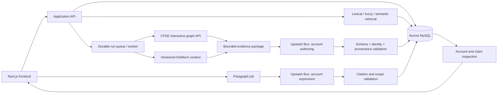

> **Historical plan.** Superseded by the [consolidated v12 plan](design-plan.md). Retained for decision history; not an implementation specification.

# REVEAL Mechanisms — revised design plan

**Revision:** 2026-09-24 · proposal for iteration before implementation specification.  
**Primary workflow:** knowledge gap → selected mechanisms → one graph expansion → ScientificAccounts → durable claims → cited Paragraph.  
**Previous plan:** [September 15 design](design-plan-2026-09-15.md).

## 1. What we are building

A researcher brings a knowledge gap, or selects one curated in DisMech. REVEAL suggests relevant DisMech mechanisms and EAGGL factors, expands their graph context once, and asks an agent in **Upstash Box** to produce one or more **ScientificAccounts**. The researcher can inspect each account's findings, claims, interpretations, and provenance. A separate, user-triggered action turns a selected account into a **Paragraph** whose citations resolve to durable claims and knowledge-gap records.

The first interaction remains an open text composer. The question now has a persistent gap/request identity, and the primary output is an organized scientific account rather than an unstructured answer or a flat list of claims.

### Accepted changes from the first design

- **Aurora MySQL on the supplied AWS instance** replaces PostgreSQL as the system of record, including stored textual embeddings.
- **The interactive CFDE API** becomes the primary graph search and expansion service. BioIndex remains useful for complete factor imports and diagnostics.
- **DisMech discussions and their attachments** become first-class inputs. Preserve `KNOWLEDGE_GAP` and the related `HUMAN_MODEL_MISMATCH` category separately.
- **One expansion round** over a frozen anchor set replaces the previous general multi-hop default.
- **Upstash Box** is the selected isolated agent runtime.
- **DAPPER's ScientificAccount design** governs the scientific output, followed by a distinct Paragraph-generation activity.
- **Durable provenance and citations** are persisted with the scientific content. Proto-OKN enrichment remains a later/optional capability, rather than the required final step before showing an account.

## 2. What is verified, and what is still proposed

### Verified in this revision

- The supplied catalog query returns the two example factor IDs and six other matches.
- The four connection POST requests succeed. For the supplied factor pair, gene sets return **63 candidates**; genes, traits, and factors return **zero**.
- The supplied 17-node contextual request returns **15 edges**.
- A separate `CADinT2D` factor returns genes and gene sets. A returned gene set also yields explicitly labeled membership edges under `cfde-inc-v2`.
- The MySQL account connects over verified TLS and has `ALL PRIVILEGES` on the `cyaka_` database prefix. Proposed database: `cyaka_reveal_mechanisms`.
- The local DisMech snapshot contains **2,604 explicit knowledge gaps**, plus **763 human/model mismatch gaps**, with **6,422 attachment references** inventoried.
- DAPPER's design document describes ScientificAccount and Paragraph, but the implemented claims module still exposes `CompositeClaim`. The proposed knowledge-gap digest object was not found in the checked schema.

### Still proposals, not implemented services

The application schema, semantic retrieval index, Upstash runner, DAPPER account profile, and paragraph citation contract are described below for review. No database/schema creation, bulk database loading, embedding generation, or Upstash Box execution occurred during this revision. The source exports and API fixtures are local preparation for those steps.

Supporting inventories:

- [Interactive API contracts and probe results](interactive-api-inventory.md).
- [Database readiness and persistence outline](database-readiness.md).
- [Original source data inventory](data-inventory.md).
- [DAPPER design document](../../dapper/schema/docs/claims.md) and [schema audit](../data/dapper/schema-audit-2026-09-24.json).

## 3. Core interaction

### Step 1 — pose or select a knowledge gap

The landing page asks **“What would you like to understand?”** A researcher can enter a new question or choose **“Browse DisMech knowledge gaps.”** The browser supports disease/module, source gap kind, status, and text search.

Selecting a gap shows its exact prompt, rationale, disease context, evidence, proposed experiments when available, and attached mechanisms/phenotypes. The run references an immutable gap revision. Editing the wording creates a user request derived from that revision; it does not edit DisMech or imply the source gap has been resolved.

Import every gap status. Default browse views can prioritize OPEN while showing a separate “status unspecified” filter; **838 extracted gaps have no source status**. Three are RESOLVED and remain available for provenance. A generated account never automatically closes a curated source discussion.

### Step 2 — suggest and select mechanism chips

Provide three routes to a mechanism:

1. **Source attachments:** offer mechanisms already attached to the selected DisMech discussion. These are strong contextual suggestions, with explicit source provenance.
2. **Semantic suggestions:** embed the question/gap and search the stored DisMech/EAGGL embedding corpus, scoped by source, model, disease, or other selected context when appropriate.
3. **Manual search:** lexical/fuzzy search or full semantic search over a user-entered mechanism subquery. Keep the subquery separate from the research question and record both.

Each chip identifies a contextual source record/version, with a source badge and disease/trait subtitle. Preserve the full interactive `node_id` for EAGGL items. Shared mechanism wording does not establish semantic identity. Similarity scores describe retrieval relevance, not biological support.

Suggested items are visually distinct from selected items. Preserve whether selection came from a source attachment, a semantic recommendation, or manual search. Phenotype, whole-section, and disease attachments appear as contextual records rather than being mislabeled as mechanism chips. Ambiguous attachment references remain inspectable and cannot seed expansion automatically.

A question without a source gap is valid. A DisMech-only request is also valid when no corresponding CFDE anchors can be established.

### Step 3 — retrieve and expand once

Create an immutable seed set **S0** from selected mechanisms:

- EAGGL factors contribute verified interactive catalog items directly.
- DisMech mechanisms contribute their source context and a bounded local neighborhood. They can contribute CFDE gene/trait seeds only through an explicit, verified mapping. The CFDE API cannot be assumed to recognize DisMech record IDs.
- Preserve source disease/phenotype identity, model, species information when available, and every cross-source mapping's provenance. Do not map two diseases solely because their labels are similar.

Against the same S0, call `/api/interactive/connections` for **gene, gene_set, trait, and factor**, using `model=cfde-inc-v2`, `connection_scope=direct`, `reducer=mean`, and `exclude_node_ids=S0 IDs`. Initial `context` is empty, matching the tested contract; the knowledge-gap prose is supplied to the agent independently until the upstream meaning of `context` is confirmed.

“One expansion” means **one round of four typed queries**, not one HTTP request. Returned candidates do not become new seeds during that run. In particular, factor → gene set → gene is a second round and must not be silently added to fill an empty first-round gene result.

Merge responses with S0: returned graph fragments can omit anchor nodes. Preserve edge families, raw and normalized scores, aggregate candidate scores, supporting paths, and anchor coverage. Retain explicit empty and failed results by target type.

Bound the selected node set, then call `/api/interactive/contextual-edges` once with those node IDs. It contributes graph edges among the selected nodes in the tested examples; it does not generate prose context or authorize another expansion round. Deduplicate repeated edges without losing which queries returned them.

Initial proposed budgets: at most 10 selected mechanism chips; at most 100 candidates per target request; at most 250 retained nodes and 1,000 edges; an agent input ceiling set for the chosen model, initially 24,000 tokens. These are tunable product limits. Keep selected anchors, preserve required path endpoints, and record every clipping decision. The contextual request-size limit must be confirmed before treating the proposed node budget as deployable.

### Step 4 — build the evidence package and run Upstash Box

Freeze a package containing:

- The original gap/question, selected source gap revision, and any mechanism-search subquery.
- Selected mechanism records, selection provenance, source attachments, and mapping decisions.
- The bounded PIGEAN/EAGGL graph, its paths and score definitions/unknowns, and the relevant DisMech assertions/evidence.
- Exact API request/response artifact references, timestamps, source/model versions, and content hashes.
- Empty/failed queries, unresolved attachments, omitted candidates, and other coverage limits.
- The requested account profile and pinned DAPPER schema/identity/authoring-skill versions.

Start a normal **Upstash `Box` with an agent harness**, transfer the frozen inputs, run the account-authoring task, and collect structured output plus run metadata. The harness/model and its provider credentials still need selection. The official [Box quickstart](https://upstash.com/docs/box/overall/quickstart) provides the isolated container and agent setup; the lighter [EphemeralBox](https://upstash.com/docs/box/overall/ephemeral-box) does not expose `agent.run`.

The application worker manages timeouts, retries, cancellation, output capture, and cleanup. The Box receives the package and any explicitly permitted evidence tools; the application owns MySQL persistence. Keep production database credentials in the application service. Box network isolation and credential handling are described in [Upstash security documentation](https://upstash.com/docs/box/overall/security).

### Step 5 — author ScientificAccounts

The agent proposes one or more accounts organized around the gap. Each account follows the DAPPER design:

- **Framing:** the question, gap, or hypothesis motivating it.
- **Context:** analytical approach/model, biological model when relevant, scope, assumptions, and limitations.
- **Component claims:** ordered references containing at least one finding.
- **Interpretations:** explicit, attributed explanations of how source claims support, dispute, or neutrally bear on a target claim under stated context. Required wherever one finding is used to justify another claim.
- **Closing:** optional component claims used as conclusions, plus editorial context.
- **Attribution/provenance:** the responsible agent(s) and generating/recording activity.

A ScientificAccount is an organizing object. It has no automatic overall truth value, causal chain, conjunction, or combined confidence score. A biological conclusion is an explicit claim within it. Result-oriented and biological propositions remain distinguishable regardless of paragraph position or confidence.

Source loading/association claims and newly proposed biological interpretations must be labeled by their actual content and evidence. A high factor loading cannot, by itself, become a causal conclusion. Missing evidence can yield an account explaining what remains unresolved.

### Step 6 — validate, mint supported identities, and save

The backend validates the output before accepting it:

- Required account structure, at least one finding, and valid ordered references.
- Claim ↔ Proposition links, required attribution/activity links, and typed scores.
- Evidence IDs and source locators exist in the supplied package or recorded tool outputs.
- Interpretations explicitly connect the appropriate source/target claims and retain context/direction.
- No new scientific assertions appear only in a closing sentence or as an unlabeled transition.
- Model/source scope and uncertainty survive generation.

Use DAPPER's existing identity implementation for supported classes; do not ask the language model to invent durable content IDs. Save claim objects, account membership/interpretations, provenance, and the account revision in one transaction. Invalid output is retained as a failed attempt with bounded repair behavior, rather than published as accepted scientific content.

Separate the original scientific production from this application's extraction/assessment activity. Record the user request, selected anchors, source snapshot, retrieval activity, bundle, Box execution, model/harness/skill version, and validation activity. These establish why/how a claim was mined; they are not automatically scientific evidence for its truth.

### Step 7 — inspect accounts and their claims

Lead the results page with account titles and concise summaries. Opening an account exposes its framing, context, ordered findings, interpretation links, and optional closing. Each claim opens an evidence drawer with its proposition, scope, score meanings, support/challenge evidence, graph paths, and production provenance.

Show incomplete coverage and agent-generation/review status separately from scientific support. Avoid a single badge that conflates schema validity, user acceptance, and biological truth. The graph explains the selected claim; it is not the required entry point for reading the account.

### Step 8 — generate a cited Paragraph

From an account or one of its claims, the user chooses **“Generate paragraph.”** When initiated from a claim, the request identifies both the selected claim and the **containing account revision**. If that claim belongs to multiple accounts, the UI keeps the current account context or asks the user to choose.

A second Box activity receives the accepted account revision, its referenced claim objects, interpretations, source gap/digest references, and presentation preferences. It expresses that account in the order **framing → context → findings → optional closing**. It may focus on the selected claim, but must not invent scientific content or strengthen causal language. If it needs a substantive new claim, it returns a proposed account revision for review rather than silently adding it to the paragraph.

Persist Paragraph text and metadata separately from the account. Citations resolve to **durable Claim IDs and knowledge-gap digest IDs**, with a span-to-record mapping. Clicking a citation reveals the scientific record and its underlying literature/source provenance. Citation numbering is presentation-local; stable IDs identify what is cited.

Validate every citation target and account version, ensure the mapped text agrees with the referenced claims' scope/uncertainty, and keep unsupported sentences visible for repair. Multiple wordings can express the same account. A wording change creates a Paragraph revision; a scientific meaning change requires revised structured content and new references as appropriate.

## 4. Backend architecture



The lab's API is the **graph backend**. REVEAL still needs an application API for user requests, semantic suggestions, job orchestration, database transactions, validation, and durable object/citation resolution. It should call the lab API through a typed adapter instead of rebuilding its connection scoring.

Keep the proposed Next.js frontend and separately deployed API/worker. Python/FastAPI remains the working backend choice because ingestion and DAPPER tools are Python; confirm this at specification time. A thin Next.js proxy can provide same-origin browser access. Background agent work must survive a browser disconnect and should not depend on one long Next.js HTTP request.

Proposed layout:

```text
apps/frontend/                  Next.js composer, account viewer, claim inspector
services/backend/               API, search, MySQL repositories, source adapters
services/backend/worker/        Retrieval, Box jobs, validation, paragraph generation
packages/contracts/             Versioned request/response and application profiles
agent-skills/                   Account authoring and paragraph expression instructions
scripts/                        Source extraction and API/database audits
schema/migrations/              SQL migrations after the specification is settled
data/                           Development snapshots, manifests, fixtures
docs/                           Design and integration inventories
```

### MySQL and semantic search

MySQL stores source revisions, gaps, mechanisms, embedding vectors/metadata, run provenance, DAPPER objects, accounts, paragraphs, and citations. Store opaque IDs with case-sensitive semantics.

Persist embeddings as versioned vectors with input text hashes and model/dimension metadata. A backend search process builds a reproducible in-memory vector index from them; exact cosine search is a reasonable first option to benchmark at the current corpus size. Add an approximate index when measurements justify it. Do not assume pgvector or native MySQL vector indexing is present on this Aurora instance.

Keep full semantic retrieval independent of the lexical candidate shortlist. Fuzzy matching, lexical matching, and semantic matching must be distinguishable in evaluation and suggestion provenance. Re-embedding changed text creates a new derived artifact/index version. Model changes do not silently mix incompatible vectors.

[Database readiness](database-readiness.md) records the actual grants, engine version, vector-probe limitation, logical records, and proposed import sequence.

## 5. DAPPER integration contract and unresolved schema work

The local source is pinned at commit `ebfc471049240c23d6ce1d3d40cd2785b35e6443`. Its [Scientific Claims design](../../dapper/schema/docs/claims.md) is a working proposal, explicitly distinct from the implemented schema.

### Available now

The checked claims module defines **Proposition, Claim, ClaimScore, and CompositeClaim**, with provenance links and score semantics. The **DAPPER-ID-1** implementation computes content IDs for schema-supported classes. Reuse its canonicalization and pinned test vectors; an application JSON hash is not a substitute for a DAPPER digest. Content addressing also does not itself provide an HTTP citation resolver.

### Required before the account workflow is considered DAPPER-native

1. Define/implement ScientificAccount as an organizing object with at least one finding, optional closing, and the context/interpretation records from the proposal.
2. Implement Paragraph with its account reference, version/presentation metadata, and span/citation mapping.
3. Define the desired **knowledge-gap digest**. No such class was found in the checked application schema. Clarify whether it means a citable representation of the gap, a generated summary, a content identifier for that representation, or a combination. These need different fields and provenance.
4. Specify which fields determine identity for the new classes; add them to DAPPER's identity/validation tooling and permanent test fixtures.
5. Define a durable resolver mapping the citable ID/version to the persisted record, with appropriate access rules and provenance links.

Recommended staged approach: begin with a small **versioned REVEAL account/paragraph application profile** aligned to the proposal, while using real DAPPER Claim/Proposition objects where supported. Unsupported object types use clearly identified application IDs until the upstream schema and minter support them. Do not encode an account as an existing CompositeClaim merely to pass validation: that class requires at least two components and an overall proposition/composition, which contradicts the new account semantics.

Citation example at the application-contract level:

```text
Paragraph
  account_revision_id
  focus_claim_id?; text; language?; audience/style?; generation_activity_id
  citations[]
    text_span: start/end using one specified offset convention
    target_kind: claim | knowledge_gap_digest
    target_id; target_revision/profile
```

The offset convention, digest structure, and new DAPPER class shapes must be finalized in the specification. Generation cannot pretend those classes already exist. Existing literature references remain reachable through the cited claim/gap; they are not replaced or fabricated.

## 6. Provenance and source identity rules

- Preserve interactive `node_id` values. Factor identity includes trait group, phenotype key, model, and factor key; `Factor1` alone is insufficient.
- The BioIndex factor dump is the bulk ingestion seed; interactive catalog results supply verified API aliases and search labels. Catalog search is not a demonstrated full-export interface.
- DisMech mechanism occurrences are contextual records. Gap IDs combine the source document and `discussion_id`. Source commits/hashes pin revisions; list pointers alone are not stable identity across revisions.
- Resolve `[file:]kind#name` attachments using DisMech's own grammar, including singular aliases, whole sections/documents, and cross-file references. Preserve ambiguity instead of guessing.
- Separate source raw scores, upstream normalized retrieval scores, aggregate ranking, embedding similarity, and scientific claim assessments.
- The requested model accompanies gene/gene-set nodes and edges in provenance even when their opaque IDs do not contain it.
- Preserve graph edge direction independently of which endpoint was the query anchor. For example, querying genes from a gene-set anchor still returned gene → gene-set membership edges.
- Deduplicate storage and presentation while retaining retrieval occurrences. Identical edges in `connections` and `contextual-edges` are not independent corroborating evidence.
- Persist the exact inputs/outputs of each execution and any retry. Scientific content identities and operational run IDs solve different problems.
- Adding Proto-OKN evidence later creates explicit assessments/revisions with source lineage. CFDE represented in two endpoints is not automatically independent evidence.

## 7. Frontend flow and failure behavior

```text
Knowledge gap / question
  [Browse DisMech gaps]  [Write my own]
  Gap details: rationale · disease · source status · attached context

Mechanisms
  [Suggested] [Search]
  [DisMech mechanism ×] [EAGGL factor ×]  [+ Add mechanism]
  Search mode: keyword/fuzzy | semantic
  [Build scientific accounts]

Run progress
  Resolve anchors → Expand once → Assemble evidence → Author → Validate → Save

Scientific account
  Framing · Context · Findings · Interpretations · Closing
  Select claim → proposition / evidence / graph / provenance
  [Generate paragraph from this account]

Paragraph
  Cited text → click citation → durable claim or gap record
  [Revise wording] [Inspect account version]
```

Keep the composer and readable scientific content prominent. Source badges and clear subtitles distinguish long EAGGL labels from disease-specific DisMech mechanisms. Claim details and graph paths appear on selection, with keyboard-accessible drawers and controls.

Handle these states explicitly:

- **No CFDE mapping:** proceed with recorded DisMech context or let the user add factors; do not send invalid source IDs.
- **Empty source result:** show which target type returned no candidates. This differs from an endpoint failure and from evidence against a claim.
- **Partial API failure:** preserve successful responses and ask the run policy to continue with disclosed missing coverage or retry only the failed query.
- **Ambiguous attachments:** show the source reference and ambiguity, without selecting an arbitrary target.
- **Invalid agent output:** bounded repair or failed stage; keep raw attempt artifacts out of the accepted account view.
- **Citation mismatch/new assertion:** revise or fail Paragraph generation; do not silently rewrite the saved account.
- **Cancellation/retry:** persisted state, idempotent stage writes, event IDs for reconnect, and a new attempt linked to the same request. A late result cannot overwrite a canceled or newer accepted revision.

## 8. Proposed application API

The browser talks to the application API; the application adapter calls the verified upstream routes.

- `GET /v1/knowledge-gaps` — text/source-kind/status/disease filters and application pagination.
- `GET /v1/knowledge-gaps/{id}` — immutable source revision, rationale, attachments, evidence.
- `POST /v1/mechanisms/suggest` — question or gap revision, optional mechanism subquery, source/model filters, retrieval mode.
- `GET /v1/mechanisms/{id}` — source details, graph ID alias, versions, and provenance.
- `POST /v1/analysis-runs` — submitted gap/question, explicit selected mechanism revisions, model, one-round/budget configuration; returns run ID.
- `GET /v1/analysis-runs/{id}` and `/events` — persisted state and reconnectable progress.
- `POST /v1/analysis-runs/{id}/cancel` — idempotent cancellation.
- `GET /v1/accounts/{id}` — requested account revision, component claims, interpretations, provenance.
- `GET /v1/claims/{id}` — durable proposition/assessment/evidence record.
- `POST /v1/accounts/{id}/paragraph-runs` — pinned account revision, optional focus claim, presentation preferences.
- `GET /v1/paragraphs/{id}` — text, account version, citations, rendering provenance.
- `GET /v1/citations/{id}` — stable claim/gap-digest resolution after the citation contract is defined.

Generated request/response contracts should constrain source IDs, model values, selection counts, allowed graph operations, and object versions. A client cannot supply arbitrary scores or unverified evidence IDs and have them accepted as source truth.

## 9. Questions to address in the next specification

### Required decisions

1. **DAPPER profile:** implement the ScientificAccount/Paragraph proposal upstream first, or start with the explicitly versioned application profile? The latter permits a frontend demo while migration proceeds.
2. **Knowledge-gap digest:** what exactly is citable, which fields determine its identity, and how are user-authored gaps represented?
3. **Semantic retrieval:** embedding provider/model/dimension, text templates, source filters, and evaluation set. MySQL stores the vectors; confirm the initial backend search implementation.
4. **CFDE API contract:** supported anchor/target families, limits, scoring/reducer behavior, context semantics, version metadata, and reasons for observed empty results.
5. **DisMech-to-CFDE mapping:** how to verify gene/trait seeds, including species, ambiguous names, and disease scope; whether an unmatched DisMech-only account is sufficient for the demo.
6. **Agent configuration:** Upstash agent harness/model, per-run timeout/cost budget, response validation strategy, and allowed evidence tools. Runtime choice itself is resolved: Upstash Box.
7. **Review and publication:** are generated accounts immediately visible as drafts, and what user action promotes a revision to the accepted/citable state? Default proposal: drafts visible immediately, accepted versions required for paragraph generation.
8. **Deployment/access:** API/worker host with RDS connectivity, credential configuration, user ownership/sharing, durable artifact storage, and citation access outside the app.

### Product choices that can iterate

- How many accounts to propose per gap; start with up to three distinct accounts, each allowed to have a single finding.
- Whether explicit user selection is required for every suggested mechanism; default to reviewable selection before the run.
- Whether unspecified-status source gaps appear in the default browse list; preserve the underlying missing status regardless.
- Whether later manual expansions create a new run or a branch from an existing bundle. They must not alter the frozen input of an existing account.
- Whether Paragraph generation may introduce a proposed account revision; default to faithful rendering only.
- When to add independent Proto-OKN evidence and graph embeddings. Neither is needed to demonstrate the revised input/output loop.

## 10. Implementation sequence and acceptance gates

### Phase A — specification and database foundation

Resolve the DAPPER application profile, gap-digest meaning, and embedding configuration. Create `cyaka_reveal_mechanisms`, apply reviewed migrations, and import versioned sources/gaps/attachments. Verify counts and referential integrity. Build textual embeddings and searchable projections. The audit in this delivery establishes readiness; creation/import are the next build phase.

### Phase B — gap composer and evidence retrieval

Build the Next.js composer, gap browser, suggestion/search modes, and chips. Integrate the three interactive endpoints behind an application adapter. Demonstrate one frozen seed set, four parallel direct queries, graph-fragment merging, bounded contextual enrichment, and a reproducible evidence package.

### Phase C — account authoring and inspection

Integrate Upstash Box, authoring instructions, validation, supported DAPPER identity minting, and transactional persistence. Display accounts and inspectable claims/interpretations/provenance. Distinguish source result claims, biological interpretations, and unresolved questions.

### Phase D — Paragraph generation and durable citations

Implement the second Box activity, account-version pinning, durable citation resolver, span mappings, and content-faithfulness checks. Save Paragraph revisions independently. Demonstrate a claim-focused paragraph from a chosen containing account without changing its scientific meaning.

### Phase E — evaluation and optional enrichment

Benchmark retrieval relevance, coverage, score interpretation, evidence traceability, account validity, paragraph faithfulness, and citation integrity. Test gaps with no CFDE matches and contrasting model-system/human evidence. Add Proto-OKN corroboration, graph embeddings, and more flexible expansion only when their contribution can be measured.

Acceptance fixtures to carry into the specification:

- The supplied AIP gap resolves to its three mechanisms and one phenotype.
- Gap kinds/statuses survive ingestion; ambiguous and whole-section attachments remain distinguishable.
- Eight supplied catalog results map to existing BioIndex factor records without losing trait-group identity.
- The supplied factor pair yields the observed 63-node gene-set fragment; merging restores the two anchor nodes.
- Empty genes/traits/factors remain explicit; a working gene-set-membership response is preserved with its own provenance.
- Newly returned candidates never trigger an unrequested second expansion round.
- Scores above 1 and differing raw/normalized values remain valid retrieval data and never become probability labels.
- One-finding accounts validate under the new profile; no synthetic overall Proposition is required.
- A biological conclusion justified by result claims has explicit Interpretation records.
- User query, source retrieval, agent generation, validation, and paragraph rendering each have traceable activities.
- Paragraph citations resolve to immutable claim/gap records; unsupported citations or scientific additions fail validation.
- Duplicate retries do not duplicate accepted content, and cancellation/partial failure preserve a clear audit trail.
