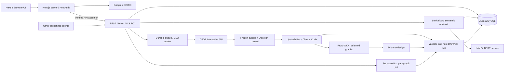

> **Historical plan.** Superseded by the [consolidated v12 plan](design-plan.md). Retained for decision history; not an implementation specification.

# REVEAL Mechanisms — revised design plan

**Revision:** September 24, 2026 · v8 · aligned to the current DAPPER implementation.  
**Flow:** DAPPER Question/KnowledgeGap → DisMech context + required EAGGL anchors → CFDE expansion → Claude Code in Box + selected Proto-OKN evidence → ScientificAccounts / claims → cited Paragraph.  
**History:** [September 24 v7](design-plan-2026-09-24-v7.md), [September 24 v6](design-plan-2026-09-24-v6.md), [September 24 v5](design-plan-2026-09-24-v5.md), [September 24 v4](design-plan-2026-09-24-v4.md), [September 24 v3](design-plan-2026-09-24-v3.md), [September 24 v2](design-plan-2026-09-24-v2.md), [September 15](design-plan-2026-09-15.md).

**What changed in v8:** DAPPER supplies the scientific object model, gap classification/entity context, structured Paragraph citations, and the external citation metadata schema and validators. Those are no longer proposed schema extensions. REVEAL must implement the source adapters, trusted agent-output assembly, persistence, resolvers, and citation rendering against these contracts. The [DAPPER integration audit](dapper-integration.md) records exact fields, verified compatibility, and remaining work. All product, auth, embedding, CFDE, and agent-provider decisions below remain settled.

## 1. Decisions now settled

- **Next.js frontend; independent lightweight backend REST API and worker on AWS EC2.** The backend connects to Aurora MySQL, monitors agent work, and serves any authorized frontend.
- **NextAuth login with ORCID or Google, using JWT sessions and no database adapter.** Authentication needs no NextAuth tables. Small application-owned user/identity-mapping records resolve verified logins to immutable internal user IDs; these own the research data independently of the auth framework. Store available profile/attribution snapshots, with no credentials or sessions in the research database. EC2 verifies trusted server-issued identity assertions.
- **Autosave signed-in drafts; preserve submitted query history.** Drafts, requests, and results use the internal `user_id`. Drafts are editable/versioned; agent requests freeze the submitted revision. A replacement auth integration maps verified identities to the same user IDs without rewriting research ownership or citations.
- **Aurora MySQL is the system of record**, including textual embeddings. `cyaka_reveal_mechanisms` now exists; the GeneSet loader is the first implemented import. Other source and embedding imports remain build steps.
- **DisMech mechanisms provide context; EAGGL factors anchor CFDE.** Every analysis requires at least one selected EAGGL factor. DisMech IDs never enter CFDE anchor payloads.
- **Five EAGGL factors total** are automatically selected from semantic matches across all selected DisMech mechanisms. Deduplicate them; users may delete them. At least one must remain before submission.
- **The lab embedding service** uses `pritamdeka/BioBERT-mnli-snli-scinli-scitail-mednli-stsb` by default. No alternative embedding provider needs selection.
- **One CFDE expansion round** runs against the frozen selected factors, followed by contextual-edge enrichment among retained nodes.
- **Upstash Box runs Claude Code with an Anthropic API key.** Proto-OKN MCP is part of the account-authoring integration, initially using BiomarkerKG and ProKN as selected graphs.
- **Mined claims have a CFDE evidence basis.** The agent may add relevant support, counterevidence, or context from the selected Proto-OKN graphs. A match is not guaranteed for every claim.
- **All advertised `cfde-inc-v2` gene sets get DAPPER GeneSet objects.** CFDE graph nodes resolve through versioned database aliases to those digests, establishing the initial provenance target before membership and original construction history are available.
- **Scientific objects use DAPPER identity digests.** Use DAPPER's KnowledgeGap class and maintain source-to-digest mappings for DisMech in the database. Digest minting is independent of human review.
- **Paragraph generation is a separate agent activity** expressing a saved account and citing durable Claim and KnowledgeGap records.
- **Claims, Questions, and KnowledgeGaps are individually citable scholarly objects.** Store versioned bibliographic metadata with human/AI credit, ORCIDs when available, mint/issue dates, exact DAPPER identifiers, and resolver links. Export BibTeX/BibLaTeX and CSL-JSON; use CSL to render APA/MLA. A DAPPER digest is the citation identifier; a DOI field is reserved for a registered DOI.

## 2. Current implementation and verified evidence

Prepared locally: **18,419 `cfde-inc-v2` factors**, **19,959 DisMech mechanism occurrences**, and **3,367 gap records**: 2,604 `KNOWLEDGE_GAP` plus 763 `HUMAN_MODEL_MISMATCH`. Preserve these source kinds separately. Their 6,422 attachment references include 6,329 uniquely resolved occurrences, 79 whole sections, 4 whole documents, and 10 ambiguous targets.

These DisMech counts come from the local all-KB YAML snapshot, not the public Discussions Browser. The public browser's static dataset has 149 discussions (127 knowledge gaps and 17 human/model mismatches) and matches a checked-in June 13 asset. The September YAML in the browser's disorder/module scope has 4,033 discussions and 2,593 knowledge gaps; our inclusion of groupings adds 18 discussions and 11 knowledge gaps. Keep source scope/version visible in the application. See [the verified reconciliation](../data/dismech-gaps/2026-09-24/browser-reconciliation.json).

The interactive API probes verified eight catalog matches; the supplied two factors returned 63 gene sets and zero genes/traits/factors. Their supplied contextual request returned 15 edges. A separate CADinT2D factor returned genes, and a gene-set anchor returned membership edges under `cfde-inc-v2`. Graph fragments omit anchor nodes; merge them with the original factors before validating endpoints.

The Proto-OKN MCP server initialized successfully and exposed 23 tools. Its catalog includes `biomarkerkg` and `prokn`; both schemas were retrieved. This verifies discovery, not a completed Box-to-MCP agent run or claim-level scientific validation.

The current DAPPER working tree implements Question/KnowledgeGap, `gap_kind`, `about_entities`, ScientificAccount, Paragraph/CitationOccurrence, and the separate `reveal-citation-v1` metadata contract. **287 targeted upstream tests passed** against a captured dependency snapshot. An offline scan covered all 801,934 imported GeneSets; **82 sampled objects and the encoding Activity retain their IDs and pass the current closed schema**. This is a compatibility audit, not a new full revalidation or database migration. The original import dependency and records remain frozen. See [audit evidence and limits](dapper-integration.md#1-audited-dependency-and-results).

The supplied embedding client is now an installable backend module. No authenticated embedding request has been made: the API key is pending. The GeneSet extension has encoded and loaded **801,934 DAPPER GeneSets** and their exact CFDE aliases into `cyaka_reveal_mechanisms` through a resumable importer. Other source collections remain local preparation. No EC2 service was deployed or Box agent launched. The gene-set import manifest and database-load report record encoding and persistence separately.

Supporting artifacts:

- [Interactive CFDE inventory](interactive-api-inventory.md) and [BioIndex inventory](api-discovery.md).
- [Database readiness](database-readiness.md) and [data inventory](data-inventory.md).
- [CFDE → DAPPER GeneSet import](geneset-import.md), including the full catalog, dependency snapshot, script, and database mapping.
- [Embedding module](../services/backend/README.md).
- [Claude Code and Proto-OKN integration](agent-evidence-integration.md).
- [DAPPER integration contract](dapper-integration.md) — implemented schema, source mapping, validation, storage boundaries, and remaining work.
- [DAPPER citation profile](citation-standard.md) — adopted metadata/occurrence contract, human/AI attribution, identifier/date rules, and planned BibTeX/CSL/APA/MLA rendering.
- [Authentication and researcher identity](authentication.md) — Google/ORCID sign-in, database-free auth sessions, persistent research attribution, and the EC2 API trust contract. This integration remains planned.
- [Pinned DAPPER dependency snapshot](../data/cfde-genesets/2026-09-24/dapper/snapshot.json), [earlier working-tree audit](../data/dapper/schema-audit-2026-09-24-v3.json), and [DAPPER claims design](../../dapper/schema/docs/claims.md).

## 3. Core interaction

### Step 1 — pose or select a knowledge gap

The landing page asks **“What would you like to understand?”** A researcher enters a question or browses DisMech gaps by disease/module, text, kind, and status. A selected gap shows its prompt, rationale, source evidence, attachments, and proposed experiments when present. Resolved mechanism attachments become selected DisMech context; phenotype and whole-section attachments retain their actual types. Ambiguous references remain inspectable without an arbitrary target selection.

Allow drafting before login. Offer **Continue with ORCID** and **Continue with Google** through NextAuth, retaining the question/chips through the redirect. Require authentication before saving personal research or submitting an agent/paragraph job. Capture the provider's stable identity plus available name/email/ORCID fields; the backend resolves it to the durable application `user_id` and determines ownership server-side.

Autosave signed-in question/chip/context edits to a versioned draft, initially after a one-second debounce. Show Saved only after database confirmation. Anonymous or temporarily disconnected edits remain local pending successful authenticated save. Query history stores immutable submission snapshots; later draft changes do not alter past runs. Preserve selection origins/dismissals and source revisions so restored drafts retain their meaning. Concurrent-tab version conflicts require reconciliation rather than silent overwrite.

Map the source discussion revision to a **DAPPER KnowledgeGap digest**: prompt → `text`, rationale → `gap_description`, source kind → `gap_kind`, and verified disease/context identifiers → `about_entities`. Preserve detailed attachments, status, experiments, and raw evidence in source records. Four of 3,367 gaps lack a rationale; use the explicitly labeled prompt-preserving fallback in [the adapter contract](dapper-integration.md#2-question-and-dismech-gap-adapter). A free-text inquiry without an explicit missing-knowledge description is a **Question**; use KnowledgeGap when that description is available. User-authored objects retain user provenance and no fabricated DisMech ID. Editing a source question creates derived content; it does not change DisMech or mark the source gap resolved.

Import all statuses: 2,526 OPEN, 3 RESOLVED, and 838 unspecified. Preserve null status. Source lifecycle status and the scientific identity of a question are separate concerns.

### Step 2 — automatically add EAGGL anchors and allow editing

**Confirmed default: five EAGGL factors total across selected DisMech mechanisms.** Add them as selected chips labeled “Added from DisMech similarity.” They are removable defaults, not merely unselected recommendations.

Proposed ranking procedure:

1. Embed each selected DisMech occurrence using a versioned template containing its name, concise description, and disease context. Search the current `cfde-inc-v2` EAGGL corpus with the same embedding model.
2. Score an EAGGL factor by its **maximum cosine similarity** to any selected DisMech mechanism. Keep the matched mechanisms and per-mechanism scores for explanation/provenance. This aggregation is an initial implementation choice to evaluate.
3. Deduplicate by complete factor identity, sort by score, break ties by stable source ID, and preselect the highest five unique factors. Preserve manually selected factors without duplicate chips.
4. Recompute automatic candidates when DisMech selections change while preserving manual selections. Keep a composer-level dismissal set: removing a factor does not immediately re-add it or silently fill the removed slot. An explicit “Reset suggestions” action clears dismissals.

Five is the initial automatic selection count, not the required count after edits. If fewer than five valid matches exist, show those available and the limitation. If no factors are available or semantic search fails, preserve context and offer manual EAGGL search.

**At least one selected, resolvable EAGGL factor is mandatory.** Enforce this in the composer, the analysis-run REST endpoint, and the worker before dispatch. Deleting the last factor is allowed during editing, but blocks submission until one is selected. There is no DisMech-only agent fallback.

Manual search supports keyword/fuzzy and full semantic search over a mechanism subquery separate from the research question. A question with no DisMech context can receive EAGGL suggestions from its own text; the user selects factors before running. Similarity means retrieval relevance, never biological support or cross-source entity equivalence.

Record automatic/manual origin, matching DisMech records, retrieval mode, similarity scores, embedding/model/template versions, input hashes, and user removals. Display full trait/model context for an EAGGL factor so a semantically related factor is not mistaken for the same disease.

### Step 3 — expand CFDE once

Freeze a nonempty seed set **S0 containing only the selected EAGGL factor items**, with valid interactive IDs and `model=cfde-inc-v2`. DisMech mechanisms and their bounded source context accompany the evidence package; no DisMech-to-gene/trait identity mapping is required to anchor CFDE. The bridge is the semantic factor selection above.

Call `/api/interactive/connections` four times against the **same S0**, targeting `gene`, `gene_set`, `trait`, and `factor`. Use the tested parameters: `reducer=mean`, `connection_scope=direct`, `exclude_node_ids=S0`, and empty `context`. Until the upstream meaning of `context` is documented, pass the question separately to the agent.

“One expansion” means one round of four typed queries. Returned candidates never become seeds in the same run. Factor → gene set → gene would be a second round and must not be added silently to compensate for empty gene results.

Merge response fragments with S0. Preserve original edge direction, families, paths, raw/normalized scores, aggregate ranks, and anchor coverage. Scores may exceed 1 and are not probabilities. The API's observed `candidate_count` is the returned count; no unbounded total/cursor was exposed, so a result at its limit may be clipped.

Bound the merged node set, then call `/api/interactive/contextual-edges` once for those IDs. Deduplicate edge occurrences without losing query provenance. Validate endpoints/path nodes and retain clipping decisions. Contextual edges are relationships, not generated explanatory text.

Resolve every retained CFDE `gene_set:` node through the selected complete GeneSet import into a DAPPER GeneSet digest. Retain both IDs, the model/import revision, and membership/construction-provenance coverage. Carry these references into the evidence package; an unknown alias remains explicit rather than receiving an invented ID.

Initial proposed budgets: 10 DisMech context mechanisms, 10 EAGGL factors (five automatic by default), 100 candidates per target, 250 retained nodes, 1,000 edges, and a 24,000-token total evidence context. Preserve selected anchors and required path endpoints. The upstream contextual request-size limit still needs verification.

### Step 4 — freeze inputs; run Claude Code with Proto-OKN tools

The initial evidence package contains the gap digest/source revision, question, selected contexts/factors, selection provenance, frozen CFDE graph, relevant DisMech assertions, source evidence, exact API artifact references, model/source versions, hashes, and coverage limits. Record empty/failed queries distinctly. Pin the schema/identity/authoring-instruction versions.

Create a normal **Upstash Box with the Claude Code harness** and `ANTHROPIC_API_KEY`; pin its Claude model and harness version per run. Configure the Box-local HTTP MCP connection to `https://apps.okn.us/okn-mcp-dev/mcp`. The application worker owns timeouts, retries, progress, cancellation, cleanup, and database writes. Keep database credentials in the EC2 backend. [Upstash configuration](https://upstash.com/docs/box/overall/quickstart).

Initial selected scientific graph allowlist: **`biomarkerkg` and `prokn`**. Read graph schemas before querying; use verified graph URIs, explicit entity cross-references, and species/context constraints. An embedding match does not establish that a CFDE gene symbol and KG entity are identical.

The agent first mines claims from the frozen CFDE evidence, then chooses relevant additional evidence from the selected graphs. It may attach support, disputes, or context. Every newly mined account claim must trace to CFDE evidence directly or through its source claims. Auxiliary source Claims recording Proto-OKN assertions are allowed as evidence without their own CFDE lineage; they must not be promoted into CFDE-grounded findings merely by being included in the bundle. No usable CFDE evidence produces an explicit insufficient-evidence result rather than invented claims.

Every tool call appends to an evidence ledger: tool/arguments, query, selected graph URI/version if exposed, entity mappings, exact returned assertions and qualifiers, source/publication references, timestamp, and content hash. Preserve failures/no matches. Freeze a final manifest for validation/minting; never rewrite the initial bundle. Repeated assertions from shared sources are not independent corroboration.

Initial proposed MCP budget: 20 calls, 100 rows per scientific query, and 5,000 tokens of retained external evidence within the overall context budget. Define a run timeout/cost ceiling. Enforce selected graphs and read-only evidence operations through a tool policy/adapter, not just the prompt: the MCP server exposes a broader federation. A live Box test must verify this configuration and complete tool-result capture.

An external no-match or outage can produce a CFDE-grounded account with explicit enrichment status. It cannot be presented as successful corroboration or evidence of biological absence. See [the integration inventory](agent-evidence-integration.md).

### Step 5 — author ScientificAccounts

Each account uses `question` to reference the submitted Question or KnowledgeGap, required `context`, ordered distinct `component_claims`, optional `hypothesis`, `conclusion_claims` and `closing_remarks`, and required `was_generated_by`/`was_attributed_to`. Conclusions are a subset of component claims, with at least one component outside the conclusion list. Although generic DAPPER accepts hypothesis-only framing, REVEAL always requires its submitted question/gap link. Hypothesis references a Proposition; it is a role, not a confidence category. An account is not a Claim and has no combined confidence score.

Separate source association/loading claims from biological interpretations. A high factor loading is not sufficient to establish causation. Missing evidence may leave the gap unresolved.

Use **EvidenceItem** for interpretation: `source_claims`, `target_proposition`, `direction`, `explanation`, `context`, optional `assumptions`, and attribution/activity. A source-claim evidence use requires the target, direction, explanation, and context. Its target must match the owning Claim's proposition. Preserve disagreements and uncertainty. Optional MechanisticModel/CausalStep structure can elaborate a Proposition; selected mechanism chips are not automatically causal assertions.

The agent returns proposed content and temporary local references in a versioned REVEAL output envelope. The backend supplies trusted source objects, attribution, activities, and citation revisions. Split a multi-account result into one closed provenance document per account for DAPPER's `scientific-account` profile; hydrate existing dependencies before validation. Shared stored objects are reused, not reminted from agent-supplied substitutes.

### Step 6 — validate, mint digests, and persist

Run DAPPER closed-schema, reference/provenance, identity, scientific-content, and citation checks, then REVEAL checks for the frozen question, authorized sources, evidence locators, CFDE lineage, score meanings, and source/model scope. DAPPER checks structure and cycles; it does not establish biological support or prose faithfulness. Inspect each generated assertion against its cited source through a separate recorded grounding check; unresolved outputs remain failed/flagged attempts. Reject new scientific conclusions appearing only in closing prose. See [validation responsibilities](dapper-integration.md#4-agent-output-and-validation-contract).

Mint supported scientific IDs through **DAPPER-ID-1**, using the pinned DAPPER module. The agent does not invent IDs. Use the pinned KnowledgeGap registration with the DisMech mapping adapter. Save the complete object graph, account membership, evidence, and provenance transactionally; retain invalid outputs as failed attempt artifacts with bounded repair.

Accepted, validated outputs become immediately inspectable and digest-addressed. No additional human approval gate is required for minting or Paragraph generation. Review annotations, if introduced later, are separate from identity and evidential support. A digest establishes content identity, not scientific truth.

Register a citation metadata revision for each persisted Claim, Question, and KnowledgeGap using DAPPER's `schema/citations/citation-record.schema.json` and `check_citation_metadata`. Preserve first durable mint/issue dates on replay, ordered human/AI credits and roles, ORCID provenance, and a resolver for the exact digest. Imported source authorship and platform publishing roles stay distinguishable. This registry remains outside the scientific node by design. Bibliographic registration does not change access controls or imply public publication.

Store immutable payload observations separately from scientific identity where DAPPER permits unhashable fields to vary. For example, changing File.location or adding a GeneSet collection backlink leaves its digest unchanged. The existing GeneSet table retains its original payload; a general object store needs append-only payload snapshots, schema/identity pins, and provenance-document references rather than applying the importer's whole-JSON collision rule to all future objects. See [persistence rules](dapper-integration.md#5-persistence-and-identity-boundaries).

Use the authenticated operator's recorded name/ORCID and explicit contribution role for platform attribution, alongside the generating agent. ORCID login authenticates the ORCID account; Google login does not supply an ORCID. Contact email remains private application metadata. Profile changes do not silently alter previously minted scientific objects or citation bylines.

Distinguish original scientific production, ingestion/extraction, user selection, CFDE retrieval, MCP retrieval, agent assessment, validation, and paragraph rendering. Query/agent provenance explains why a claim was mined; it is not automatically evidence that its proposition is true. Operational job/attempt IDs remain distinct from scientific digests.

### Step 7 — inspect accounts and claims

Lead with readable account framing, context, findings, interpretations, and closing. A claim opens its proposition, scope, score meaning, CFDE path, added KG assertions, literature/source references, and provenance. Label added evidence by graph and relationship to the claim. Show missing coverage, enrichment errors, generated status, and scientific support separately.

Each Claim/Question/KnowledgeGap inspector includes **Cite**: APA, MLA, BibTeX, BibLaTeX, CSL-JSON, and permanent link. The citation identifies the exact object and exposes the human/AI byline, roles, source attribution, and underlying evidence. Formatting and object review status remain separate.

### Step 8 — generate a cited Paragraph

“Generate paragraph” submits the **saved account digest**, optional focus claim, and presentation preferences to a second Box/Claude Code activity. When started from a claim, retain its containing account; a claim shared by several accounts needs an explicit account context.

Render framing → context → findings → optional closing from the account and its saved evidence. Do not perform fresh KG research or silently strengthen/add claims. A substantive addition requires a new account/evidence revision.

Have the agent return authored text segments with explicit allowed target/revision pairs. Use DAPPER's `assemble_cited_text` to calculate `Paragraph.text` and `citations`. Each CitationOccurrence has `target_id`, `citation_metadata_revision`, inclusive `start`, exclusive `end`, and optional `exact_text`; offsets count Unicode code points, not JavaScript UTF-16 units. Freeze text after anchoring. The backend supplies the separate paragraph activity and saved `scientific_account` digest.

Validate local target classes/spans and call `check_citation_registry_links` against exact stored metadata revisions. Allowed targets include the framing Question/KnowledgeGap, account Claims, and explicitly selected prior Claims from the saved evidence context; a prior citation does not change account membership. Questions/gaps provide framing, not support for an answer. The resolver returns the exact object and its evidence lineage. Citation changes, including metadata revision pins, change Paragraph identity; metadata edits alone leave existing paragraphs pinned to their earlier revisions.

Render the complete ordered citation set through a pinned CSL processor/style/locale. BibTeX and CSL-JSON are sibling exports of structured metadata. Store numbering/author-date markers and bibliographies in separate rendered artifacts, outside the saved Paragraph text. Changing style needs neither a new agent run nor a new Paragraph digest. See the [citation profile](citation-standard.md) for mappings and examples.

## 4. Backend architecture and deployment



Use a lightweight **Python/FastAPI API and independent worker process on EC2**. The graph backend is the lab API; REVEAL still owns source/search records, jobs, agent lifecycle, validation, persistence, and citation resolution. Next.js initially uses authenticated same-origin server routes to proxy the REST/progress calls. Other clients can use the same independently deployed API with an approved authentication integration.

Initially one EC2 instance can host API and worker services. Use a MySQL-backed durable job queue with transactional claiming, leases/heartbeats, idempotency keys, and per-attempt records. Persist Box/run IDs before monitoring; after process restarts, reconcile existing executions before launching duplicate paid work. Browser disconnects do not cancel runs. Cancellation and late results use guarded state transitions so an old attempt cannot overwrite a newer result.

Keep progress events with sequence IDs; expose polling and server-sent events with reconnect support. Put large immutable evidence/tool artifacts in durable storage (proposed S3), with hashes/locations in MySQL. Configure HTTPS, API access control/CORS for authorized frontends, RDS network access, secret configuration, and stage/timeout/cost monitoring. EC2 size/image/network and operational settings remain deployment details.

Proposed layout:

```text
apps/frontend/                     Next.js composer, account/claim/paragraph views
services/backend/src/reveal_backend/ REST, retrieval, adapters, repositories
services/backend/.../worker/         CFDE/Box jobs, monitoring, validation
packages/contracts/                 Versioned API and evidence-bundle contracts
agent-skills/                       Account-authoring / paragraph instructions
schema/migrations/                  MySQL migrations
scripts/                            Ingestion and audits
data/                               Development fixtures and manifests
docs/                               Design and integration inventories
```

Only the embedding component is currently implemented under `services/backend`.

### Login, ownership, and attribution

Use NextAuth/Auth.js with `session.strategy="jwt"` and no database adapter. Google uses the built-in provider; ORCID uses a custom OpenID Connect authorization-code configuration verified against its discovery/profile contract. Register provider applications and callback URLs during implementation. The [authentication design](authentication.md) records official provider documentation and acceptance checks.

Resolve validated provider issuer/subject through `login_identities` to an immutable `app_users.user_id` UUID. Store that application ID on drafts and submitted requests, with run/result links and attribution snapshots. The mapping contains identifiers and verification provenance, not passwords, OAuth tokens, client secrets, or sessions. This replaces v6's provider-derived owner keys so ownership remains independent of the auth strategy. Email/display names are attributes, not ownership keys; ORCID email may be absent and Google does not supply an ORCID iD. Multiple verified identities can map to one user when explicitly linked; names/emails never merge histories automatically.

The Next.js server validates its session and issues a separate short-lived signed assertion for EC2 with the verified external identity, trusted gateway issuer, API audience, expiry, and necessary claims. EC2 validates it, resolves the external identity to its internal user ID, and enforces per-resource authorization for draft/history access, progress, mutation, cancellation, and paragraph generation. Do not treat the Auth.js encrypted cookie or a browser-supplied identity as this API credential. Worker jobs retain their initiating actor even after logout.

Citation credits snapshot the actual human operator/publisher identity and verified or supplied ORCID status. Preserve source authorship; keep email private and separate from public bibliography fields. Additional frontends require the equivalent trusted authentication flow rather than being implicitly trusted because they use the API.

### Drafts, query history, and database portability

Persist `research_drafts(owner_user_id, version, composer_payload, timestamps)` and immutable `research_requests(owner_user_id, source_draft_id, source_draft_version, submitted_payload, attribution_snapshot, submitted_at)`. The payload retains the question, selected gap/source revision, mechanism/factor selections and origins, dismissals, subquery, CFDE model, selected KGs, and composer settings. Autosaving alone never expands CFDE or launches an agent.

Serialize saves per draft and use expected-version updates with explicit conflicts. Keep pending edits bound to the original user through expiry/account switches. Submission verifies the saved draft revision, freezes its exact payload, and queues an idempotent run transactionally. Missing/failed save confirmation is visible; a close/reload before a successful server save cannot be presented as guaranteed recovery. See [the draft contract](authentication.md#7-draft-autosave-and-query-history).

For a database handoff, preserve internal user IDs, external identity mappings, drafts, requests, scientific objects, and provenance. A colleague can replace NextAuth while retaining those records and owner foreign keys. The new trusted integration resolves the same verified issuer/subject or uses an explicit verified migration mapping when subject namespaces change. Old sessions/signing/provider secrets are deployment state and are not required in the research database export. A change of auth framework does not itself prove two differently named external identities are the same person.

### Embedding and search contract

Service: `https://embedding-service-27386110942.us-east1.run.app`; `POST /embed`; authentication `X-API-Key`; provider `huggingface`; default model `pritamdeka/BioBERT-mnli-snli-scinli-scitail-mednli-stsb`. The module reads the pending key from `EMBEDDING_SERVICE_API_KEY`. See [module usage and supplied wire contract](../services/backend/README.md).

Store versioned input text/templates/hashes, source revisions, model/provider, dimensions, normalization, and float32 vectors in MySQL. Build a reproducible backend vector matrix/index; benchmark exact cosine initially before selecting approximate search. MySQL native vector indexing is not established by the audit. Lexical/fuzzy and semantic searches retrieve independently; semantic search is not confined to a lexical shortlist.

The [model card](https://huggingface.co/pritamdeka/BioBERT-mnli-snli-scinli-scitail-mednli-stsb) reports 768 dimensions and `max_seq_length=100`. Confirm the service's loaded configuration, model revision, pooling, and truncation with the live key. Long EAGGL labels need intentional concise templates or documented chunk aggregation. Store effective input/version so truncation or model changes cannot silently mix incompatible retrieval artifacts.

### GeneSet inventory and provenance boundary

The first import enumerates **801,934** gene-set keys from `pigean-gene-set/2` for `cfde-inc-v2`. It does not use truncated factor top lists or source summaries as the complete universe. Each object has a computed DAPPER GeneSet ID, readable name, exact term/source aliases, `member_type=gene`, a namespace where unambiguous, and the separate encoding activity. See [the importer and data contract](geneset-import.md).

The database stores immutable DAPPER objects, import manifests, and `(model, exact CFDE node ID, import revision) → DAPPER ID` mappings. Evidence packages, source result claims, and the claim inspector use these references immediately. Original creation provenance, members, assay/data type, organism, genome build, and gene counts are enriched only from verified sources; missing fields are not populated from example defaults or inferred from association scores.

Keep initial IDs and source snapshots. An enriched object receives the digest determined by its new hashable content and an explicit new alias/import revision. This allows the application to trace evidence to a stable GeneSet now and later follow its scientific construction history without rewriting historical claims.

## 5. DAPPER integration baseline

The [September 24 v8 audit](dapper-integration.md) captures the current schema, identity code, validators, examples, and targeted tests. The base commit remains `ebfc471049240c23d6ce1d3d40cd2785b35e6443` with uncommitted changes, so the commit alone is not a sufficient pin. Root-schema checksum: `219769c9874a3c0a7d6972360d5847a8b344e412a8b9f4e2648f059682440345`. Pin the full dependency manifest as well as `DAPPER-ID-1`; promote a committed/package version before deployment. The sibling repository and existing database import were not modified by this audit.

### Scientific and communication contracts now implemented in DAPPER

- **Question / KnowledgeGap:** required inquiry `text`; optional `scope` and URI/CURIE `about_entities`; KnowledgeGap adds required `gap_description` and optional `gap_kind` (`KNOWLEDGE_GAP` or `HUMAN_MODEL_MISMATCH`). Status is separate source/application metadata.
- **Proposition / Claim / ClaimScore:** distinguish scientific content from its attributed assessment and typed quantitative values. Claim requires a Proposition, generating Activity, and attribution. Loading and retrieval scores are not probabilities. Hypothesis is an account role referencing a Proposition, not a separate class.
- **EvidenceItem:** source Claims bearing on a target Proposition, direction, explanation, context, optional assumptions, and provenance. Reference-only literature evidence is also supported; REVEAL requires locatable, authorized sources and explicit interpretation for generated assessments.
- **ScientificAccount:** typed question/hypothesis framing, context, ordered component/conclusion Claims, optional MechanisticModel and editorial closing, and required activity/attribution. REVEAL always carries the submitted question/gap.
- **Paragraph / CitationOccurrence:** separate textual expression with typed account link and ordered inline citation values. Exact targets, positive metadata revisions, Unicode code-point spans, and optional text checks participate in Paragraph identity.
- **Citation metadata:** DAPPER supplies an external JSON Schema plus metadata/link validators, including ordered role-bearing human/AI credit and observed date rules. These records intentionally have no independent DAPPER node digest and do not hash back into the cited target.
- **GeneSet / GeneSetCollection / File:** one GeneSet per named set; collections represent libraries, files represent bytes. `in_gmt_file` and `gmt_entry` form a paired row selector. Collection `members` is complete when supplied; the inverse `in_gene_set_collection` is unhashable and avoids cycles.

Reuse `compute_id`, `assign_ids`, `verify`, the closed-schema provenance linter, `check_scientific_content`, `assemble_cited_text`, `check_citation_metadata`, and `check_citation_registry_links`. The exact file/function references and limits are in the integration contract. There is no remaining requirement to invent Question, gap classification, a citation class, or a new digest algorithm.

### DisMech conversion and identity

Implement the field mapping in Step 1, including the four source-rationale fallbacks. The database maps `(repository, source document, discussion_id, observed snapshot/hash)` to the DAPPER object and exact adapter version. Preserve original discussions, source commit/file hashes, attachment resolution, evidence, and import observations. Lifecycle status is not an answer or a scientific assertion.

Keep mutable source observations separate from the hashable semantic projection used to mint a gap. Hashing the whole repository snapshot or a batch-specific import activity into every gap would change its identity on status-only or unrelated source edits. Use a stable, versioned projection/recording activity and preserve each full observation in the source mapping. Genuine changes to gap text, classification, scope, attribution, or entity context can change identity under DAPPER's actual rules.

Resolve external CURIEs through a pinned prefix map before minting new objects; use a consistent stored representation. Do not retroactively expand or rewrite historic GeneSet payloads. Changed literal external references can change DAPPER IDs even when they denote equivalent entities. Opaque CFDE aliases remain aliases, not ontology identifiers.

### GeneSet compatibility and future enrichment

The current schema adds unhashable GMT row/file locators absent from the existing catalog records; they can change without reminting the named GeneSet. The sampled IDs remain stable; no reimport is indicated by this audit. Membership, source GMT bytes/row keys, and original scientific construction history still require verified source data. Enrichment produces new identities when hashable content changes; all historical aliases stay pinned to their original imports.

Collection backlinks, GMT row/file locators, and file locations are unhashable observations and need the payload-snapshot handling described above. Do not create one GeneSetCollection listing the whole 801,934-set catalog: DAPPER-ID-1 limits each object to 10,000 canonical triples. Keep the catalog in its existing manifest/alias tables; use real source libraries with complete membership only when known and within that limit, or omit their full member list and retain verified inverse links. Never label an arbitrary partial list as a complete collection.

## 6. Application contracts and failure behavior

Proposed REST surface:

- `GET /v1/me` — caller's resolved internal user ID and available profile/verification fields; no client-selected owner ID.
- `GET/POST /v1/drafts`, `GET/PATCH /v1/drafts/{id}` — owned draft listing/creation/recovery and version-checked autosave; `expected_version` required for updates, `409 Conflict` for stale revisions.
- `GET /v1/research-requests` — immutable submitted query history owned by the resolved user.
- `GET /v1/analysis-runs` — caller-authorized research history, filtered by persisted stable ownership.
- GET /v1/knowledge-gaps/search -- send free text and get knowledge gaps back
- `GET /v1/knowledge-gaps` and `/{id}` — source kind/status/disease/search, mapping and immutable content.
- `POST /v1/mechanisms/suggest` — gap/question, selected DisMech revisions, dismissals, source/model filters, subquery/mode; returns top-five automatic EAGGL selection provenance.
- `GET /v1/mechanisms/{id}` — source context, API aliases and embedding/source versions.
- `POST /v1/analysis-runs` — owned saved draft ID/version plus permitted run budgets and idempotency key; atomically freezes its question/context/selections into a request and queues the run. Validate nonempty EAGGL anchors, source/model scope, and selection provenance from that frozen snapshot; return request/run IDs.
- `GET /v1/analysis-runs/{id}` and `/events`; `POST /v1/analysis-runs/{id}/cancel` — durable state, reconnectable progress and cancellation.
- `GET /v1/accounts/{id}`, `/v1/claims/{id}` — digest-addressed content and provenance.
- `GET /v1/citations/{id}` — native bibliographic metadata and exact object resolver; optional `format=bibtex|biblatex|csl-json|apa|mla`, metadata `revision`, and `locale` for a single-item export.
- `POST /v1/citations/render` — ordered citation occurrences, target/metadata revisions, style, and locale; returns contextual in-text labels, bibliography, and rendering manifest.
- `GET /v1/gene-sets/{dapper_id}` — immutable GeneSet payload, source aliases/import revision, and provenance coverage; CFDE adapters resolve exact aliases against a pinned complete import internally.
- `POST /v1/accounts/{id}/paragraph-runs` — saved account digest, focus claim, presentation preferences.
- `GET /v1/paragraphs/{id}` — text, account reference, citations and generation provenance.

Required explicit states:

- **Missing/expired login or unauthorized ownership:** reject protected operations; retain the draft for sign-in. A signed-in user cannot access another user's private results. Missing ORCID email is a supported profile state.
- **Autosave failure or stale draft revision:** retain pending edits, show unsaved/conflict state, and prevent a stale submission from silently replacing the visible question. Account switches never replay another user's pending saves.
- **Zero EAGGL anchors:** block API/worker dispatch, retain editable context and offer factor search.
- **No usable CFDE evidence:** insufficient-evidence outcome, no fabricated scientific claims or Proto-OKN-only fallback.
- **Partial/empty CFDE responses:** retain target-specific coverage; failures differ from valid empties and neither implies biological refutation.
- **Ambiguous DisMech attachments:** preserve the raw reference and ambiguity; never pick the first name match silently.
- **KG no-match/unavailable:** persist enrichment status and any CFDE-grounded account; never label missing corroboration as support.
- **Invalid agent/citation output:** bounded repair or failed attempt, with raw artifact retained separately from saved scientific objects.
- **Retry/cancellation/restart:** leases, idempotent stage writes, stored Box IDs, terminal-state guards and replayable event history.

## 7. Remaining work and specification details

**No core DAPPER class is missing for the agreed first version.** The audit leaves the following application work, with defaults in [the integration contract](dapper-integration.md#7-remaining-work-and-optional-upstream-improvements):

1. **Source adapters and grounded claims:** implement DisMech → Question/KnowledgeGap and CFDE/Proto-OKN → source Claims/EvidenceItems. Specify exact source locators, verified entity crosswalks, score interpretations, source-only versus mined-claim roles, and the four missing-rationale fallbacks. DAPPER cannot determine that a source actually supports the generated prose.
2. **Agent output and validation:** version the output envelope and authoring instructions; hydrate pinned existing objects, validate one account document at a time, enforce CFDE ancestry and authorized evidence, and define bounded repair plus a recorded grounding/paragraph-faithfulness check. Do not treat the upstream fictional PIGEAN example as a real metric contract.
3. **Durable object/provenance storage:** add schema pins, immutable document/edge captures, payload observations for unhashable changes, run-to-object links, and independent ownership/access grants. Freeze first-mint events and citation revisions transactionally. Preserve existing GeneSet IDs and payloads.
4. **Citation service:** persist DAPPER's now-defined registry records and implement exact-revision resolution, BibTeX/BibLaTeX/CSL export and APA/MLA rendering. Choose the resolver domain and pin processor/styles/locales. No new citation schema or readable accession is required for v1.
5. **Operational completion:** the embedding key and effective model configuration; CFDE request limits/build/score semantics; a real Box/MCP test with complete tool-output capture, selected-graph enforcement and budgets; and EC2/network/storage/auth-client/secret/monitoring configuration. Providers, model family, login strategy, backend/frontend split, and the one-round flow are settled.

Optional DAPPER improvements are a validator profile for standalone inquiry documents, a multi-account wrapper, and a first-class software-agent node if needed for richer export. The current application can validate inquiry nodes directly, package accounts individually, and record software through Activity/AgenticWorkspace plus the citation byline; these are not schema blockers.

Product defaults to evaluate: up to three accounts per gap; maximum-per-mechanism similarity ranking for the confirmed five total factors; default visibility of unspecified-status gaps. Graph embeddings and user-requested later CFDE expansion remain future options. Proto-OKN enrichment is in the current integration scope.

## 8. Implementation sequence and acceptance

**A — schema and database foundation:** the full GeneSet catalog is encoded through pinned DAPPER and loaded using versioned aliases/import provenance. Continue with application-owned users/identity mappings, versioned drafts and immutable query history, DisMech Question/KnowledgeGap conversion, the defined citation registry, general DAPPER payload/provenance storage, other source imports, and embedding/search projections. Preserve GeneSet digests as evidence targets while scientific creation provenance is added in later revisions.

**B — login, composer, and CFDE retrieval:** implement ORCID/Google NextAuth login, authenticated API forwarding and user resolution, durable owner/attribution snapshots, draft autosave/recovery/conflict handling, query history, gap browsing, automatic top-five EAGGL selections/removals, nonempty-anchor gates, one frozen expansion round, merging/bounding/contextual edges, and evidence packages.

**C — account authoring:** integrate Claude Code in Box, selected-graph MCP evidence capture, validation, DAPPER minting, transactional persistence, and account/claim inspection.

**D — paragraphs and citations:** implement the second Box activity, account-digest pinning, structured citation registry/resolver, human/AI attribution and date rules, BibTeX/CSL export, APA/MLA rendering, scope-faithfulness validation, and Paragraph identity. Bibliographic metadata registration belongs alongside object persistence in the foundation phase.

**E — deploy and evaluate:** deploy API/worker on EC2, connect Next.js, verify restart/retry/cancel behavior and independent clients; evaluate retrieval, evidence traceability, KG annotation, generated claims, and paragraph faithfulness.

Acceptance cases:

- ORCID and Google logins work with JWT sessions and no NextAuth adapter tables. Missing email/name fields are supported; repeated provider logins preserve ownership despite profile changes.
- Draft questions/chips survive login. EC2 rejects invalid API assertions and unauthorized access; client session updates cannot replace verified identity. Agent jobs and citation attribution remain traceable after logout.
- Google and ORCID identities do not silently merge; any later account linking proves both accounts and persists its mapping. Public citation exports omit contact email and retain actual ORCID verification provenance.
- Saved drafts recover across devices under the same internal user ID. Two-tab edits, lost save acknowledgements, expiry/account switches, and duplicate submissions preserve ownership and expose conflicts without losing submitted history.
- Replacing the authentication implementation preserves user IDs, draft/query ownership, scientific objects, and historical citation snapshots through verified identity mappings; the database contains no login credentials or sessions.
- Every advertised `cfde-inc-v2` GeneSet key has a schema-valid DAPPER object and exact source/model alias. Only complete imports serve evidence lookup. Hashable-content conflicts fail; permitted unhashable changes append payload observations without overwriting the original import.
- Unknown assay/species/build/member counts remain absent. Import activity is never represented as original scientific creation. Later enrichment creates new digests/mapping revisions while earlier citations remain resolvable.
- The supplied AIP gap retains its three mechanisms and one phenotype and maps to a DAPPER KnowledgeGap with kind and verified disease context. The four missing-rationale cases use the labeled fallback; a free inquiry can remain a Question. Status-only and unrelated source edits preserve scientific identity, while semantic/attribution changes follow DAPPER hashability.
- Multiple DisMech mechanisms add **five unique EAGGL factors total**; removal persists; zero selected factors blocks frontend/API/worker dispatch.
- Every CFDE anchor is an EAGGL factor; semantic associations never become biological identity/support assertions.
- The observed 63-node gene-set fragment merges with the two anchors; empty target responses stay explicit. No returned candidate triggers an unrequested second expansion.
- Scores above 1 and raw/normalized differences remain retrieval data, not scientific confidence.
- Each newly mined account claim traces to CFDE evidence; source-only Proto-OKN Claims are explicitly distinguished. Proto-OKN annotations reference selected graphs, exact assertions and query/results; no-match states do not fabricate evidence.
- One-finding accounts validate; conclusions cannot exhaust all components; every REVEAL account retains its submitted question. Multi-account results validate as separate complete provenance documents. Explicit EvidenceItems describe interpretations; each activity and referenced artifact has traceable provenance.
- ScientificAccount, Paragraph, Claim and KnowledgeGap digests use the pinned DAPPER identity implementation, independent of human approval status.
- Paragraph citations resolve immutable Claim/Question/KnowledgeGap content and exact bibliographic revisions; Unicode/emoji spans, repeated targets and coincident citations validate. A missing pinned revision never falls back to latest. Unsupported citations or new scientific assertions fail the separate grounding/faithfulness checks.
- Every citable object can export BibTeX/CSL metadata and APA/MLA references. Human/AI roles, source attribution, available ORCIDs, first-mint dates, and exact digests remain traceable. No digest or source-paper DOI is exported as the object's registered DOI.
- Reimports preserve issue dates and metadata history; formatting does not alter scientific identity. Citations introduce no digest cycle. Document-level rendering handles repeated and same-author/year citations consistently.
- Retries do not duplicate accepted content or paid Box work unnecessarily; cancellation and EC2 restarts preserve observable state.
- File relocation, GeneSet collection backlinks/GMT row locators, and activity timestamps can yield new payload observations under the same digest; historical evidence packages retain their exact snapshots. Object ownership is authorized through run/user grants, independent of global digest deduplication.
- DAPPER dependency upgrades replay identity/schema fixtures and preserve historical pins. Large source collections respect the 10,000-triple identity limit; the full catalog remains an import manifest, not a fabricated giant GeneSetCollection.
