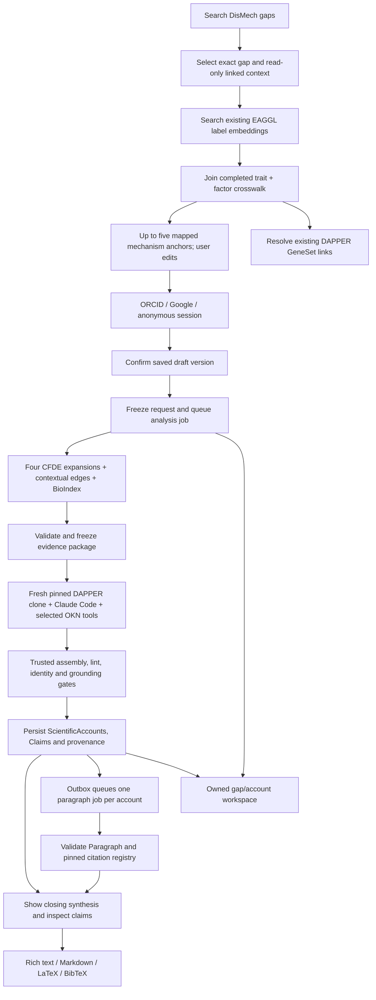

# REVEAL Mechanisms — consolidated design plan

**Revision v12.1 · September 25, 2026 · implementation handoff.** This is the current product and architecture plan. Earlier numbered plans are historical; the [document map and audit](design-package-audit.md) records what superseded them. This revision adopts the populated EAGGL→CFDE crosswalk as the initial application retrieval path. It updates the design and API documentation without deploying the application.

**Purpose:** help researchers investigate existing DisMech knowledge gaps using genetic mechanisms, captured CFDE evidence and selected Proto-OKN knowledge graphs. A completed analysis produces assessed scientific accounts; it does not itself establish that a knowledge gap has closed.

## 1. Start here

| Read / inspect | Authority and use |
|---|---|
| This plan | Current product behavior, architecture, stage boundaries and implementation order |
| [OpenAPI and handoff](../api/README.md), [JSON](../api/openapi.json), [viewer](../api/index.html), [interactive endpoint flow](../api/flow.html) | Version 0.2.0-draft request/response schemas, examples, errors and transport rules; proposed service, not a deployed API |
| [Approved HTML design](../design/index.html), [design guide](../design/README.md) | Visual behavior. `prototype.html`, `account-view.js/css`, `workspace-view.js/css`, `polish.css` are source; HTML is simulation |
| [Import and storage audit](design-package-audit.md#2-imports-and-database) | What is actually loaded, what is prepared and what needs implementation |
| [EAGGL→CFDE links](eaggl-cfde-links.md) | Loaded routing tables, lookup helper, GeneSet joins and replaceable mapping runs |
| [Evidence-package design](evidence-package.md), [builder](evidence-package-builder.md), [schema](../schema/README.md) | Agent input semantics, deterministic collection/replay, LinkML and generated JSON Schema |
| [Account construction](scientific-account-construction.md), [PIGEAN/EAGGL templates](pigean-claim-model.md) | Scientific authoring rules; retain these specialist documents rather than duplicating them |
| [Account skill](../services/backend/agent-skills/construct-scientific-account/SKILL.md), [linter/startup](scientific-account-linting.md) | Installed research-agent instructions and trusted validation boundary |
| [Implementation checklist](implementation-handoff.md) | Ordered work, acceptance tests and remaining integration gates for the next session |

Precedence: this plan resolves product/history conflicts; OpenAPI owns public wire shapes; the evidence LinkML schema owns package shape; the pinned DAPPER implementation owns scientific classes and identity. If these disagree, repair the contract and its examples before implementing a workaround. Runtime gates described here remain necessary even when JSON Schema accepts a payload.

## 2. Settled decisions

- Next.js frontend; independently deployed Python/FastAPI REST API and worker on AWS EC2; Aurora MySQL is the system of record. Other authorized frontends use the same API.
- Search selects **imported DisMech KnowledgeGaps only**. Free text is a lookup query, never a submitted scientific Question. Preserve exact source text and revision.
- Linked DisMech mechanisms are source-owned, read-only context. Users edit **Mechanism anchors**. Initially these come from the embedded EAGGL corpus joined to its populated CFDE crosswalk. An EAGGL factor **is a mechanism**; no separate equivalence Claim is required.
- Suggest five EAGGL mechanisms **total**, deduplicated across linked mechanisms, ranked by maximum cosine similarity then stable full ID. Preserve manual choices/dismissals. One to ten valid anchors are required for analysis; deleting all is allowed while editing.
- `cfde-inc-v2` is the expansion model. Use the completed crosswalk's **exact trait + factor number** rule for application routing, ignoring label and gene differences. Its 1,756 mapped factors are sufficient to build the first application. Biological agreement, a complete crosswalk and a newly embedded 18,419-factor corpus are not prerequisites. Preserve the source import and mapping run so the data can be replaced later.
- Lab embeddings use `pritamdeka/BioBERT-mnli-snli-scinli-scitail-mednli-stsb`; store versioned text, hashes, model/revision/template and vectors in MySQL. Start with exact cosine over a reproducible in-memory index.
- Four direct CFDE expansions use the **same frozen seed set**, then one contextual-edge query among retained nodes. Returned factors never become new seeds. BioIndex supplies the underlying result observations.
- Claude Code in Upstash Box uses an Anthropic key and a fresh verified DAPPER release clone on every new attempt. Proto-OKN enrichment is limited to selected `biomarkerkg` and `prokn` graphs.
- Each account answers the exact selected gap through one or more Claims and a closing synthesis. Each Claim assesses one Proposition. Evidence observations and biological assessments remain distinct.
- Research results, Claims, KnowledgeGaps, Mechanisms, GeneSets and Paragraphs use DAPPER. Jobs, users, source aliases, selections, search rankings and transport envelopes are application records.
- Submit-time ORCID / Google / anonymous continuation; NextAuth JWT sessions without adapter tables. Stable application ownership is independent of provider credentials and scientific authorship.
- Each accepted account automatically queues a separate cited-Paragraph job. Conclusions remain usable if paragraph generation is pending or fails.
- Account/claim inspection, Word-compatible rich-text copy, Markdown, LaTeX and BibTeX exports, plus a personal gap/account dashboard follow the approved prototype.

## 3. What exists today

**Recorded Aurora state:** **14 applied tables**. The earlier read-only [September 25 audit](../data/audit/2026-09-25-consolidation/database.json) captured the original 11: **801,934 GeneSets**, 801,934 aliases, one encoding Activity, **4,037 legacy EAGGL factors**, 18,477 genes, 2,553,330 nonzero weights, 5,682 hierarchy nodes, 8,535 edges and **3,103 BioBERT vectors of 768 dimensions**. The subsequent [crosswalk load](../data/eaggl-cfde-mapping/2026-09-25/database-load.json) and [verification](../data/eaggl-cfde-mapping/2026-09-25/database-verification.json) record three additional tables, **1,756 factor mappings**, **4,056 resolved GeneSet links** to 3,733 distinct existing objects, and **2,281 unmatched factors**. No database mutation was performed for this plan revision.

**Prepared but not loaded into Aurora:** nine DisMech tables, validated importer and 148,039 source rows: 3,361 documents, 19,959 mechanisms, 37,149 causal edges, 1,025 hypotheses, 21,382 ontology terms, 54,690 vocabulary rows, 4,051 discussions and 6,422 attachments. Discussions include 2,604 `KNOWLEDGE_GAP` plus 763 `HUMAN_MODEL_MISMATCH`. The public browser's older 127-gap count has a different source version/scope; see [reconciliation](../data/dismech-gaps/2026-09-24/browser-reconciliation.json).

**Initial searchable anchors:** reuse the existing label embeddings and restrict selectable results to the **1,756 factors with completed CFDE mappings**. The full 18,419-factor `cfde-inc-v2` inventory remains available for future coverage expansion. The crosswalk stores CFDE payloads for matched factors; a full new factor import/re-embedding is unnecessary for the first build. The suggestion service and shared DAPPER projection adapter still need wiring.

**Implemented components:** embedding client and database-backed cosine search; GeneSet/EAGGL/DisMech importers; EAGGL→CFDE mapping loader and lookup; deterministic evidence collector/builder; package LinkML/JSON schema and validation; pinned release bootstrap; research-account skill; shared account linter/final validator. A captured package was collected through 11 successful API requests and replayed byte-for-byte offline. These are callable components, not a running REST service or Box worker.

**Design assets:** validated DAPPER/OpenAPI examples, HTML simulation, 12-claim CAD account, cited Paragraph and export examples. Its numerical observations are captured; KG/membership assertions are explicitly illustrative. The separate HuBMAP provenance example is not evidence for that account.

**Not built:** Next.js application, FastAPI routes, trusted auth gateway, application storage/queue, source-to-DAPPER registry, crosswalk-backed suggestion service, Box/MCP integration, citation service, paragraph agent skill and deployment. No paid agent run or end-to-end production validation is claimed.

## 4. User journey → endpoints → schemas → implementation assets

Names below are OpenAPI components unless a schema file is linked. Every operation has paired examples in [the exchange library](../api/examples/exchanges.json).

| Stage / approved UI | Input → endpoint → output | Implementation assets and persistence |
|---|---|---|
| **Discover.** One compact rounded box; typing hides trending entries; idle questions animate without becoming input. Results show source questions. | Lookup `q` → `GET /v1/knowledge-gaps/search` → `GapSearchResults`; browse `GET /v1/knowledge-gaps` → `GapList`. Default fuzzy/DisMech. | [DisMech importer](../scripts/import_dismech.py), [source inventory](data-inventory.md), `DismechDiscussion` in [Prisma](../schema/prisma/schema.prisma). Add source-to-DAPPER/search projection. Initial homepage is curated with exact public-account counts; no fake live popularity. |
| **Select.** Same page renders the exact gap; rationale/experiments and Linked DisMech mechanisms are disclosures. | DAPPER gap ID + source revision → `GET /v1/knowledge-gaps/{gap_id}` → `GapRecord`: KnowledgeGap, source observation, attachments, raw source detail, count metadata. | [Gap projection rules](dapper-integration.md#2-question-and-dismech-gap-adapter). Four missing rationales use the documented verbatim-prompt fallback. Preserve null statuses and ambiguous/non-mechanism attachments. |
| **Choose mechanism anchors.** Editable chips; linked DisMech list cannot be unpinned. | `SuggestInput` with `SelectedGap` → `POST /v1/mechanisms/suggest` → `Suggestions`; manual `GET /v1/mechanisms/search` / `/{source_id}` → Mechanism records. | [Existing embedding search](eaggl-factor-import.md#search-on-demand) → [completed crosswalk](eaggl-cfde-links.md#application-lookup) → native CFDE alias + shared DAPPER Mechanism/catalog File. Rank mapped candidates before selecting five; retain EAGGL labels for display. |
| **Continue.** “Let's close this gap” / up arrow offers ORCID, Google or anonymous only when no session exists. Avatar is always available. | [Gateway contract](gateway-contract.md) establishes trusted session; `GET /v1/me` → `Me` with `principal_kind`. | [Authentication](authentication.md). Provider/session secrets stay outside research DB; application UUID and verified issuer/subject mapping own work. Anonymous access requires a valid session, not a client flag. |
| **Save.** Before session, local edits only; afterward debounce one second and show Saved only on confirmation. | `DraftCreate` → `POST /v1/drafts` → `Draft`; `DraftPatch(expected_version, composer)` → `PATCH /v1/drafts/{id}`. `GET` detail/list recovers confirmed work. | `Composer` accepts selected gap, EAGGL selections, dismissals, subquery, model and KGs; no client-authored inquiry/DisMech links. Add versioned draft storage; idempotency before compare-and-swap on replay. |
| **Submit.** Freeze saved selection. | `AnalysisJobInput` → `POST /v1/jobs` → 202 `Job`. | Freeze source context, selected mapping run/bindings and resolved native IDs, exact saved version, actor and budgets; insert `ResearchRequest` + job/outbox transactionally. Reject zero anchors, unavailable source revision, missing routing record, wrong model and forged gap input. Label/gene disagreement is not a rejection condition. |
| **Prepare evidence.** Question contracts upward; anchor chips remain. One active spinner and horizontal indicator; counts distinguish retrieved/retained. | Worker invokes collector with exact DisMech ID, factor IDs and frozen source adapters. `GET /v1/jobs/{id}` / `/events` → `Job` / `JobEvent`. Inspection: `GET /v1/jobs/{id}/evidence-package` → `EvidencePackageResult`. | [Builder CLI](../scripts/build_evidence_package.py), [collector](../services/backend/src/reveal_backend/evidence_collector.py), [pure builder](../services/backend/src/reveal_backend/evidence_package.py), [LinkML](../schema/evidence-package.yaml), [JSON schema](../schema/evidence-package.schema.json). Store package/source bytes and hashes; validate before handoff. |
| **Research agent.** Observable messages, tool names/arguments/results stream in a simple panel; Stop requests cancellation. | Same sequenced `/events`; `POST /v1/jobs/{id}/cancel` → authoritative current state. Worker output is one complete DAPPER document per account, plus attempt artifacts. | [Startup script](../scripts/start_research_agent.py), [release lock](../services/backend/agent-runtime/dapper-release.json), [skill](../services/backend/agent-skills/construct-scientific-account/SKILL.md), [MCP integration](agent-evidence-integration.md). Append-only full tool ledger; no private reasoning in telemetry. |
| **Accept accounts.** On completion activity collapses to one “Gap analysis complete” line; show closing remarks. | Successful `AnalysisResult.account_ids` + `paragraph_job_ids`; `GET /v1/accounts/{id}` → `AccountResult`. | [Linter script](../scripts/lint_scientific_account.py), [shared validator](../services/backend/src/reveal_backend/scientific_account_lint.py), pinned [DAPPER claims](../data/dapper/2026-09-24-v8/snapshot/schema/claims.yaml). Trusted assembly/minting and remaining grounding/authorization gates precede atomic persistence. |
| **Inspect.** Conclusions/Research statement tabs built into divider. Associated claims initially collapsed; search/filter; card expands below, never auto-opens. | `GET /v1/claims/{id}` → `ClaimResult`; `/gene-sets/{id}` → `GeneSetResult`; `/objects/{id}` → `ObjectResult`. | [Account UI source](../design/account-view.js), [example packet](../design/data/cad-account/README.md), [provenance example](../design/data/hubmap.provenance.yaml). Claim page: proposition above Assessment/Proposition/Evidence/Provenance tabs. Bound traversal; explicit missing/partial coverage and artifact availability. |
| **Express.** Research statement prepares asynchronously as each account arrives. | Worker creates `kind=paragraph` job; `GET /v1/jobs/{id}` → `ParagraphResult`; `GET /v1/paragraphs/{id}` → `ParagraphObjectResult`. Explicit `POST /v1/jobs` remains for retry/alternate focus. | DAPPER `Paragraph`, `CitationOccurrence`, [paragraph profile](../api/paragraph-profile.yaml), [example object](../design/data/cad-account/paragraph-object.json). Build paragraph skill/worker; no new KG retrieval. Failure does not discard account. |
| **Cite/export.** References with durable links; Copy for Word, Markdown, LaTeX and BibTeX. | `POST /v1/citations/render` → `CitationRendering`; `GET /v1/citations/{id}` → metadata/BibTeX/CSL/APA/MLA; `GET /v1/paragraphs/{id}/export?format=…` → `ParagraphExport`. | [Citation standard](citation-standard.md), [registry schema](../data/dapper/2026-09-24-v8/snapshot/schema/citations/citation-record.schema.json), [example registry](../design/data/cad-account/citation-registry.json). Exact revision pins/code-point spans. LaTeX includes `\cite` and reminds user to download `references.bib`. |
| **Return.** Avatar → Your knowledge gaps / Your scientific accounts. | `POST/GET /v1/me/explorations` → `Exploration` / list; `GET /v1/accounts` → `AccountList`; existing drafts, `/research-requests` and `/jobs` support drilldown. | [Workspace UI](../design/workspace-view.js). Owner-scoped history includes pre-submission visits after trusted session import. Anonymous cache/session loss can lose access; registered history survives across devices. |

### End-to-end flow

## 5. Import and storage contracts

### Existing import lanes

| Lane | Inputs → transform → outputs | Database / state |
|---|---|---|
| CFDE inventory | [pull_cfde.py](../scripts/pull_cfde.py) → [manifest](../data/cfde/manifest.json), factor/phenotype inventories and response fixtures | 18,419 current factors local; matched payloads already stored in crosswalk. Full independent factor/search import is later coverage work |
| CFDE GeneSets | [import_cfde_genesets.py](../scripts/import_cfde_genesets.py): full catalog → frozen DAPPER converter/identity → [export manifest](../data/cfde-genesets/2026-09-24/manifest.json) | [001 SQL](../schema/migrations/001_gene_set_inventory.sql) applied; 801,934 objects + aliases + encoding Activity. [Guide](geneset-import.md) |
| Legacy EAGGL | [import_eaggl_factors.py](../scripts/import_eaggl_factors.py): frozen bundle → source records/hierarchy + unique-label embeddings | [002 SQL](../schema/migrations/002_eaggl_factors.sql) applied, verified. [Guide](eaggl-factor-import.md). Keep distinct from current CFDE |
| EAGGL→CFDE routing | [link_eaggl_cfde.py](../scripts/link_eaggl_cfde.py): imported factors + pinned CFDE catalog + GeneSet aliases → exact trait/factor mapping and ranked summary links | [004 SQL](../schema/migrations/004_eaggl_cfde_links.sql) applied. 1,756 mappings, 8,780 summary references / 4,056 resolved links. [Guide and lookup](eaggl-cfde-links.md). Independent of pending migration 003 |
| DisMech | [extract_dismech.py](../scripts/extract_dismech.py) + [extract_dismech_gaps.py](../scripts/extract_dismech_gaps.py) → paired hash-checked exports → [import_dismech.py](../scripts/import_dismech.py) | [003 SQL](../schema/migrations/003_dismech.sql) implemented, locally verified, **not applied to Aurora**. Imports raw source data, not DAPPER projections/embeddings. [Guide](dismech-import.md) |
| DAPPER mapping/search | DisMech source adapter + existing EAGGL index + completed crosswalk → KnowledgeGap/Mechanism projections and native anchors | Wire existing retrieval/mapping components; add DisMech query-text projection/embedding and one collector-compatible scientific projection. No full CFDE re-embedding gate |
| GeneSet enrichment | Exact verified alias + real membership/construction packet → additional payload observations / new identities when hashable content changes | Future enrichment. Preserve catalog identities/claims; HuBMAP is a separate exemplar, not an automatic match |

**Schema authority:** SQL migrations define storage. [Prisma](../schema/prisma/README.md) maps **23 tables: 14 applied and nine planned DisMech tables**. `EagglCfdeLinkRun`, `EagglCfdeFactorLink` and `EagglCfdeGeneSetLink` are applied routing models. Prisma is useful for colleague/client access but is not an application persistence layer or evidence that all models are deployed. Python API/worker components may use their existing MySQL helpers. No Prisma auth adapter is required. Do not `db push`, reset or baseline migrations against Aurora to erase the difference.

**Application persistence still to add:** users/login mappings and anonymous transfer audit; source-to-DAPPER revision mappings and search-query provenance; drafts/explorations and frozen anchor-resolution bindings; immutable requests; jobs/attempts/leases/events/outbox/idempotency; package/artifact/tool ledgers; general DAPPER document/edge and payload snapshots; account memberships; ownership/access grants; citation metadata revisions and rendering manifests. Detailed invariants are in [database readiness](database-readiness.md). These are future migrations, not existing Prisma models.

Keep `dapper_objects` imported payloads intact. DAPPER digest identity and exact payload identity differ: permitted unhashable changes append `(object_id, payload_sha256)` observations rather than overwriting the record used by a previous claim. Global digest deduplication never grants access. Counts/listings filter permissions before aggregation.

### Initial crosswalk-backed retrieval contract

Build the connections between existing components now; improved data can enter through later versioned imports. The active mapping run is `272cfa19d093257863d7e7134776229dbc9b9b018d974e6b311285686833ec31`, with `match_method=exact_trait_factor_number`.

1. Resolve the selected gap and its linked DisMech context. Embed the mechanism query text with the configured BioBERT service and search the existing `eaggl_name_embeddings` index. The 3,103 vectors cover 4,037 factors through shared labels; no new factor-vector batch is needed.
2. Join candidates on `(eaggl_import_id, factor_index)` to `eaggl_cfde_factor_links` for the configured completed run and `cfde-inc-v2`. Use exact keys only; do not require matching labels, genes or loadings. Score the mapped candidates before the final top-five cutoff, with maximum cosine across linked mechanisms, full-native-ID deduplication/tie-breaking and existing manual/dismissal rules. Return fewer than five if needed. The current search helper needs this eligibility/ranking adapter; the REST service is still to implement.
3. Return the existing API `EagglFactor` shape with the resolved full CFDE `source_id` / `cfde_anchor.node_id`, CFDE source revision and collector-compatible DAPPER Mechanism/catalog File. A friendly EAGGL display label may travel in `cfde_anchor.label`; it must not silently rewrite the frozen scientific object. Persist originating EAGGL hit, embedding run/score and mapping run server-side. Existing public endpoints suffice; do not submit a bare legacy ID to the collector.
4. On draft save, bind the native selection to its source/projection and chosen mapping run. On submit, copy those bindings into the immutable request/attempt context. Store `eaggl_import_id`, exact `eaggl_factor_id`/`factor_index`, `mapping_run_id`, matching rule, resolved CFDE ID/model/catalog hash, GeneSet import ID and retrieval provenance. These are application provenance records, not new DAPPER assertions. `SourceRef.source_revision` continues to identify the scientific source observation; it is not overloaded with the mapping-run ID.
5. Resolve ranked GeneSet references through `eaggl_cfde_gene_set_links` → `cfde_gene_set_aliases` → `dapper_objects`. The 4,056 resolved links support immediate navigation to existing objects. Unresolved summary references remain nullable; having no resolved summary GeneSet does not disable a mapped factor. Live expansion/BioIndex queries still supply the evidence package's observations and retained GeneSet inputs.
6. Send the resolved native IDs to the existing collector; keep the frozen routing/retrieval bindings alongside the package hash in the request/attempt record. The current `0.2-draft` package schema and historical captures remain unchanged. A summary-link miss does not fail selection; if a retained required GeneSet cannot be hydrated during collection, report the existing source-resolution failure rather than inventing an object.
7. Keep the 2,281 unmatched source factors in the database. Exclude them from selectable automatic/manual anchors; they can be inspected in source tooling. A new completed mapping/import run can improve coverage without changing endpoints or rewriting old jobs, packages, claims or GeneSet IDs. New drafts use the newly configured run; saved drafts and submitted jobs retain their pinned bindings. Full current-model embeddings and richer GeneSet provenance are later data upgrades.

Concrete stored example: [`AD::Factor1`](../data/eaggl-cfde-mapping/2026-09-25/lookup-ad-factor1.json), “Amyloid Precursor Protein Processes,” resolves to `factor:portal:AD:cfde-inc-v2:Factor1` and one currently available GeneSet, `dapper:GeneSet.1GifgXxTzu0nAv3OlqxCXrwsBwqdj_R1`. Its four other summary references remain recorded for later resolution. See the [lookup guide](eaggl-cfde-links.md#application-lookup) for Python and Prisma access.

## 6. Evidence preparation and agent boundary

### Collect deterministically

The service calls the existing collector with an **exact source-selected DisMech ID and full native CFDE factor IDs resolved through the selected crosswalk**, plus the frozen source revision/import and budgets. Source lookup must resolve the same revision selected by the draft; never silently read a changed sibling checkout or latest database row. Source-label or gene disagreement across the routing link does not trigger additional matching approval.

The collector performs catalog + `pigean-factor` verification per trait; four interactive `connections` calls (`gene`, `gene_set`, `trait`, `factor`, same S0, mean/direct/empty context); contextual edges on retained nodes; `pigean-gene-factor` / `pigean-gene-set-factor` per factor; `pigean-gene-phenotype` / `pigean-gene-set-phenotype` per trait. One factor/trait is 11 successful calls. Exact endpoint/query recipes remain in [BioIndex inventory](api-discovery.md) and [interactive inventory](interactive-api-inventory.md).

Default retention: 100 rows/candidates per query, 250 nodes including all anchors, 1,000 edges, ten anchors; related same-document gaps capped at ten. Stable ranking is score descending/full-ID ascending. Byte cap is 2 MB; separately measure the selected model's 24,000-token evidence budget. Retries, timeout, clipping and per-query empty/unavailable states are recorded. A successful empty result does not establish biological absence.

The [current portable captured example](../api/examples/evidence-package/evidence-package.yaml) validates against `reveal.evidence-package/0.2-draft`. It contains prefixes, DisMech source context, PIGEAN mechanisms/traits/entities, exact artifact hashes/JSON pointers, hydrated DAPPER objects, coverage, build policy and readiness. The initial Proto-OKN ledger is empty. Historical illustrative `0.1-draft` packets are not schema-current or dispatch-ready.

Same frozen inputs + builder/dependency/policy pins produce identical bytes. A new live request is a new capture even for the same IDs. Validate shape plus source fidelity, prefix resolution, identity, dependency closure, query/graph/model consistency and limits. `input_capture_complete` is not dispatch permission; trusted ownership, token, tool and cost limits are separate worker gates.

### Start and observe the agent

Every new attempt invokes [start_research_agent.py](../scripts/start_research_agent.py), which freshly clones DAPPER **0.2.0-a1**, verifies tag/commit/runtime checksums against the [lock](../services/backend/agent-runtime/dapper-release.json), copies inputs/tools/skill and emits `runtime.json`. The lock explicitly allows the historical v8 input snapshot; do not rewrite old packages or remint their objects. Runtime instruction updates are recorded separately from original captured instructions.

The worker must provision Box, pin Claude Code/model configuration, configure Anthropic/Box credentials and the [MCP template](../services/backend/agent-config/okn.mcp.example.json), enforce read-only mounts for trusted inputs/linter/release, and supply writable output separately. The local helper does not enforce filesystem isolation or create a Box.

Capture every attempted MCP call, including empty/error results, with request/result bytes, hashes, exact locators and selected graph. Enforce graph/read-only/budget policy in the worker or scoped MCP proxy, not only in prompts. Initial package stays immutable; enrichment is a separate ledger and final output provenance. Tool discovery does not prove a successful scoped Box-to-MCP run.

Publish bounded observable agent messages, sanitized arguments/results, source/call IDs, explicit started/completed/failed states, measured counts and artifact references through `JobEvent.detail`. Never expose private model reasoning. One active loading state; Stop remains “Stopping…” until confirmed. Browser disconnect only triggers reconnect, not cancellation. A terminal account is shown after validation/persistence, not as an agent draft.

## 7. Scientific output and acceptance

The [account skill](../services/backend/agent-skills/construct-scientific-account/SKILL.md) identifies the unknown, inspects PIGEAN and relevant gap/KG context, constructs scoped propositions, assesses them and synthesizes how they address the gap.

- Each account's `question` is the exact selected KnowledgeGap. Multiple accounts are separate fully hydrated documents, each with exactly one terminal ScientificAccount.
- Gene–mechanism, gene-set–mechanism, gene–trait and gene-set–trait evidence support biological involvement propositions. A simple observation stays in a source File/EvidenceItem, without a mandatory redundant observation Claim. Optional source Claims remain possible when independently assessed/citable.
- One EvidenceItem targets one Proposition. Reuse underlying source artifacts across propositions; create distinct evidence uses when target or interpretation differs.
- Loadings, normalized graph ranks, association statistics and embedding cosine have different meanings. Shared loadings do not prove membership; labels/signs do not prove inhibition, amplification, activity, tissue or causality.
- Every mined account component Claim needs explicit captured CFDE ancestry. Selected KG evidence may support, oppose or contextualize it; no-match is not support. Auxiliary source-only KG Claims are distinct from account findings.
- `closing_remarks` explains how assessed propositions jointly address the gap and what remains unresolved. A substantive new synthesis proposition must also be represented and assessed; optional `conclusion_claims` follows DAPPER membership rules.

**Output interface:** the current linter consumes one complete DAPPER YAML/JSON document, not an account ID or a graph-path extension. Keep documents separate; a worker-owned attempt manifest lists output files/hashes, account IDs after trusted minting, package/runtime/ledger hashes and lint reports. See [agent transport contract](agent-output-contract.md) for the proposed manifest and failure boundary; transport metadata is not added to DAPPER nodes.

Trusted backend assembly supplies real actor/runtime/source records, resolves temporary IDs with pinned DAPPER, then reruns [the shared validator](scientific-account-linting.md) in final mode using its own release and frozen package. Agent-supplied lint reports do not authorize persistence. Draft/profile-only passes are not final acceptance.

**Additional required gates:** verify exact row/metric-to-evidence agreement, species/trait/model scope and provenance, selected-KG ledger completeness, truthful attribution/ownership, and scientific synthesis/paragraph faithfulness. Lint proves structural/identity/lineage properties, not biological truth. Bounded repair is followed by failed/insufficient-evidence state if no valid result; retain attempt artifacts without publishing them as accounts.

Persist accepted scientific documents, payload observations, evidence/provenance links, owner grants, first-mint/citation metadata and paragraph outbox entry atomically. Digest minting does not require a new human-approval step. Initial visibility is private; publication/sharing is outside this first workflow.

## 8. Paragraphs, citations and history

Use a separate paragraph job for each accepted account. Enqueue transactionally through the outbox as the account becomes available; deduplicate by account **payload observation**, citation metadata pins, generation settings and skill version. Analysis need not wait. Retry/generate alternate focus via the same `/v1/jobs` interface; never repeat analysis merely to regenerate prose.

The paragraph agent expresses saved claims only; no fresh research. Backend assembles text and citation occurrences using DAPPER's `assemble_cited_text`. Validate exact authorized Claim/KnowledgeGap targets, immutable registry revisions and Unicode code-point spans, including repeated/shared spans. The saved Paragraph has no rendered citation markers; renderer adds them from the occurrences. Validate account separately and Paragraph with [reveal-paragraph](../api/paragraph-profile.yaml).

Citation registry metadata is versioned outside the target's digest: source authorship, actual human/AI roles, available ORCIDs and verification provenance, truthful generation/first-mint/issue dates, resolver URL and exact target digest. Never invent an author/date or export the digest as a registered DOI. Stable metadata revision pins prevent bibliography drift. Formatting does not change scientific identity. Pin CSL processor/styles/locales before claiming APA/MLA output.

Rich-text export includes sanitized HTML and plain text for Word plus hyperlinked references. Markdown includes bibliography; LaTeX includes `\cite{...}`/`\bibliography{references}` and a BibTeX reminder. All exports derive from the same saved Paragraph and citation revisions, with current access checks.

Dashboard has two primary tabs, knowledge gaps and scientific accounts. Keep immutable request/job history below this projection. Anonymous credentials prove session possession only; cookie loss is loss of guaranteed access, not automatic deletion. First verified login can upgrade the same application UUID; claiming into an existing account requires both proofs and explicit consent. Historical anonymous authorship remains unchanged. [Gateway contract](gateway-contract.md) separates auth framework details from durable ownership.

## 9. Operations, failure behavior and defaults

- MySQL-backed queue, separate API/worker processes on EC2, durable artifact bytes in S3 (or equivalent durable configured store), verified TLS and per-resource authorization. No browser/agent DB credentials.
- Record job attempt, lease, heartbeat and Box execution ID; reconcile existing Box state before restarting paid work. Guard terminal writes against stale/cancelled attempts.
- Public reads expose only public content. Authenticated anonymous and registered principals have identical owner checks. Cache keys include owner/visibility/revision.
- Idempotency retention at least seven days; bind caller/operation/canonical body, lookup before optimistic-version checks. Default page size 20/max100; cursor pins filters/order/caller/snapshot.
- Job states: queued, running, cancel_requested, cancelled, succeeded, insufficient_evidence, failed. Completed execution is not source-gap resolution. Accepted account results survive a later paragraph failure.
- Event IDs are monotonic per job; JSON polling or SSE with `Last-Event-ID`/`after`, dedup on reconnect. Expired cursors return typed conflict and recover through job status. Browser uses authenticated Next.js proxy/fetch streaming.
- Source failure differs from success with zero records; schema/source conflict is not “insufficient biological evidence.” Collector terminal failure emits a failed job, not a ready partial package.
- Initial research budgets: at most three accounts, 20 MCP calls and the collector retention/token limits above. Operational duration/cost/concurrency/anonymous quotas are deployment configuration and must be enforced before enabling paid work.
- UI error paths preserve the selected question and pending edits. Search empty states never offer free-text research. Respect keyboard/focus, reduced motion, mobile reading widths and history scroll position.

## 10. Build order and definition of ready

The design is sufficiently consolidated to start implementation. It is **not** an already integrated or deployment-validated application. The [handoff checklist](implementation-handoff.md) turns the remaining work into explicit acceptance gates:

1. Preserve current imports/IDs and migration 004; apply and verify DisMech; connect the existing embedding index, completed crosswalk, GeneSet aliases and shared source-to-DAPPER adapters.
2. Add reviewed application migrations and repositories; trusted auth/anonymous lifecycle, autosave and history.
3. Implement the OpenAPI routes and hook the approved Next.js interaction to real data.
4. Integrate queue, deterministic collector/schema validation, artifact storage and event stream.
5. Integrate pinned Box bootstrap, selected-KG full ledger, trusted account assembly and all acceptance gates.
6. Implement paragraph skill/jobs, citation registry/renderer/exports and dashboard projections.
7. Exercise failure/retry/restart/cancel/access-isolation tests and a bounded live end-to-end run before deployment.

The crosswalk-backed retrieval service, anonymous scientific attribution fixture, paragraph skill, complete tool ledger/grounding validation and operational settings remain concrete implementation tasks. Improving factor correspondence, importing the entire current-model search corpus and completing GeneSet source provenance can follow a working application. No further redesign of the core Claim/Proposition/ScientificAccount model is required to begin.
