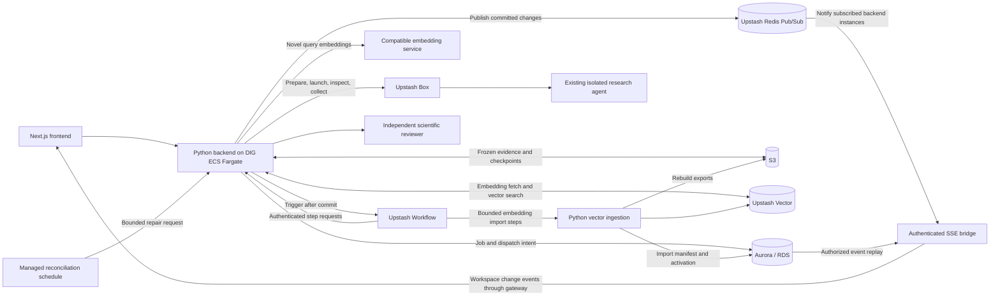

# Refactor REVEAL execution and retrieval to Upstash

Draft — September 29, 2026; updated September 30, 2026. This document proposes implementation work; it changes no runtime behavior. It is based on the current working tree, including deployment work that is still uncommitted. Recheck the relevant modules before starting each phase because other agents are editing this repository.

**Proposed decision:** replace the dedicated Docker worker pool and Redis delivery stack with Upstash Workflow invoking bounded Python execution steps, and use Upstash Vector to store embeddings and perform vector search. Keep Upstash Box for the research agent, Aurora/RDS for authoritative application state and source records, and S3 for frozen inputs, outputs, and checkpoints. Job concurrency should be independent of backend container count. Upstash Vector is a required part of the target architecture, not an optional cache in front of local vector search.

Prefer a managed Upstash Redis instance over self-managed Redis for Pub/Sub, subject to the infrastructure team's agreement on service ownership, region, connectivity, capacity, and cost. Push committed workspace changes to the frontend through an authenticated server-sent events (SSE) endpoint. Knowledge gaps, scientific accounts, explorations, drafts, publication state, and job summaries should update from events rather than recurring workspace refresh polling. Redis remains in the target architecture for notifications; the old Redis job queue is retired.

Use the refactor to converge on DIG's standard HTTP-service deployment: a REVEAL backend service on ECS Fargate behind the shared ALB, with durable execution and data outside replaceable tasks. This is the proposed target, not a claim that the Upstash services or REVEAL's platform integration have been approved or deployed. Section 9 distinguishes the published platform contract from local integration work.

## 1. Target deployment and scope

Keep the existing Next.js frontend and deploy the Python backend, serving both application requests and authenticated workflow endpoints, as a DIG ECS Fargate HTTP service. Reuse the existing deployable image and service-bundling work where compatible. Docker remains useful for packaging Python, DAPPER, and pinned scientific source assets; backend replicas scale HTTP and computation capacity independently of concurrent Box jobs. There is no dedicated worker container per concurrent job. The earlier EC2/Compose approach remains a development or transition option rather than the target infrastructure shape.

Upstash Workflow schedules, retries, and resumes steps. The Python backend still performs evidence collection, validation, review, and persistence. A workflow does not make those computations run inside Upstash's infrastructure. Its main benefit here is releasing application execution capacity while Box is running.

Upstash Vector serves stored embeddings and semantic nearest-neighbor queries. Keep the current compatible embedding-generation service/model initially; moving vector storage/search does not itself require changing the model. RDS retains source identities, import/mapping records, and the registry of active embedding snapshots. S3 retains immutable embedding exports needed for audit and rebuild.

The completed deployment removes the long-running worker service, the Redis Streams job queue, and its continuously running dispatcher. Managed Redis Pub/Sub provides event fanout to connected clients. A managed scheduled request handles bounded reconciliation of missed workflow triggers, unpublished notifications, and abandoned cleanup. No correctness-critical work relies on an in-memory FastAPI background task.

Keep the current custom Box harness, its restricted tools, protected evidence ledger, source checks, model limits, and independent acceptance boundary. Preserve analysis, insufficient-evidence outcomes, paragraphs, cancellation, review-only retries, authorized artifact downloads, and replayable progress events. Moving collection into Box, adopting Box's built-in agent runner, or moving the Python backend to serverless hosting can be evaluated separately.

Upstash has a Python/FastAPI integration, and durable sleeps finish the current request before scheduling a continuation. Verify the selected Python SDK version during Phase 0. [FastAPI integration](https://upstash.com/docs/workflow/quickstarts/fastapi), [sleep behavior](https://upstash.com/docs/workflow/steps/sleep).

## 2. Existing code to preserve and separate

- [worker.py](/Users/cyakaboski/src/research/reveal-mechanisms/services/backend/src/reveal_backend/worker.py) combines collection, execution, review, acceptance, leases, and transport consumption. Extract domain operations from it; retain its legacy entrypoint during migration.
- [box_adapter.py](/Users/cyakaboski/src/research/reveal-mechanisms/services/backend/src/reveal_backend/box_adapter.py) currently exposes one long `execute()` call. Split its lifecycle into resumable operations while retaining a compatibility wrapper for the legacy worker.
- [box_remote.py](/Users/cyakaboski/src/research/reveal-mechanisms/services/backend/src/reveal_backend/box_remote.py) already runs the trusted harness separately from the unprivileged agent and guards repeated launches. Keep that boundary.
- [jobs.py](/Users/cyakaboski/src/research/reveal-mechanisms/services/backend/src/reveal_backend/jobs.py) owns enqueue, events, cancellation, and fenced writes. Add workflow execution state alongside the existing queue records rather than reinterpreting legacy leases in place.
- [artifact_store.py](/Users/cyakaboski/src/research/reveal-mechanisms/services/backend/src/reveal_backend/artifact_store.py) already provides immutable, versioned, checksum-verified S3 references. Reuse that representation.
- [acceptance.py](/Users/cyakaboski/src/research/reveal-mechanisms/services/backend/src/reveal_backend/acceptance.py), [scientific_grounding.py](/Users/cyakaboski/src/research/reveal-mechanisms/services/backend/src/reveal_backend/scientific_grounding.py), and [review_retry.py](/Users/cyakaboski/src/research/reveal-mechanisms/services/backend/src/reveal_backend/review_retry.py) remain the basis for scientific acceptance and retries using saved output.
- [eaggl_embeddings.py](/Users/cyakaboski/src/research/reveal-mechanisms/services/backend/src/reveal_backend/eaggl_embeddings.py) currently loads MySQL vectors into `FactorSearchIndex` and performs a full matrix search. Replace production storage/search access with an Upstash Vector adapter while retaining import validation and an offline reference implementation for comparison.
- [catalog.py](/Users/cyakaboski/src/research/reveal-mechanisms/services/backend/src/reveal_backend/catalog.py) also computes suggestion scores directly with `self.index.matrix @ vectors.T`. Both search and suggestion paths must use Upstash retrieval; changing `FactorSearchIndex.search()` alone is insufficient.
- [dismech_embeddings.py](/Users/cyakaboski/src/research/reveal-mechanisms/services/backend/src/reveal_backend/dismech_embeddings.py) validates exact source/context bindings and embedding-space compatibility. Preserve those checks while fetching selected context embeddings from Upstash instead of preloading vector blobs from MySQL.
- [WorkspaceCache.tsx](/Users/cyakaboski/src/research/reveal-mechanisms/services/frontend/src/components/WorkspaceCache.tsx) currently refreshes active workspace data every 10 seconds and otherwise uses the 30-second freshness interval. Replace these recurring fetches with a shared workspace event subscription and targeted cache updates.
- [workspace-events.ts](/Users/cyakaboski/src/research/reveal-mechanisms/services/frontend/src/lib/workspace-events.ts) currently notifies listeners inside one browser session. Extend this integration to consume backend events, including changes from background workflows, other tabs/devices, and publication actions.

Do not wrap `Worker._process()` in one workflow step: that would retain the long request and its coupling to remote execution. Also do not replace the worker with an uncheckpointed `asyncio.create_task()` launched by the submission endpoint.

## 3. Execution lifecycle

Each operation consumes durable references, obtains a short execution lease, records a durable result, and releases local resources. Subsequent requests can run in a different process or on a different host. Proposed operation names below are design interfaces, not existing APIs.

1. **Accept submission.** Authorize and freeze the request as today. Commit the job, execution version, and dispatch intent in one RDS transaction. Return the existing job response. Attempt workflow delivery after commit; failed delivery leaves recoverable intent.
2. **Prepare evidence.** Collect bounded source responses, assemble and validate the package, and save the exact inputs to S3. Commit their references and checksums. Preserve the frozen user selection, source revisions, and captured vector-search provenance from discovery/suggestions. Recovery must not rerun search against a newer active index to replace the user's selected anchors. Reuse completed captures on retry. If the worst-case collector exceeds the endpoint budget, checkpoint retrieval batches and assembly separately.
3. **Prepare Box.** Reserve active-Box capacity, record creation intent, create or recover the assigned Box, persist its ID, and install/upload the existing harness and frozen inputs. Make bootstrap resumable or explicitly recover an interrupted preparation before continuing. Do not retry the current bootstrap blindly: it contains non-idempotent setup commands.
4. **Launch once.** Record launch intent for this authoring attempt. Start the detached harness using the existing remote lock/status guard, then checkpoint the running handle and deadline. An uncertain launch response leads to inspection of the same Box, never an unconditional new agent launch.
5. **Observe once, then sleep.** Fetch one bounded batch of events/status. Persist deduplicated events and the acknowledged remote cursor together. If still running, finish the step and use durable sleep before checking again. There is no local polling loop that spans the agent's lifetime.
6. **Capture output.** After the trusted runner and ledger are finalized, retrieve and verify the complete artifact manifest. Upload to S3 before committing the capture reference. A lost response or S3 error must leave the remote copy recoverable.
7. **Delete Box.** Delete only after durable capture, or after a confirmed pre-launch abandonment requiring no result capture. Persist cleanup acknowledgment. Retry deletion independently without authoring again. Keep a durable cleanup obligation until resolution; keep unresolved Boxes counted against the relevant resource cap.
8. **Validate and review.** Assemble account identities, verify source fidelity and provenance, and independently review scientific content. Review uses resumable turns as specified below. Insufficient-evidence output follows its existing validation path; paragraphs use their own validation and faithfulness review.
9. **Commit outcome.** Atomically save accepted results or the validated exploration outcome, job status, public events, workspace change events, and any paragraph dispatch intent. Publish workspace notifications after commit using durable outbox intent. Repeated invocation returns the previously committed result without generating a second logical change event. Successful completion requires the required capture and cleanup checkpoints.

Every operation needs a maximum execution time below the chosen endpoint and delivery timeouts. Box startup, file transfer, subprocess validation, and a reviewer HTTP call may take much longer than a status check; measure them separately. Durable orchestration does not remove per-request limits.

## 4. Durable state, ownership, and retries

Introduce an additive execution record, conceptually containing:

- `job_id`, execution version, workflow generation, workflow run ID, and current phase.
- Separate authoring-attempt and review-attempt identities. Review retry changes neither the authoring attempt nor its capture.
- Frozen input references, Box ID, launch state, remote cursor, capture reference, review checkpoint, and cleanup state.
- Current step identity, fencing token, lease expiration, and committed step-result reference.
- Cancellation request, agent deadline, next expected activity time, retry disposition, and reserved/observed provider spend.

RDS determines whether a transition is allowed and which generation may commit. Upstash stores scheduling/replay history. S3 stores large payloads and immutable checkpoints. Workflow payloads and step results contain opaque IDs and small references, not complete evidence, reviewer conversations, credentials, or long-lived download URLs.

Restore only the artifacts needed by each step into bounded scratch space unique to that invocation. Never persist an absolute scratch path as a cross-step dependency. Cleanup must not remove files belonging to an overlapping retry or another step; durable checkpoints remain the recovery source.

Use a stable operation key such as `(job_id, generation, phase, phase_index)`. Distinguish a new review attempt from a transport retry. Perform external I/O outside database transactions; commit the resulting reference only while the step still owns its fence. Losing a fence prevents acceptance but cannot undo an external operation, so recovery must inspect already-started effects.

Short leases protect active steps. A job waiting on Box has no continuously renewed worker lease. Its Box assignment, execution deadline, and capacity reservation remain durable until confirmed completion or cleanup. Do not infer that Box stopped merely because an HTTP handler or its lease expired.

Workflow execution must replay deterministically: create timestamps/IDs, read mutable state, and perform effects inside persisted steps. Store branch decisions as step results; keep step names and workflow versions stable for active runs. Step bodies must tolerate retries even after a successful effect whose response was lost. [Workflow caveats](https://upstash.com/docs/workflow/basics/caveats).

Classify failures explicitly: retry transient transport/storage failures with a bounded policy; stop on invalid evidence or rejected scientific content; inspect ambiguous external execution; retain exhausted work for operator recovery. A provider failure callback must not mark a job safely finished while its Box is still running or its capture is unsecured.

### Box creation is a separate ambiguity from Box launch

The remote launch guard protects an identified Box. It does not by itself cover a successful Box creation whose response was lost. Phase 0 must verify a supported way to rediscover/reuse the intended Box, such as a stable provider identity with suitable uniqueness semantics. Labels alone are not assumed to enforce uniqueness.

If identity cannot be resolved, pause automated creation and reconcile the ambiguous allocation. Do not claim exactly-once paid execution from workflow retries. Keep an auditable record of every creation/launch intent and any orphan cleanup.

### Reliable dispatch without a dispatcher service

Retain a transactional RDS outbox. After committing a new job, use a bounded trigger call with a stable dispatch identity. A managed scheduled endpoint scans indexed pending/stale intents in bounded pages and repairs missing delivery. Workflow duplicates still pass through RDS step fencing.

The same reconciler handles stale executions, deadline violations, retry exhaustion, and cleanup obligations, including obligations attached to terminal jobs. Configure and monitor the schedule explicitly; API startup and browser requests are not recovery mechanisms. Recovery must rejoin a compatible active workflow or start a new recovery generation after fencing the old one, rather than repeatedly starting independent workflows for the same state.

## 5. Checkpoint independent scientific review

The current reviewer keeps its conversation and budget accounting in process memory and can make several model calls. Moving the whole review into one retried step would risk starting over, duplicating charges, and losing consumed-budget information.

Separate review initialization, one model turn, evidence-tool processing, and final verdict validation. Persist an immutable checkpoint after each completed turn: exact messages/tool responses, read-source coverage, model/configuration, evidence and document hashes, turn counter, accumulated usage, and remaining budget. A retry restores this checkpoint; it does not reload changed evidence or silently reset its budget.

Reserve a conservative amount before each paid call. If a response is lost after the provider may have executed, keep that reservation and record ambiguity. Recover provider output if supported; otherwise stop or retry only within the remaining explicitly accounted budget. Automatic retry must not silently assume an unobserved call was free.

Preserve the current final-verdict rules and failure classifications. An explicit review-only retry creates a new review attempt against the original verified capture, with the existing authorization and budget policy. It must never recollect evidence or rerun the authoring agent. Use the same principles for paragraph faithfulness review.

## 6. Concurrency, progress, cancellation, and access

Maintain independent limits for evidence preparation, active Boxes, validation/review, per-user admission, and provider request/token/spend budgets. Backend replica count is a hosting setting, not a scientific job limit. Prove configurable concurrency with inexpensive probes before raising live-agent caps.

Use RDS reservations for active Boxes across sleeping workflows. Workflow step parallelism limits only simultaneous step execution. For different execution-stage limits, use separate invoked workflows or bounded service operations with explicit limits; current Upstash flow control is primarily configured per workflow run, with separate controls for calls/invocations. Confirm Python support before choosing those interfaces. [Flow control](https://upstash.com/docs/workflow/features/flow-control).

Protect ordinary API traffic with bounded preparation/validation concurrency and database pools. Keep blocking I/O/subprocesses off the event loop. Check DAPPER's process-global import/schema state and cached validators before sharing them concurrently; bounded subprocess execution is acceptable without introducing a container per job.

Keep RDS as the ordered event source and use Redis notifications to wake SSE delivery rather than repeatedly querying unchanged data. Scheduled status/event checks may still be needed between the backend workflow and the current Box harness; a provisional five-second interval is a tuning hypothesis for that remote boundary only. Workspace freshness comes from pushed events as specified in Section 8. A trusted Box push channel can be added later if remote polling cannot meet the chosen progress-latency target.

Persist cancellation immediately and enqueue a durable control action to cancel the existing Box. A sleeping authoring workflow must not delay cancellation until its next ordinary progress check. Every stage rechecks cancellation, and acceptance verifies it in the final transaction. Test cancellation racing with launch and completion; reconciliation must stop an agent launched during that race. Canceling the scheduler run alone does not cancel Box or perform cleanup.

Expose workflow endpoints directly on the backend, reachable by QStash over HTTPS. Enable SDK signature verification, validate job namespace/generation from RDS, and protect failure, recovery, and control endpoints too. These requests use workflow authentication rather than browser session assertions. Keep application secrets in the backend environment and avoid placing scientific payloads in workflow logs. [Workflow request verification](https://upstash.com/docs/workflow/howto/security).

## 7. Upstash Vector storage and search

### Embedding corpus and compatibility

Migrate the completed EAGGL factor-label embeddings and compatible DisMech mechanism/question-context embeddings. Store corpus embeddings in Upstash Vector and fetch stored context vectors by stable identity when forming automatic queries. Novel free-text queries still use the compatible embedding service; a bounded query cache may reuse results by text hash and embedding-space identity. This migration does not automatically enable semantic knowledge-gap discovery, which currently supports lexical/fuzzy search.

Create dense cosine indexes with the dimensions of the selected embedding run. Define an embedding-space identity from the model/provider, available model-revision or calibration evidence, dimensions, input templates, and normalization policy. Equal dimensions alone do not prove compatibility. Backfill existing verified vectors first rather than re-embedding them with a different Upstash-hosted model. The Python SDK supports uploading supplied vectors and querying by vector. [Python upsert](https://upstash.com/docs/vector/sdks/py/example_calls/upsert), [Python query](https://upstash.com/docs/vector/sdks/py/example_calls/query).

Use separate indexes for incompatible embedding spaces and credentials/environments that need independent access boundaries. Within a compatible index, use explicit namespaces for immutable corpus snapshots, for example an EAGGL retrieval snapshot and a DisMech context snapshot. The application must always supply the namespace; Upstash otherwise uses its default namespace. Namespaces organize data but do not replace application authorization. [Namespaces](https://upstash.com/docs/vector/features/namespaces).

Use deterministic vector IDs derived from snapshot and source binding. Preserve distinct EAGGL aliases that map to one native CFDE factor: their vectors can differ, and current scoring takes their maximum. Required metadata includes corpus/source kind, native and imported source IDs, source revision, input-text hash, original-vector checksum, embedding run/space, template, and mapping run where applicable. Store an explicit record count and binding manifest; unique embedded texts and source bindings are not necessarily the same count. Hydrate canonical source payloads from RDS using verified IDs/revisions rather than treating vector metadata as scientific evidence.

### Search contract

Route both `Catalog.search_factors()` and `Catalog.suggest_factors()` through a shared search interface backed by Upstash. Remove full-corpus NumPy search and vector preloading from the production path. Small computations over returned candidates for aggregation or verified pairwise scores are acceptable; they must not become a hidden replacement for Upstash candidate retrieval.

Preserve the following behavior explicitly:

- Embed a novel query in the same space as the indexed corpus, or fetch a verified existing context/factor vector. Batch independent context queries where the selected SDK supports it.
- Restrict results to the selected source/mapping snapshot and eligible factors. Apply trait/source filters in Upstash where supported, then verify mappings and exclusions in the backend. Filter expressions must be constructed from validated values. [Metadata filtering](https://upstash.com/docs/vector/features/filtering).
- Retrieve enough candidates before native-factor deduplication and exclusions. Use a measured expansion policy or resumable queries when duplicates would underfill results; do not fetch only the final requested count and then discard half of it. Bound and close resumable handles. [Resumable queries](https://upstash.com/docs/vector/features/resumablequery).
- Preserve maximum-per-context ranking, maximum-over-aliases for each native factor, deterministic tie handling, and the existing reciprocal-rank-fusion rule for hybrid search. REVEAL's semantic-plus-lexical hybrid mode is not automatically equivalent to an Upstash dense/sparse hybrid index.
- Record a real similarity for every relevant context/returned-native-factor pair, including non-winning contexts and all applicable aliases. Fetch the bounded selected vectors for exact pairwise evaluation when ANN results omit those pairs; do not substitute the winning score, zero, or an uncomputed value. Validate fetched vector precision and provenance against the retained import representation.

Upstash's cosine query score is `(1 + cosine_similarity) / 2`. Convert with `cosine_similarity = 2 * score - 1` before populating existing cosine fields, subject to numerical validation and tolerance. Keep the raw provider score and metric/version in retrieval provenance; do not relabel a normalized provider score or a fusion score as raw cosine. [Similarity functions](https://upstash.com/docs/vector/features/similarityfunctions).

Upstash uses approximate nearest-neighbor retrieval, while the current code scores the full small corpus. Candidate truncation can also affect hybrid fusion rankings. Compare against the existing exact implementation on representative and regression queries; do not promise identical ordering from a fixed top-k ANN query. Record candidate depth, aggregation, score conversion, and retrieval-policy version. Establish recall/rank-agreement and numeric-tolerance gates before enabling the new default, and investigate lost required anchors. [Search algorithm](https://upstash.com/docs/vector/features/algorithm).

Freeze the exact returned candidates, per-context scores, query/context input hashes, source and mapping runs, embedding space, index/namespace snapshot, and retrieval-policy version when saving suggestions/requests. Persist the input/query-vector checksum and a durable vector reference where needed for replay. Retrying an accepted research submission uses this frozen record; a new search can legitimately differ and must not rewrite historical provenance.

### Ingestion, activation, and operation

Use bounded workflow import steps: export verified source embeddings to S3, upsert deterministic batches into a new namespace, checkpoint batch progress, verify coverage/readback and query visibility, then activate the completed snapshot through an atomic RDS registry update. A successful upload response alone is not the activation gate. Retry batches idempotently and leave partially loaded or incompatible namespaces inactive.

Readback verification must distinguish original serialized-vector checksums from provider round-trip numeric precision. Retain the original immutable vector export and verify returned values against an explicit tolerance rather than assuming JSON round trips preserve binary bytes. Validate the complete ID/binding inventory and representative query results before activation. Bind each search request to one registry snapshot so activation cannot mix embedding versions within a request.

Source updates and removals produce a new retrieval snapshot; old namespaces remain available for the documented retention/rollback window. Expire them only after active references and rebuild exports are accounted for. RDS and Vector are separate systems: persist indexing intent and repair failed synchronization instead of assuming a cross-service transaction. Historical accepted evidence remains readable from frozen records/S3 even if an old search index is retired.

Add a pinned `upstash-vector` dependency and backend-only Vector URL/token configuration. Use read-only credentials for serving queries where supported and a separate write credential for ingestion; keep both out of the frontend, agent bundle, and logged workflow payloads. Check space, dimensions, metric, snapshot status, and required context coverage in semantic readiness. Do not rebuild indexes or generate corpus embeddings at API startup.

On Vector failure, return an explicit semantic-search availability error with bounded retry behavior; never silently scan local/MySQL vectors or report an empty scientific match. Existing lexical/fuzzy modes may remain explicitly available. Rollback to the legacy retrieval implementation is an operator-controlled migration action, not an automatic runtime fallback. Measure Vector request latency/errors, ingestion lag, query/expansion counts, startup memory, and search quality.

## 8. Redis Pub/Sub and workspace events

### Managed Redis deployment

Use Upstash Redis as the preferred production notification service, removing the need to run, patch, size, and recover a REVEAL-owned Redis container. Keep notifications behind a small Redis adapter so deployment configuration determines the endpoint. A local Redis instance can remain a development convenience. Upstash Redis, Vector, Workflow/QStash, and Box have separate roles and credentials; adopting Redis does not replace the other services or turn Pub/Sub into a durable work queue.

The current [platform deployment draft](/Users/cyakaboski/src/research/reveal-mechanisms/docs/platform-deployment.md) already proposes Upstash Redis over TLS TCP for the existing Streams queue. Preserve that as an independent near-term deployment option. This refactor changes the eventual workload to Pub/Sub and retires the queue after legacy jobs drain. Do not move active queue consumers between Redis endpoints as part of notification cutover. Use separate notification configuration and channels during overlap; decide whether to reuse the managed database or isolate notifications based on measured capacity and operational needs.

In Phase 0, record the selected region near the backend, database ownership, environment isolation, supported subscriber transport, connection/message limits, expected event fanout, and measured costs. Prefer separate QA and production instances and credentials. Keep TLS credentials in backend Secrets Manager bindings, rotate them with subscriber reconnect and RDS replay, and never expose them through frontend configuration. Start by evaluating the existing TLS TCP client on Fargate; REST streaming is also supported, but its behavior must be verified with the selected client. [Upstash Redis connection options](https://upstash.com/docs/redis/howto/connect-client), [REST Pub/Sub](https://upstash.com/docs/redis/features/restapi#subscribe--publish-commands).

Redis availability affects notification latency, not the authority of committed application state. Retain the RDS event log/outbox and replay guarantees below even with a managed provider. Alert on subscriber disconnects, publish failures, outbox age, throttling, and connection pressure. A provider outage must not discard accepted scientific results or quietly reinstate permanent workspace polling.

### Commit, publish, and deliver

Write an authorized workspace event and notification outbox record in the same RDS transaction as each observable mutation, including workflow completion, paragraph completion, draft changes, exploration changes, publication/withdrawal, and catalog activation. Attempt publication after commit with bounded I/O. The scheduled reconciler retries unpublished outbox records; a Redis outage must neither roll back an already committed scientific result nor lose its notification permanently.

Use versioned event envelopes with a stable event ID, scope-specific committed cursor, event type, entity ID/revision, operation, affected collections, and commit time. Proposed types include `knowledge_gap.updated`, `scientific_account.updated`, `exploration.updated`, `draft.changed`, `publication.changed`, `job.updated`, and `catalog.updated`. Include deletions and visibility changes. A change to an account may also invalidate its gap's account count; express those dependencies in the event rather than refreshing only the account row.

Publish lightweight notifications to environment- and audience-scoped Redis channels. Each backend instance with interested SSE clients subscribes and delivers to all its authorized connections. This is fanout, so do not use a competing-consumer job group that would notify only one instance. Reuse subscriptions within a process where practical and bound subscriber buffers. Keep private events separate from safe public catalog/publication invalidations, and authorize replay as well as live delivery.

Propose `GET /v1/me/workspace/events` as the browser-facing backend contract, proxied through the existing same-origin Next.js authentication gateway. The frontend consumes typed SSE events and never receives Redis credentials or chooses arbitrary Redis channels. Use one workspace subscription per mounted provider, not one per row/tab panel. Verify SSE buffering, connection limits, authentication renewal, and bounded connection windows on the actual hosting path. The stream uses connection capacity but does not reserve a scientific job execution slot.

Upstash Redis supports Redis Pub/Sub, including a streaming REST subscribe endpoint. Phase 0 should choose and verify the backend subscriber transport against the pinned client and hosting environment; the browser still connects through the application's authorization layer. [Upstash publish/subscribe](https://upstash.com/docs/redis/features/restapi#subscribe--publish-commands).

### Missed events and ordering

Redis Pub/Sub is at-most-once and cannot replay messages missed while disconnected. Use the RDS event log for replay and Redis as the live notification mechanism. [Redis delivery semantics](https://redis.io/docs/latest/develop/pubsub/#delivery-semantics).

On connection, subscribe and buffer notifications before reading the authorized committed high-water mark, replay events after the client's cursor, then drain buffered notifications in committed order. On Redis wakeup, read the durable changes after the connection's cursor; duplicate, delayed, or reordered publishes cannot move it backward or skip earlier committed changes. Do not depend on publish order or a Redis subscriber count as proof that a browser applied an event.

Support `Last-Event-ID` or the existing authenticated stream client's explicit cursor. After Redis reconnect, browser reconnect, or detected sequence loss, replay the missing authorized events. If retention has expired, emit `resync_required` and fetch one fresh workspace snapshot paired with a cursor, then resume events. Keep private and public scopes independently cursorable, or encode their positions in a server-issued cursor. Define retention, replay limits, and slow-consumer handling; overflow should trigger resync rather than silent event loss.

Send keepalive heartbeats without refetching workspace lists. On bounded stream renewal, check the durable cursor so a missed final notification cannot leave the view stale indefinitely. Session expiry, logout, ownership transfer, or access revocation closes/rebinds subscriptions and clears the prior identity's cache; previously authorized replay cursors do not grant continued access.

### Frontend cache behavior

Feed events into `WorkspaceCacheProvider` and the existing revalidation cache. Apply a versioned summary patch when the event contains enough authorized data; otherwise mark only affected collections/details stale and issue an event-triggered fetch. Coalesce bursts, deduplicate by event/revision, and invalidate list counts/pagination where membership changes. If a newer event arrives while a fetch is in flight, preserve the newer stale revision and revalidate again instead of letting the older response clear it.

Remove the recurring 10/30-second workspace refresh timers in normal operation. Retain initial loads, explicit refresh, event-triggered reads, and a one-time catch-up after reconnect/resync. Keep cached navigation, selected tabs, scroll position, and unsaved composer state intact. The existing local mutation notifications can provide immediate invalidation, with server event IDs/revisions preventing duplicate work. Disconnected views should indicate stale/live-connection status; any temporary polling fallback must be explicitly degraded behavior and stop when streaming resumes.

Extend the existing job SSE path to wake from Redis notifications too: it currently reads RDS every second. Retain its public event contract and replay semantics, while preventing a workspace-wide update or full list fetch for every agent token/tool event. Workspace job summaries should update on relevant state/result transitions; detailed activity stays in its job stream.

## 9. Align the backend with DIG service platform

### Verified platform contract and existing integration

Reviewed `broadinstitute/dig-service-platform` at published `main` commit `7810744ba7f915e23ad88ea5e008297b14efe67e` on September 30, 2026. The repository defines one HTTP service per service directory, with its own image and `service.yaml`, deployed to ECS Fargate behind the shared ALB. GitHub Actions uses AWS OIDC; `main` deploys QA and production promotion uses the `prod` environment's approval gate. These are repository conventions, not evidence that REVEAL is already registered or that external providers have infrastructure approval. [Platform README](https://github.com/broadinstitute/dig-service-platform/blob/7810744ba7f915e23ad88ea5e008297b14efe67e/README.md), [runbook](https://github.com/broadinstitute/dig-service-platform/blob/7810744ba7f915e23ad88ea5e008297b14efe67e/docs/runbook.md).

The local platform checkout also contains an **uncommitted REVEAL integration** and changes to its runtime schema/renderer. The matching REVEAL [deployment draft](/Users/cyakaboski/src/research/reveal-mechanisms/docs/platform-deployment.md) describes the API, two workers, a dispatcher, managed Redis, a service bundle, and RDS networking. Treat this as existing work to reconcile during implementation. The published registry currently contains `hello`, `kg`, and `genesets`; it does not yet register REVEAL. The proposed `runtime` block and worker/release renderers are not part of the reviewed published platform contract. Do not overwrite that integration or assume it is deployed.

The architectural fit is an inference from that contract: bounded HTTP workflow steps let the backend use the normal service template, while external durable state makes task replacement safe. Managed Redis and Vector reduce the application services operated alongside that API. Fargate can also host background services; the reason to retire the dedicated workers is to simplify REVEAL's execution lifecycle, not a platform prohibition on workers. Keep the frontend on its current Vercel deployment initially; this backend alignment does not require moving it.

### Proposed REVEAL deployment contract

| Area | Plan for the refactor |
| --- | --- |
| Service packaging | Reuse the allowlisted service-local bundle and pinned scientific assets. Supply a Dockerfile, tests, and `service.yaml` in the platform's `reveal/` directory. Record the REVEAL source revision and bundle hashes so release and rollback identify the code actually built. |
| HTTP routing | Use `/api/reveal/*`, honoring `SERVICE_PATH_PREFIX` for application, workflow, SSE, artifact, health, and documentation routes. Reserve an available listener priority through the registry; the draft's priority 40 is a proposal, not a registration. |
| Runtime configuration | Honor platform-provided `SERVICE_NAME`, `SERVICE_ENV`, `PORT`, and `SERVICE_PATH_PREFIX`. Declare architecture, valid Fargate CPU/memory, task limits, health paths, grace periods, and scaling targets in `service.yaml`; measure sizes rather than transferring worker allocations unchanged. |
| State and scratch | Persist all workflow checkpoints, events, and results in RDS/S3 and serving embeddings in Upstash Vector. Temporary paths are scoped to one invocation. Preserve required read-only-root, init, bounded scratch, and shutdown behavior through a reviewed platform runtime extension or an agreed supported equivalent. |
| Secrets and access | Use Secrets Manager ARN bindings for backend credentials and the task role for scoped AWS access, including retained S3 object versions. Reuse or adapt the RDS client security-group work. Confirm outbound TLS access to Upstash, embedding, and model services; managed Redis removes the need to host a Redis service in the VPC. |
| Delivery and promotion | Register the service, validation/tests, QA/prod workflow jobs, and manual deploy choices according to the runbook. Use the platform's ECR build, CloudFormation render/deploy, rollout verification, and rollback workflow. Retain platform production approval requirements. |
| Operations | Send structured job/run/stage identifiers to CloudWatch. Track workflow age, cleanup and notification backlogs, dependency failures, and SSE connection counts alongside the platform's request/CPU metrics. Keep Box concurrency and paid-call budgets independent of ECS replica count. |

The runtime fields, supplied environment variables, Secrets Manager injection, task policy, health probes, and scaling behavior are grounded in the reviewed [schema](https://github.com/broadinstitute/dig-service-platform/blob/7810744ba7f915e23ad88ea5e008297b14efe67e/platform/dig_platform/schema.py), [renderer](https://github.com/broadinstitute/dig-service-platform/blob/7810744ba7f915e23ad88ea5e008297b14efe67e/platform/dig_platform/render.py), and [service stack](https://github.com/broadinstitute/dig-service-platform/blob/7810744ba7f915e23ad88ea5e008297b14efe67e/infra/service-stack.yaml). Release behavior comes from the [deploy workflow](https://github.com/broadinstitute/dig-service-platform/blob/7810744ba7f915e23ad88ea5e008297b14efe67e/.github/workflows/deploy-service.yml). Revalidate these against the platform revision selected for implementation.

### Integration decisions and checks before cutover

- **Public callback and stream path.** The published public HTTPS path is `https://api-<env>.hugeampkpnbi.org/api/reveal/...`; TLS terminates at the existing portal nginx proxy, which forwards `/api/` unchanged to the shared ALB. Configure Workflow callbacks against the backend's public HTTPS URL, independent of browser sessions. Verify QStash signatures and canonical URL handling through nginx and the ALB; retain the separate gateway authorization for user-facing routes. The platform's HTTP ALB smoke test alone does not verify this full path.
- **Streaming and replacement.** Verify buffering, idle timeouts, heartbeats, cursor forwarding, and auth renewal across browser → Next.js → nginx → ALB → backend. Published task stop timeout and target deregistration delay are both 30 seconds, with stickiness disabled. Close/reconnect SSE safely during replacement and make interrupted workflow steps retryable; do not extend drain time to the full agent runtime. Include open-stream count and memory pressure when sizing because request/CPU scaling alone may not capture stream capacity.
- **Readiness.** Use prefixed liveness and readiness routes, retain `curl` for the platform's container probe, and verify cold-start time under real dependencies. Define degraded behavior explicitly: Redis disconnection must not make every otherwise healthy API task unusable, while unavailable authoritative storage or invalid required configuration must not report full readiness. Verify separate container start-period and ALB health-grace limits.
- **Environment isolation and provider ownership.** The current local deployment draft intentionally targets a single QA-labelled service using existing application state. That is a transitional choice, not independent QA/prod isolation. Before enabling both platform environments, establish separate application/job/event namespaces, S3 write scopes, Vector snapshots/indexes, Redis credentials/channels, and workflow callback destinations. Agree who owns and pays for each Upstash service and who handles credential rotation and incidents; the platform repository does not establish that policy.
- **Existing integration handoff.** Keep useful bundle, prefix, secret, network, and runtime work. Once workflow execution passes migration checks, remove the need for `render_workers.py` and simplify `render_release.py` toward the standard HTTP deployment. Resolve any remaining runtime/secret/network extensions as explicit platform changes before enabling stock deployment jobs. Roll back application, workflow, and vector versions coherently; a container-image rollback alone cannot reverse a database migration or retire an active workflow definition.

Phase 0 should produce a small infrastructure handoff: reviewed service manifest and rendered-template diff, source/build provenance, routing and authentication contract, dependency/secret bindings, environment isolation map, measured capacity assumptions, and rollout/rollback steps. These are future implementation deliverables; this plan does not provision resources or alter platform files.

## 10. Implementation phases and reviewable changes

### Phase 0 — Verify the integration contract

Pin compatible Workflow and Box SDK versions. Build an isolated, non-scientific prepare/sleep/resume/finalize probe. Verify signed delivery, replay, stable dispatch IDs, failure callbacks, recovery, workflow-version updates, and the Python interfaces needed for stage limits. Confirm Box creation recovery and existing custom-harness compatibility. Do not change the harness merely to use a documented built-in agent webhook.

Also pin the Vector SDK and verify raw-vector ingestion/query/fetch, namespaces, filters, cosine score conversion, readback precision, indexing visibility, request limits, and credentials. Establish the frozen search-quality baseline and candidate-expansion policy using existing EAGGL/DisMech embeddings.

Verify managed Upstash Redis publish/subscribe across two backend instances and authenticated SSE through Next.js and the DIG nginx/ALB path, including connection renewal, permission checks, disconnect replay, credential rotation, and publish-after-commit recovery. Measure commit-to-visible-update latency, steady-state workspace fetch counts, subscription limits, and provider cost under representative fanout.

Reconcile the existing DIG integration with Section 9. Produce the infrastructure handoff, verify the service bundle and manifest against the selected platform revision, and identify any required platform extensions. Confirm callback ingress, dependency egress, RDS access, environment isolation, and ownership of managed Upstash services. Keep these decisions separate from approval to provision or deploy.

Measure preparation, bootstrap, artifact transfer, validation, and individual review-call duration/memory. Record endpoint limits, workflow history/payload limits, poll request counts, and API responsiveness. The current offline collector benchmark is not a production sizing result.

**Exit:** a written integration contract and passing probe demonstrate that waiting survives backend restart without holding a handler open. The DIG deployment contract and managed Redis choice have resolved implementation requirements or explicitly recorded open infrastructure decisions. Unresolved provider semantics have an explicit recovery policy.

### Phase 1 — Extract operations and add persisted execution state

Extract preparation and acceptance services from `worker.py`. Split Box lifecycle methods from `execute()`. Add step state, fencing, immutable checkpoint references, and per-job runner/version routing. Keep the legacy worker invoking the extracted operations until the new path passes acceptance.

Suggested new modules: `job_steps.py`, `execution_state.py`, and `box_lifecycle.py`. Names are provisional. Use additive records/index migrations; avoid broad edits to the API or scientific schemas.

**Exit:** legacy behavior and public contracts remain compatible; duplicate and stale step invocations cannot overwrite a newer transition or accepted result.

### Phase 2 — Add durable review

Extract a serializable review session and one-turn execution boundary from `scientific_grounding.py`. Add review checkpoint storage and persistent budget reservation. Route legacy review through the same scientific logic where practical to avoid divergent acceptance rules.

Suggested new module: `review_session.py`. Preserve the public review-retry endpoint and saved-capture authorization.

**Exit:** interrupted review resumes from captured state, respects cumulative budgets, and never starts authoring during review-only retry.

### Phase 3 — Wire workflows, control actions, and reconciliation

Add versioned FastAPI workflow routes, Workflow transport, transactional trigger intent, managed reconciliation, cancellation, cleanup, and telemetry. Compose the stage lifecycle rather than duplicating its implementation in workflow handlers. Support research, insufficient-evidence outcomes, paragraphs, and review-only retries.

Suggested new modules: `workflows.py`, `workflow_transport.py`, and `workflow_reconciliation.py`. Extend `jobs.py`, `app.py`, deployment health/probes, and runtime settings narrowly. Keep existing public job statuses and translate internal phases for current clients.

**Exit:** all job kinds complete through the workflow path with legacy workers and the Redis job queue absent from the isolated test stack. Scheduler failure leaves recoverable RDS intent. Redis Pub/Sub may operate separately for notifications.

### Phase 4 — Migrate embeddings and semantic retrieval

Add a shared retrieval interface and Upstash adapter; suggested modules are `vector_store.py`, `semantic_search.py`, and `vector_ingestion.py`. Separate vector storage from embedding generation. Backfill a new inactive snapshot from completed, verified imports and compare Upstash search with the existing exact reference. Keep source/run metadata in RDS and immutable rebuild exports in S3.

Route manual semantic search, the semantic leg of hybrid search, and automatic factor suggestions through the adapter. Replace MySQL vector preloading with targeted context/vector fetches and bounded caches. Preserve alias aggregation, exclusions, per-context cosines, ranking metadata, and frozen-request provenance. Adapt existing search/suggestion regressions and add Vector integration tests.

**Exit:** completed corpus embeddings are stored in Upstash, every production semantic candidate search uses Upstash, the retrieval-quality gates pass, and neither API startup nor search requires loading a full local/MySQL vector matrix. Snapshot activation and rollback are demonstrated without changing already frozen research inputs.

### Phase 5 — Deliver workspace events and remove refresh polling

Add the durable workspace event log/outbox, after-commit publisher, Redis subscriber bridge, authenticated workspace SSE endpoint, and replay/resync contract. Suggested modules are `workspace_events.py` and `redis_notifications.py`. Integrate all relevant mutation paths, including background acceptance, paragraphs, drafts, exploration, publication/withdrawal, identity changes, and catalog activation. Cover public API contracts and generated frontend types.

Connect `WorkspaceCacheProvider` and `workspace-events.ts` to the stream, add targeted invalidation/patching and fetch-race protection, and remove periodic workspace refresh timers. Switch job SSE delivery from its one-second database loop to notification-driven wakeups. Include notification health, outbox lag, connection counts, replay/resync counts, and stale-client indicators in deployment/admin telemetry.

**Exit:** changes made in another tab/device or by a workflow appear without manual refresh or recurring workspace-list polling. Restart/disconnect recovery restores missed changes, unauthorized subscribers receive no private events, and idle connected workspaces make no recurring data-refresh requests.

### Phase 6 — Pilot and cut over

Pilot the backend on the agreed DIG Fargate service using isolated test state. Verify the complete HTTPS callback/SSE path and task replacement, then use the platform's promotion process for the live release. Do not activate a second environment against the transitional draft's shared primary state. Keep hosting cutover, execution routing, retrieval activation, and notification rollout independently observable and reversible where their data contracts permit.

Use the existing isolated application-table approach for verification; do not point two execution systems at unpartitioned jobs. Freeze runner/version/namespace on each job and verify legacy claimers exclude workflow-owned jobs.

For the live cutover, pause new submissions briefly, drain legacy jobs and unresolved cleanup, enable workflow routing for new jobs, and reopen submissions. Keep the old path available until completion/recovery checks pass. During any deliberate overlap, enforce provider caps across both execution systems rather than giving each its own full allowance.

Switch the active Vector snapshot and retrieval backend through a separate controlled flag/registry change so orchestration and retrieval can be diagnosed or rolled back independently. Keep the old embedding tables read-only during the rollback window. After the verified cutover, remove them as serving dependencies; new corpus embeddings go to Upstash with S3 exports and RDS manifests rather than requiring continued vector-blob writes to MySQL.

Roll out workspace streaming independently as well. During migration, keep legacy frontend refresh behavior behind an explicit rollback flag; disable it once event coverage and reconnect checks pass. Continue writing durable change events during rollback so clients can subsequently resume safely.

Pin workflow endpoint versions for active runs. A deployment must retain compatible old definitions until those runs drain. Rolling back means routing future jobs to the legacy path while existing workflow jobs finish or are explicitly recovered; it does not mean letting a legacy worker claim partially executed workflow records.

**Exit:** the pilot satisfies the checks below, with a demonstrated rollback and no duplicate authoring, lost outputs, or abandoned Boxes.

### Phase 7 — Retire the worker deployment

Remove worker, self-managed queue Redis, and Redis job-dispatcher services from the deployment configuration after legacy drain is verified. Retire any legacy Streams queue in managed Redis separately; do not delete a database still serving notifications. Retain/configure Upstash Redis Pub/Sub for workspace and job notifications, with separate notification settings and credentials. Remove the obsolete DIG worker-stack deployment and simplify release integration to the reviewed HTTP service contract. Update deployment scripts, readiness checks, admin views, and documentation to report workflow delivery, stage age, active Boxes, review attempts, cleanup backlog, and notification health. Remove worker-specific settings from the default deployment while preserving any explicitly supported legacy development tooling.

Archive or remove unused queue/worker modules only after their callers and recovery dependencies are accounted for. Keep historical job/event/artifact records readable. Update `docs/deployment-plan.md`, `docs/platform-deployment.md`, `docs/cloud-deployment.md`, and `docs/local-deployment.md` to reflect the delivered architecture and distinguish the supported DIG deployment from historical EC2/worker instructions.

**Exit:** job execution and recovery no longer require the dedicated worker or Redis job queue. Live workspace delivery uses the configured Redis Pub/Sub service and durable RDS replay.

## 11. Acceptance and failure-injection checks

Use mocks and the existing deterministic/non-scientific probes first, then bounded live research runs. These are required implementation checks, not actions performed while drafting this plan.

1. **Behavior:** analysis, insufficient evidence, paragraphs, review-only retry, downloads, and SSE reconnection preserve their current contracts and authorization.
2. **Durable wait:** restart or replace every backend process while Box runs. The existing Box completes and the workflow resumes without a new authoring attempt or preserved local disk.
3. **Delivery gaps:** interrupt between database commit and trigger, after trigger acceptance before acknowledgment, and after a step commit before its response. Reconciliation recovers delivery; duplicates do not duplicate acceptance or paragraph jobs.
4. **Provider ambiguity:** lose Box creation and launch responses separately. Verify identity recovery or explicit ambiguity handling, remote launch guarding, and eventual orphan cleanup.
5. **Capture:** interrupt transfer and S3/checkpoint commits. Never delete the sole complete output copy; resumed capture verifies exact versions and hashes.
6. **Review:** restart between turns and after a paid call with no acknowledged response. Restore the same evidence/conversation, preserve budget reservations, and prevent duplicate acceptance. Review-only retry makes zero authoring calls.
7. **Cancellation:** cancel while queued, preparing, sleeping, launching, capturing, reviewing, and committing. No result is accepted after cancellation wins its transaction; remote execution and cleanup are resolved.
8. **Concurrency:** run more probe jobs than backend replicas. Enforce each configured stage limit and active-Box cap across replicas and sleeping runs. Check API latency, pool usage, memory, and database lock contention.
9. **Isolation and upgrades:** reject invalid signatures, stale generations, and namespace mismatches. Legacy consumers cannot claim workflow jobs. Existing runs remain resumable across deployment and rollback.
10. **Scheduler/storage outage:** leave jobs durably pending or recoverable, alert on stale activity, and resume after recovery. Exhausted retries and cleanup obligations remain discoverable without a user reopening the app.
11. **Vector storage and routing:** import/retry partial batches without duplicates, prevent activation of incomplete snapshots, and prove every semantic search/suggestion path calls Upstash. Verify normal serving with the legacy vector tables and full local matrices unavailable; source metadata remains accessible.
12. **Retrieval correctness:** compare ANN recall/ranking with the exact baseline; cover duplicate text, multiple aliases per native factor, exclusions, traits, multiple contexts, hybrid fusion, ties, and candidate underfill. Validate normalized-score conversion and all per-context cosines against known vector pairs.
13. **Vector versioning and failure:** reject incompatible dimensions/model spaces and stale source bindings; isolate namespaces; rotate active snapshots during concurrent queries; handle timeouts/partial ingestion without silent fallback. Replaying a frozen job after index activation or retirement must not change its evidence or selected anchors.
14. **Workspace push coverage:** exercise gaps, scientific accounts, paragraphs, drafts, explorations, publication/withdrawal, and catalog changes from workflows and other browser sessions. Updates, removals, and dependent counts appear through events without full-page reloads or periodic workspace fetching.
15. **Notification durability:** interrupt after RDS commit before publish, duplicate/reorder publishes, disconnect Redis/SSE, restart backend instances, overflow a slow subscriber, and expire a replay cursor. Outbox repair/replay or explicit resync restores the correct state without phantom pre-commit events or missed final updates.
16. **Frontend and access:** test an event arriving during revalidation, duplicate local/server notifications, multiple viewers/backend instances, session expiration, logout/login, ownership changes, and access revocation. No stale response clears a newer invalidation or leaks another principal's data; drafts and navigation state survive updates. An idle connected workspace has zero periodic list-refresh requests, and job SSE no longer reads unchanged RDS events once per second.
17. **Managed Redis operations:** verify TLS, credential rotation, reconnect and replay, throttling/connection exhaustion, and environment separation against the chosen Upstash service. Run without self-managed Redis; notification outages preserve authoritative writes and recover pending notifications. Retiring legacy queue keys/services must not interrupt Pub/Sub clients.
18. **DIG platform compatibility:** validate/render the service against the selected platform revision, build its declared architecture from the service-local bundle, and verify prefixed health, authorized API/artifacts, signed workflow callbacks, and SSE through the actual public HTTPS path. Replace/scale tasks during active probes and browser streams with no shared local disk or sticky-session dependence. Verify source provenance, secret/IAM bindings, environment isolation, production gating, and rollback with active workflow versions retained.

Measure total and per-stage latency, progress/cancellation latency, request counts, retry amplification, actual provider usage, reserved spend, database pressure, and orphan/cleanup counts. Agree numerical service targets from Phase 0 measurements; this draft makes no unmeasured throughput or cost-saving claim.

## 12. Completion criteria

The refactor is complete when one supported backend deployment can serve application requests and execute bounded workflow steps, concurrent Box jobs are controlled independently of backend container count, and no application execution slot is held throughout an agent run. Recovery, cancellation, trusted validation, review budgets, progress history, and durable artifacts must work with the dedicated worker pool and legacy Redis job queue stopped.

Completion also requires Upstash Vector to hold the serving embedding corpus and execute all semantic candidate retrieval, including automatic suggestions and the semantic leg of hybrid search. Full-corpus vector blobs in MySQL and NumPy matrix scans must no longer be production serving dependencies. The established source bindings, per-context score semantics, and frozen evidence provenance must remain verifiable.

Workspace knowledge gaps, scientific accounts, explorations, drafts, publication state, and job summaries must refresh from committed Redis-backed events consumed by the frontend, with authorized replay after disconnects and no recurring workspace data polling during healthy streaming operation.

The preferred deployment outcome is the reviewed DIG HTTP service on ECS Fargate, plus managed Upstash Redis for notifications, with no REVEAL-owned production Redis container or dedicated worker/dispatcher service. The service must follow platform packaging, routing, secrets, health, promotion, and rollback conventions and pass the actual callback/streaming path checks. Record any infrastructure-agreed deviation explicitly instead of describing an unverified or unapproved option as completed.

Start with Phase 0 and Phase 1. The smallest useful first review should establish the integration contract and extract lifecycle boundaries; replacing all of `worker.py` in one change would make the behavior and migration harder to verify.
