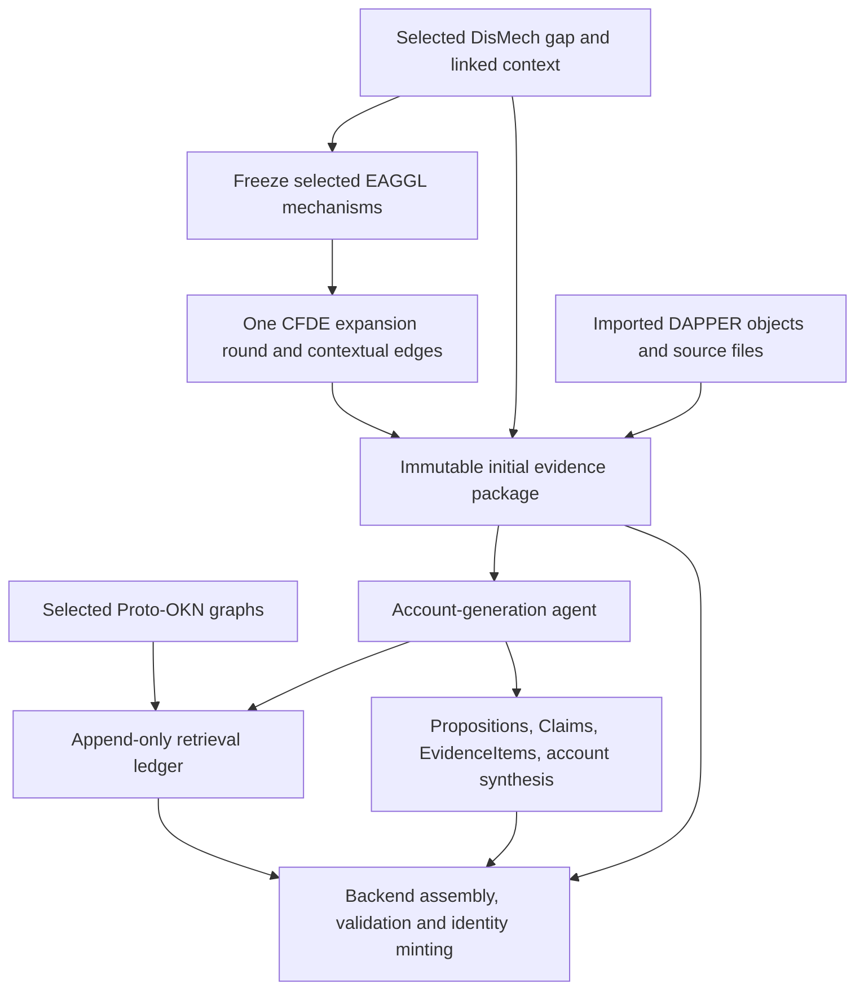

# Evidence package for ScientificAccount generation

Current local/hosted authoring rules: [shared contract v2](authoring-contract.md). Its mode-specific tool and evidence rules govern new workspaces; historical examples below retain their original scope.

> New online and local runs use the [progressive MCP workflow](local-agent-mcp.md): a small seed plus on-demand retained data and evidence receipts. Eager collector descriptions below apply to historical full packages. For CFDE queries, use loaded CFDE/PIGEAN/EAGGL data or the two explicitly offered small/sigma2 BioIndex phenotype operations. Independent imported evidence and authorized reuse remain supported; never infer evidence from unqueried data.

**Current wire contract: `reveal.evidence-package/0.2-draft` · September 25, 2026.** The [LinkML/JSON schema](../schema/README.md), [collector guide](evidence-package-builder.md) and [portable captured example](../api/examples/evidence-package/evidence-package.yaml) are authoritative for new inputs. The `0.1-draft` packets below remain earlier illustrative fixtures; shared scientific semantics still apply.

The package gives the research agent **the selected knowledge gap, the mechanisms chosen to investigate it, and the source observations it can use to assess propositions**. It is frozen before the agent starts. The agent reads this material, retrieves permitted additional evidence, and authors one or more DAPPER ScientificAccounts around the original gap.

**Implemented collection entry point:** [collect and build from a DisMech ID and EAGGL factor IDs](evidence-package-builder.md). The collector makes the interactive/BioIndex calls and resolves local imports; its separate builder supports deterministic offline replay. Its `0.2-draft` output retains multiple trait-source observations and explicit graph/source occurrences. The `0.1-draft` packets below remain the illustrative design fixtures. In `0.2-draft`, inspect each trait entity's `observations` list and the graph edge's `source_refs`; repeated source occurrences are not independent corroboration. Check `readiness.input_capture_complete` and `readiness.agent_dispatch_validated` before any worker handoff. Validation hashes/counts are in `manifest.json`; `validation.json` below describes the earlier illustrative fixture.

This follows the proposed `pigean.mechanisms`, `pigean.traits`, and `dismech` organization. An **EAGGL factor is a mechanism**. Mechanism loadings, trait associations, and semantic retrieval scores remain distinct quantities.

## Read the examples

- [CFDE + DisMech evidence package, YAML](examples/evidence-package-cad/evidence-package.yaml) · [JSON](examples/evidence-package-cad/evidence-package.json): the CAD knowledge gap and captured CAD-in-T2D neighborhood used by the account prototype.
- [Legacy EAGGL fragment, YAML](examples/evidence-fragment-legacy-eaggl.yaml) · [JSON](examples/evidence-fragment-legacy-eaggl.json): two descriptively labeled CAD mechanisms from the supplied EAGGL subgraph bundle.
- [Source checks and package hashes](examples/evidence-package-cad/validation.json).
- [Account-generation skill](../services/backend/agent-skills/construct-scientific-account/SKILL.md).

These are **offline design fixtures**, not completed jobs or production-ready dispatch packets. The main example retains three genes and two sets from an eight-gene/eight-set capture. It uses real captured values and source text; selection is illustrative. Similarity has not been measured, no KG assertion was retrieved, and the example does not establish an answer to the gap. The existing UI's invented KG membership assertions are deliberately absent.

## 1. Package boundaries



The package is an **application envelope**, not a new DAPPER scientific class. `dapper_context` carries existing schema-conformant objects. Source observations have not yet been interpreted against a Proposition, so they are not DAPPER EvidenceItems yet. The agent supplies that interpretation; the backend assembles, validates and mints the resulting objects.

No graph-path EvidenceItem extension is introduced. Native `path_nodes` and other upstream fields remain in exact source captures. They do not become a new scientific object or prove biological causation.

## 2. Top-level contract

| Field | Contents |
|---|---|
| `package_version` | Version of this application input shape, separate from DAPPER and CFDE versions. |
| `prefixes`, `identifier_policy` | Document-local CURIE → URI namespace bindings and explicit handling of opaque source identifiers. |
| `selection` | Exact frozen gap, DisMech context IDs, selected EAGGL IDs, origins, dismissals and semantic retrieval provenance. |
| `dismech` | Gap prompt/rationale, source revision, resolved attachments, linked mechanisms, other attached context and bounded related gaps. |
| `pigean.mechanisms` | One entry per fully identified EAGGL mechanism, with fit metadata and gene/set/trait observations. |
| `pigean.traits` | Trait-level gene and gene-set associations, retaining their actual metric names. |
| `entities` | Source identifiers, DAPPER GeneSet mappings and entity-resolution/provenance coverage. |
| `dapper_context` | Hydrated KnowledgeGap, Mechanism, GeneSet, File and provenance objects available for reuse. |
| `source_artifacts` | Checksummed frozen files, exact requests, retrieval times and source revisions. |
| `coverage` | What was requested, returned, retained, omitted, empty, unavailable or failed. |
| `external_evidence` | Selected graph allowlist and initial enrichment state. Actual calls/results go in the later ledger. |
| `dapper_pin`, `authoring` | Schema snapshot, skill/instruction hashes, output requirements, runtime pins and budgets. |

Production also binds the package to the immutable research request, job/attempt, trusted attribution snapshot and ownership in backend storage. Those application identifiers are not scientific entity identifiers. Credentials and auth tokens never belong in the scientific packet.

### Prefixes and identifier resolution

Every package declares the prefixes needed to expand its CURIEs. The CAD example includes:

```yaml
prefixes:
  dapper: https://broadinstitute.github.io/dapper/ns#
  MONDO: http://purl.obolibrary.org/obo/MONDO_
  CL: http://purl.obolibrary.org/obo/CL_
  PMID: http://identifiers.org/pubmed/
  GO: http://purl.obolibrary.org/obo/GO_
  ECTO: http://purl.obolibrary.org/obo/ECTO_
  factor: 'urn:cfde:factor:'
  gene: 'urn:cfde:gene:'
  gene_set: 'urn:cfde:gene_set:'
  trait: 'urn:cfde:trait:'
  cfde: 'urn:cfde:record:'
```

Split at the **first colon**, then concatenate the declared base and local identifier. Thus `GO:0006809` expands to `http://purl.obolibrary.org/obo/GO_0006809`, `PMID:40594772` to `http://identifiers.org/pubmed/40594772`, and `gene:SHH` to the source-local `urn:cfde:gene:SHH`. Preserve the rest of a multi-colon factor ID unchanged.

Namespace expansion gives a URI, not necessarily a working web page or a verified biological mapping. The `factor`, `gene`, `gene_set`, `trait`, and `cfde` bases are explicit application bindings for source-local records; they are not claimed upstream resolver services. DAPPER record URIs identify objects; the application's object/citation resolver supplies their human-facing pages. A gene-symbol URN is not an HGNC/NCBI identity. The legacy fragment declares its own `eaggl` and gene namespace and remains separate from current CFDE.

Expansion is field-aware. DisMech `source_id` values such as `dismech:disorders/Coronary_Artery_Disease#/pathophysiology/0` are existing **native record aliases**, resolved using their `source_ref`, frozen source revision and DAPPER mapping. They are not terms in DAPPER's already reserved `dismech:` schema-vocabulary namespace. Do not rebind that prefix to a repository URL or concatenate these aliases into vocabulary URLs. Local `artifact_id`/`result_key` values, raw alternate identifiers, native legacy IDs like `CAD::Factor1`, prose and source annotations also remain opaque.

Use the pinned DAPPER `PrefixResolver` for CURIE expansion and schema-aware `transform_identifiers` for DAPPER reference fields. Reject undeclared prefixes in CURIE fields and conflicting model-prefix overrides; leave absolute URIs unchanged. `dapper_context` repeats the same map so it remains interpretable when extracted as a standalone input document. Preserve imported/minted payloads and IDs: prefix declarations alone do not authorize rewriting hashable external references. Any later normalization follows DAPPER's explicit identity/revision process.

Freeze the prefix map with the package hash. If enrichment introduces another namespace, record it with the new ledger artifact/final manifest rather than mutating the initial map. Prefix expansion does not verify ontology membership or network availability. The offline builder validates expansions and records them in `validation.json`.

### Identity and collection rules

Use the full source identity as each map key, not an unscoped `Factor1`. For example:

```text
factor:portal:CADinT2D:cfde-inc-v2:Factor1
```

`trait:portal:CADinT2D` in the example is an application grouping key constructed from the reported group/phenotype, not a newly returned graph node. Its inclusion in `pigean.traits` does not increase the captured graph's node count. Production keys must also distinguish model/build where multiple fits are present; this first package has one model.

Each observation collection uses `{status, items}`. `items` is a map keyed by the subject/target identity. `ok` means the retained collection is nonempty; it does not mean exhaustive. Use `empty` for a successful query returning zero items, `omitted` when captured observations exist but none survive retention or required graph joins, `not_queried` for an unattempted operation, `not_available` for a source that lacks the field or a bounded multi-anchor response without a relationship for this anchor, and `failed` for an attempted failure. Historical fixtures additionally use `not_captured`. Loading collections retain the original typed `query_status` separately. Truncation is recorded in coverage; omitted evidence must never be interpreted as a negative scientific observation. Missing quantities remain absent or null, never zero.

The CAD example projects DisMech's linked mechanism into a DAPPER Mechanism with a verified digest, marked `example_projection_not_imported`. Other DAPPER entities reuse the existing account fixture/import. This does not claim the pending production Mechanism adapter or DB import is implemented.

## 3. Mechanism observations and trait observations

An abbreviated real-source excerpt illustrates the proposed shape. The complete packet includes all referenced artifacts and DAPPER objects.

```yaml
pigean:
  model: cfde-inc-v2
  mechanisms:
    factor:portal:CADinT2D:cfde-inc-v2:Factor1:
      dapper_id: dapper:Mechanism.kEJMDzCkDYE94DpWaXrQg-eC4gFGQyuX
      display_name: CAD-in-T2D mechanism Factor1
      fit:
        trait_id: trait:portal:CADinT2D
        trait_group: portal
        phenotype: CADinT2D
        factor: Factor1
        model: cfde-inc-v2
        upstream_build: null
      gene_loadings:
        status: ok
        items:
          gene:SHH:
            result_key: portal:CADinT2D:cfde-inc-v2:Factor1:gene:SHH
            factor_value: 0.5042
            source_ref: {artifact_id: bioindex-gene, pointer: /data/0}
            interactive:
              edge_id: eceaf78b98133a1e
              family: factor_gene_direct
              relation: direct
              raw_score: 0.5041999816894531
              normalized_score: 3.6776304513454114
              aggregate_score: 3.6776304513454114
              support_anchor_count: 1
              anchor_count: 1
              source_ref: {artifact_id: interactive-gene, pointer: /response/candidates/0}
      trait_loadings:
        status: empty
        items: {}
        source_ref: {artifact_id: interactive-trait, pointer: /response}
  traits:
    trait:portal:CADinT2D:
      model: cfde-inc-v2
      gene_associations:
        status: ok
        items:
          gene:SHH:
            result_key: portal:CADinT2D:cfde-inc-v2:Factor1:gene:SHH
            reported_metrics: {combined: 3.86, log_bf: 2.14, prior: 1.72}
            source_ref: {artifact_id: bioindex-gene, pointer: /data/0}
            ascertained_via_mechanism: factor:portal:CADinT2D:cfde-inc-v2:Factor1
```

`gene_set_loadings` follows the same structure as `gene_loadings`, keyed by the exact `gene_set:` identifier. Gene sets resolve through `entities.gene_sets` to their DAPPER objects. The primary AMP AD / GTEx set has `factor_value=1.0`. Its trait association reports `beta=0.115`, `beta_uncorrected=0.119`, and `rs_score=0.9840045398876323`.

### Why name the trait collections `*_associations`?

The proposed scaffold calls these trait-level values loadings. The captured rows actually contain different statistics:

| Relationship | Captured quantity | Agent interpretation |
|---|---|---|
| Gene → mechanism | `factor_value` | Model loading used to assess gene involvement in that mechanism. |
| Gene set → mechanism | `factor_value` | Model loading used to assess the gene program's involvement. |
| Gene → trait | `combined`, `log_bf`, `prior` | Distinct PIGEAN statistics; retain names and unresolved calibration/log-base semantics. |
| Gene set → trait | `beta`, `beta_uncorrected`, `rs_score` | Separate reported effect estimates; preserve `rs_score` without inventing its interpretation. |
| Mechanism → trait | Actual returned relationship, if any | This CAD query returned none. A mechanism's fit trait is not another observed edge/loading. |

Thus the first two groups remain `*_loadings`; the trait groups are `gene_associations` and `gene_set_associations`. If a future source returns a genuine trait loading, preserve that metric and its definition rather than squeezing every score into one number.

### Do not count overlapping views as corroboration

The SHH loading and trait statistics are different fields of the **same source row**. Both projections share a `result_key` and row locator. The interactive response reports a near-identical loading at different numeric precision; preserve both reported values. Neither another endpoint nor another graph display makes this an independent study.

`result_key` is a local overlap/grouping hint, not a minted identity or proof of a common upstream build. Production grouping must also record source revision/build and avoid merging conflicting values across snapshots. Exact source references are authoritative.

The contextual-edge call returned 16 edges, all identical to the 16 direct edges. Record that successful query and deduplicate its observations; do not manufacture another 16 independent results. It supplied no gene–gene-set membership. The main fixture retains six graph nodes and five edges after its explicit illustrative subset selection.

## 4. DisMech context and semantic associations

The selected gap asks:

> Are the CAD PGS×context interactions driven by adverse exposures causally amplifying genetic risk, or are some "contexts" actually downstream readouts of incipient disease (reverse causation)?

Its DAPPER ID is `dapper:KnowledgeGap.zNV20nhHamt-a4CeAktQQPoAivOJe6xk`. The package preserves the exact prompt, rationale, source status, proposed experiments, disease identifier and discussion locator. Source revision combines the repository commit, exact YAML hash and discussion ID/pointer; an unversioned discussion ID alone is insufficient.

The gap has four resolved attachments:

| Source attachment | Package location |
|---|---|
| Endothelial Dysfunction | `dismech.mechanisms`, with source description, cell type, biological process and curated evidence. |
| LDL Cholesterol | `dismech.other_context`, biochemical record. |
| C-Reactive Protein | `dismech.other_context`, biochemical record. |
| Smoking | `dismech.other_context`, environmental record. |

Do not relabel all four as mechanisms. The source's Endothelial Dysfunction record explicitly limits its cited evidence to disturbed-flow/carotid observations and does not treat them as direct coronary nitric-oxide evidence. Preserve those qualifications with the citations. Source excerpts are curator-provided assertions, not an independent publication validation by REVEAL.

The nested bridge is:

```yaml
associated_eaggl_mechanisms:
  factor:portal:CADinT2D:cfde-inc-v2:Factor1:
    status: not_computed
    semantic_similarity: null
    association_basis: co_selected_for_design_example_only
```

When actually computed, use `status: computed`, the measured cosine value, embedding run/model revision, text-template/input hashes, source revisions and per-mechanism rank. Preserve all contributing matches. Select five unique EAGGL mechanisms **total** using the proposed maximum cosine across selected DisMech mechanisms, with deterministic ties, user dismissals and manual additions retained. Require at least one resolvable selected EAGGL mechanism at dispatch.

The application freezes each selected factor's per-context cosine values in
`selection-provenance.frozen_binding.retrieval[<factor>].hit.context_similarities`.
These values are separate from the maximum-context selection score and from
hybrid reciprocal-rank fusion. The collector projects a value into the matching
DisMech association with `association_basis: semantic_retrieval` only when the
context ID, source revision, description hash, embedding runs, source import and
factor mapping agree with the frozen selection. The full provenance remains in
the checksummed `selection-provenance` source artifact; deterministic assembly
verifies computed associations against it.

Older saved semantic suggestions can supply their aggregate cosine only when
they contain exactly one verified mechanism context. Multiple-context maxima,
hybrid ranking values, free-text subqueries and gap-prompt scores cannot be
substituted for a mechanism pair's cosine. If no matching measurement is recorded,
the pair remains `not_computed` with a null score; its basis is
`automatic_selection` for automatic anchors and `user_supplied_anchor` for manual
or direct caller selections. Frozen historical packages retain their original
bytes; the corrected projection applies when collecting a new package.

The example does **not** use a fictional `0.9`. Co-selection is not a measured semantic match, a biological association, or entity equivalence. Similarity helps select where to investigate; the agent must find scientific evidence for any Proposition relating these mechanisms.

`related_knowledge_gaps` includes a bounded same-document subset with its selection method and source locators. These help identify nearby unknowns; they do not replace the selected gap or establish proposed answers.

## 5. Source artifacts and GeneSet provenance

Every projected observation retains a source artifact ID and exact locator. JSON Pointer addresses parsed JSON/YAML captures; a future TSV adapter records row identity/column and file hash. The manifest records actual local bytes, and separately records the upstream response-body hash. These differ for a response wrapped with HTTP metadata.

The main example includes six API captures and the original frozen DisMech YAML. Requests, model, limits, timestamp, field names, source labels and numeric precision are retained. The API responses were collected on September 24–25; a shared immutable upstream build was not exposed/verified. `candidate_count` is a returned count, not an exhaustive total. The factor-target query is not captured in this example; production still performs all four required typed requests and records their outcomes.

Keep observation normalization lossless. In these BioIndex rows, `gene_set_size` contains the model string `cfde-inc-v2`, not a gene count. `label_factor` can differ from the result's `factor`; use the fit identity and retain the original annotation. Never merge on display labels.

The two retained GeneSets resolve to the existing import. Their `membership_status` and `construction_provenance_status` are `not_loaded`. The imported catalog identity is useful provenance, but does not establish the set's members, original assay, organism, genome build or source experiment.

When verified richer provenance arrives, hydrate the existing DAPPER **GeneSet → GeneSetCollection → File/C2M2File → generating Activities** relationships and exact GMT entry/source-row locators. Reuse the corrected HuBMAP provenance pattern for applicable sets; do not attach that unrelated example to these CAD sets. Preserve verified identity revisions and source aliases. No fabricated membership or new graph-path object is needed.

## 6. The labeled EAGGL subgraph bundle

The supplied `EAGGL_capped_union_graph_share` is the **legacy 711-trait atlas**. Its separate fragment includes:

- `CAD::Factor1`: **Lipoprotein Metabolism and Clearance**, including its five annotated leading genes and their actual capped matrix values.
- `CAD::Factor8`: **Vascular Development and Migration**, with the same source-backed structure.

These are mechanisms in their own source namespace. Neither is automatically `factor:portal:CADinT2D:cfde-inc-v2:Factor1`. Preserve namespace/import revision; a source crosswalk or a matching current-model retrieval is needed before using one as a current CFDE API anchor.

**Current application route (v12.1):** the [populated crosswalk](eaggl-cfde-links.md) now supplies 1,756 exact trait/factor-number mappings to CFDE, ignoring label/gene differences. Resolve each EAGGL hit through the configured completed run and collect using its returned native ID. For example, the stored `AD::Factor1` mapping targets the `AD` fit, not a similar label or a different trait. Keep routing/embedding provenance with the immutable request and package hash; retain original source observations under their own capture. The illustrative legacy fragment remains unchanged.

The bundle caps gene loadings above one. For example, its cap audit records **APOB = 1.216 → 1.0** for `CAD::Factor1`; the fragment preserves both the capped matrix observation and the transformation's source locator. Its internal hierarchy uses gene-profile similarities and union summaries; those are distinct from text-embedding similarity between a DisMech mechanism and a factor label. A hierarchy group is not another factor, and a noisy-OR union score is not a calibrated probability or causal relationship. Source top-gene-set annotations are retained as annotations: the metadata row does not supply a per-set loading matrix. Per-factor summary `gene_set_score` must not be assigned to each named set.

The separate fragment demonstrates descriptive labels and source-specific quantities without silently substituting legacy data into the current-model account. It is not a dispatchable package and has no invented gene/set–trait results or DAPPER crosswalk.

### Reference-generation (KPN) packages

After a [reference reload](reference-reload.md), anchors of model `eaggl-capped-v1` are collected by `reveal_backend.reference_evidence` from the generation's MySQL tables instead of the CFDE interactive API and BioIndex. The package shape, builder and validation are unchanged; these differences matter when reading one:

- **Identities.** Anchors are KPN public ids (`factor:kpn:NNNNNNN:eaggl-capped-v1:FactorN`). Their fit has `trait_group` `kpn`, phenotype `NNNNNNN`, trait `trait:kpn:NNNNNNN` and `upstream_build` = the generation id. Genes are `gene:<EAGGL symbol>`; gene-set candidates are `gene_set:<dapper:GeneSet id>`.
- **Captures.** Every row capture comes from MySQL (`source.kind` `mysql`, origin `mysql:<tables>?generation_id=<id>`, with its SQL and parameters). Computed views (`mysql-derived`) keep the `POST`/`200` envelope the builder expects but have no URL. `limit` and `continuation` are null: each capture is a complete SQL result.
- **Gene sets.** Each gene-set candidate binds an alias GeneSet `{name, member_type, alternate_identifier: [gene_set:<CFDE id>]}`. When the generation stored the exact CFDE GeneSet (`cfde_gene_sets.metadata.dapper_gene_set`, loaded from its GeneSetCollection document), the alias `was_derived_from` it, that GeneSet and its generating Activity are in the DAPPER context, and `membership_status` is `loaded`; otherwise the alias stands alone (`not_loaded`) and the `gene-set-resolution` capture says why.
- **Traits.** A selected factor's own KPN trait is linked by the edge family `factor_trait_direct` (relation `factor_of_trait`, no score). MySQL holds no PIGEAN trait-level statistics, so the trait-scope phenotype queries are **not captured**. The package records them as `readiness.capture_blockers` `bioindex:trait:trait:kpn:NNNNNNN:gene:not_captured` and `…:gene_set:not_captured` (`policy.allow_incomplete_capture` is true only for these), so `input_capture_complete` is false; the worker dispatches a KPN package whose only blockers are these. That is a capture limitation, not "no association".
  - A trait collection holds only observations ascertained via a selected factor (`ascertained_via_mechanism`), with empty `reported_metrics`: never read that as zero. There is no PIGEAN gene→trait or gene-set→trait evidence for the Template 3 and 4 claims of the [claim model](pigean-claim-model.md).
- **Related factors.** `factor` candidates use the edge family `factor_factor_shared_genes`: for each selected factor, the sum over candidate genes of min(its loading, the other factor's loading), divided by its own loading sum on those genes. This is loading overlap, not correlation or causation.

## 7. From package observations to account objects

The [four claim templates](pigean-claim-model.md) remain the scientific model. This input contract supplies their observations:

| Input | Candidate biological Proposition | Evidence use |
|---|---|---|
| SHH loading on the CAD-in-T2D mechanism | SHH is involved in this mechanism relevant to CAD in people with T2D. | Loading 0.5042, fit scope and exact row; explain why this bears on involvement. |
| AMP AD / GTEx set loading | The gene program represented by this set is involved in the mechanism. | Loading 1.0 plus available set definition/provenance; qualify unavailable biological interpretation. |
| SHH trait statistics | SHH is involved in the biology of CAD in people with T2D. | `combined`, `log_bf`, `prior` from the same row, without probability conversion. |
| Set trait estimates | The set's represented gene program is involved in CAD-in-T2D biology. | Separately named beta estimates with scope and source-definition limitations. |

These are candidate assessments, not automatic claims generated by crossing a threshold. The agent chooses the smallest useful set and may find the evidence insufficient. A Claim assesses one Proposition; its statement summarizes its evidence and qualifications. Small examples need no extra “the source reports this loading” Claim. A separately useful result/source assessment remains optional.

One source row can inform multiple Propositions. Give each interpreted EvidenceItem one `target_proposition`, while reusing its source File/locator. The account's `question` is the frozen gap ID. Its `closing_remarks` gives a synthesis or recommendation in at most two short sentences, retaining decisive uncertainty. Citations, native IDs, metric values, pointers, snippets and retrieval logs stay in structured account records; the later cited Research Statement supplies the fuller explanation. A new substantive synthesis conclusion needs its own assessed component Claim.

For this input, an account might identify genes and gene programs associated with a CAD-in-T2D mechanism and propose them for follow-up. The package alone does not distinguish exposure-driven amplification from reverse causation, establish gene membership in these sets, or establish inhibition/amplification. The wider CAD gap and the T2D-specific fit must remain distinguishable.

## 8. Agent skill and additional evidence

The [account skill](../services/backend/agent-skills/construct-scientific-account/SKILL.md) follows the agreed workflow: identify the unknown; inspect these observations; interrogate related gaps and selected KGs; assess scoped propositions; synthesize the account. It uses [the construction guide](scientific-account-construction.md), [claim templates](pigean-claim-model.md), and [DAPPER assembly contract](dapper-integration.md).

Initial graph choices are BiomarkerKG (`biomarkerkg`) and ProKN (`prokn`). The worker/adapter enforces the allowlist and bounds. The agent reads the available schema and resolves identities before scientific queries. CFDE symbols alone do not prove identity with a KG gene/protein.

Append each request and response, including failures and no matches, to an immutable enrichment ledger: tool, arguments/query, graph and exposed version, identity mappings, returned assertions/qualifiers, publications, time, checksum and exact row locators. Enrichment can support, dispute or contextualize a Proposition. Do not mutate the initial package or count repeated upstream assertions as independent evidence. A final manifest binds the initial package hash, ledger artifacts and authored output.

Every account finding must trace through explicit EvidenceItems to eligible scientific source Files. Seek a relevant CFDE connection, but its absence is an account-level advisory and does not prevent acceptance, including strict lint. Imported independent evidence and authorized prior science can support findings within their recorded scope. An empty or unavailable query does not demonstrate biological absence.

## 9. Freeze and validation requirements

Before a real dispatch:

1. Freeze request selections; verify gap/source projection, at least one current-model anchor, source-to-DAPPER mappings and required inputs.
2. Record all four expansion outcomes and the bounded contextual call. Preserve every source response and deterministic selection/omission decision. Follow the job's explicit partial-failure policy rather than silently skipping required calls.
3. Verify source checksums, locators, entity references, metric fidelity and exact DAPPER input identities. Fail unresolved required mappings; optional missing fields retain explicit coverage.
   Validate document prefixes and resolve declared CURIE fields before matching identifiers; keep opaque source aliases and existing hashed payloads intact.
4. Upload the complete immutable package and captured sources as files. Point the agent to the parsing skill and a bounded index, then let it inspect relevant records and exact source rows progressively. Apply collection, upload and runtime limits without treating the entire stored package as an inline prompt or cutting scientific records to meet a context threshold.
5. Pin DAPPER, the skill and its referenced instruction files, model/harness versions and actual input hash. Record real trusted attribution; never inherit the UI fixture's designer as an author.
6. After generation, hydrate all dependencies per account; run closed DAPPER schema, identity, provenance/scientific-content and application-grounding checks. Verify that each claim's evidence targets its Proposition and every substantive closing assertion is represented. Save accounts after these deterministic checks and the trusted ownership and tool-policy checks pass. No second AI review runs; this validates structure and source fidelity, not experimental truth. Exactly one account per scientific-account validation document.

The illustrative design limits were 10 DisMech mechanisms, 10 EAGGL anchors, 100 candidates per target, 250 retained nodes, 1,000 edges, 24,000 total context tokens, 20 MCP calls, 100 rows per query and 5,000 retained external tokens within the total. The live worker now uses [file-backed agent reading](evidence-package-builder.md#file-backed-agent-reading): the 24,000-token inline-package gate is removed, while configured collection, upload, runtime duration, cost and tool limits remain. The example has no runtime/model launch and does not claim token-budget validation.

`validation.json` records offline source/value/reference checks and closed-schema shape/identity checks on the embedded DAPPER objects. It does not validate scientific truth or the draft application envelope against a production JSON Schema. The package manifest hashes the exact JSON/YAML files externally, avoiding a self-referential hash field. Durable DAPPER File identity for the final package can be minted from those bytes by the worker.

## 10. Decisions this exposes

The provider, auth strategy, factor-as-mechanism model, four biological claim templates and account framing remain settled. The remaining contract work is concrete:

- **Current-model observations:** define upstream build IDs and metric documentation. The collector now performs dedicated phenotype queries as well as factor queries and retains their observations separately; neither bounded query establishes exhaustive coverage.
- **Legacy/current crosswalk — initial route decided and populated:** use the existing exact trait/factor-number mappings and embedded EAGGL labels. Wire the search→mapping→collector adapter and pin each mapping run with its request. Improved biological correspondence and coverage are later data updates, not a prerequisite for the first application.
- **GeneSet detail:** hydrate verified membership, collections and original file provenance when available; the catalog import alone supplies neither membership nor functional direction.
- **Semantic retrieval:** attach actual embedding-run/input provenance and measured scores. The example has none.
- **Dispatch contract:** the implemented collector fails on required retrieval failures, and the builder validates its versioned input and DAPPER objects. A [LinkML package schema and generated JSON Schema](../schema/README.md) now cover the `0.2-draft` output. The [worker output contract](agent-output-contract.md) now defines per-account DAPPER files and a worker-owned manifest. Tokenizer/runtime gates and API/worker wiring remain. The v12 API adds an owner-authorized job-package inspection route; it does not expose collection as a separate browser mutation.

### Rebuild the offline examples

Use Python with the repository's DAPPER/LinkML and PyYAML dependencies (the same environment used for the account fixture):

```bash
python design/build_evidence_package_example.py
# Also rebuild the separately namespaced legacy fragment when that bundle is available:
python design/build_evidence_package_example.py --legacy-bundle /path/to/EAGGL_capped_union_graph_share
```

This illustrative fixture builder reads local captures only. It verifies the copied CAD YAML against the frozen import; an available sibling DisMech checkout must match that hash. It copies exact source captures, verifies projected quantities/pointers and DAPPER identities, and records artifact hashes. For live collection from IDs and deterministic replay, use the separate [collector/builder CLI](evidence-package-builder.md).
