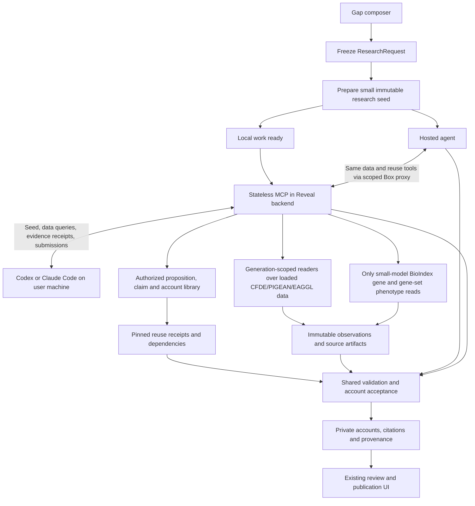

# Stateless Reveal MCP and progressive agent research

**Implementation design — updated October 6, 2026.** The core flows are implemented in this branch; see [local testing and operation](local-agent-mcp.md) for the tested surface and remaining deployment limits. Confirmed scope: Codex and Claude Code are equal first-version clients; v1 supports independently collected evidence uploads; CFDE grounding is encouraged but non-blocking; the data MCP uses loaded CFDE/PIGEAN/EAGGL data, plus one narrow BioIndex exception for the small model's gene–phenotype and gene-set–phenotype observations; both modes start with a smaller package and can discover/reuse accepted Propositions, Claims and ScientificAccounts from earlier runs. This document extends the existing research workflow and [account acceptance contract](agent-output-contract.md).

## Product behavior

Keep one gap composer with a **Let’s close this gap** menu containing **Run online** and **Use my local agent**. Both freeze the exact selected gap, anchors, notes, attachments and reference generation. Online remains the default and uses the existing hosted job/Workflow/Box execution flow, redesigned to receive the smaller seed and the same data and scientific-reuse MCP tools as local agents.

Local mode prepares a credential-free workspace containing a small frozen research seed and lets the user's agent investigate on their machine. The default launcher uses public tools anonymously; offline launch and explicit registered sign-in are separate options. The agent reads the downloaded seed, discovers the operations supported by its pinned imports, and retrieves loaded factor details, gene loadings, gene sets, memberships and related CFDE/PIGEAN/EAGGL records as needed. It works with local files, then requests registered browser consent before private reads, server validation, uploads or submission. Reveal validates and stores accepted accounts under the same owner and gap. Local agents can reconnect later; closing a browser or MCP connection does not lose the work.

“Local” describes where the agent runs. Seed preparation, evidence retrieval/capture and final validation still run on Reveal. The user's chosen agent may itself use a remote model provider; this is not an offline-only promise. **Progressive retrieval and the factor MCP tools are required for both online and local modes in this redesign.** Online integration is part of the initial deliverable, not a later optional extension.

Recommended defaults:

- Accept results privately; use the existing explicit publication controls afterward.
- Do not automatically launch a hosted research-statement job for a local submission. Store `research_statement = {status: "not_requested", job_id: null, paragraph_id: null}` and offer the existing generation action.
- Allow multiple immutable submission batches while local work is open. Each batch returns one to three accounts, newly authored or reused. Each new account has its own document containing one ScientificAccount and its dependencies; reuse-only batches need no newly authored document. This preserves the existing per-document bounds while allowing more accounts over time.
- Freeze inputs once. Changes to the draft or requested evidence scope create new work; they do not rewrite an existing package.
- Encourage every scientific account, online or local, to connect its findings to relevant CFDE evidence. Missing CFDE grounding is an account-level advisory, not a rejection; every claim still requires explicit lineage to eligible scientific evidence.
- Search existing accepted science before authoring new objects. Prefer an existing scoped Proposition, reuse an unchanged Claim when its assessment fits, and link an existing account when it already answers the selected gap. Preserve original identities, evidence and authorship.
- A successful submission means deterministic schema, identity, provenance and source checks passed. It does not certify scientific correctness or automatically declare a knowledge gap closed.

## Architecture

Add a remote Streamable HTTP endpoint at `<REVEAL_API_BASE>/mcp` in the existing FastAPI deployment. REST and MCP are adapters over the same application services; avoid implementing business rules twice or calling private REST handlers with fabricated requests.

**Stateless transport, durable application records:** every research-bound call carries authentication, an explicit ResearchRequest/local-work ID or authorized child ID, and all arguments needed for that operation. Any API replica can handle the next request. No connection-local “current draft,” tool budgets, upload registry or conversation memory. Database/object storage hold research state, credentials, receipts and idempotency records. Temporary scratch directories may be reconstructed per validation task and are not the source of truth.

Use the official Python MCP SDK, mounted with the backend lifespan and explicit authentication/Host/Origin handling. FastAPI route dependencies do not automatically authorize a mounted MCP application. Pin and test the SDK and supported protocol versions during the first implementation slice. The current protocol is sessionless; support older clients through the SDK's stateless compatibility mode where required. Do not depend on sampling, unsolicited notifications or sticky sessions. Long operations return durable operation IDs for polling. See [MCP transport specification](https://modelcontextprotocol.io/specification/2026-07-28/basic/transports) and [official SDK deployment guidance](https://py.sdk.modelcontextprotocol.io/run/deploy/).

The existing `box_mcp.py` is a trusted, process-bound tool proxy for hosted execution. Extract its bounded research-tool policy and capture logic where useful; do not expose that server directly as the public MCP endpoint.

## Integration into the current online agent flow

The hosted agent receives the same factor, loading, gene-set, gene/trait association, connection and catalog-query MCP tools as local agents, backed by the same `ReferenceQueryService`. It also receives the same proposition/claim/account search and reuse tools through a shared `ScientificReuseService`. Tool schemas, source semantics, coverage and authoritative receipts are shared. Execution identity, file transfer and result delivery use the existing hosted runtime boundaries.

The online sequence becomes:

1. The existing analysis submission freezes the ResearchRequest and acquires its reference pin.
2. `workflow_execution.py:prepare` prepares/checkpoints the small seed and authoring-kit bindings. The progressive branch bypasses `collect` and full-package construction; do not run eager collection before dispatch. In particular, `worker.py:collect` currently routes non-KPN models into the legacy HTTP collector: the new seed/data paths must use explicit imported-generation readers and return unavailable for unsupported imports. Job status then advances into the existing Box creation/launch steps.
3. `box_adapter.py` builds a versioned seed-aware bootstrap with the minimal inputs, pinned authoring kit and tool configuration. Update its complete-package readiness/schema assumptions and source-file bundling for this new contract, plus `direct_bootstrap.py`'s strict configuration keys/version/fingerprint checks. Stable service/context bindings belong in the configuration; rotating credentials do not. Old dispatch formats remain readable for existing jobs.
4. `box_remote.py` registers the shared data, scientific-object lookup and reuse tool definitions through the existing trusted `ScopedTools` MCP proxy. That proxy forwards those calls to Reveal's backend `/mcp` using execution-scoped authority; the hosted model sees the tools in its current MCP connection. The new backend endpoint remains stateless. Do not reuse the existing fixed Proto-OKN-only upstream client unchanged for this separate authenticated backend.
5. The hosted agent starts from the seed, searches existing science, inspects factors and follows interesting genes/sets/traits dynamically. Completed captures and reuse selections are retained centrally before results return; local proxy events reference the canonical receipt IDs rather than creating a competing scientific record. Preserve the backend receipt's source File/hash; the proxy's wrapped response hash identifies its audit envelope, not the scientific source bytes.
6. Existing `write_account_draft` / `lint_account` tools resolve authorized evidence/import/reuse receipts and materialize the closed validation context. Final account files, existing-account result selections and their used receipt references return through the current Box output capture and Workflow validation/commit path. Extend `write_outcome` and the worker result contract to accept reuse-only results without fabricated account files. The worker independently verifies these bindings and retains its existing commit fence. The agent does not directly publish or accept its own accounts through MCP.

Keep the Box proxy as the trusted runtime adapter: `box_remote.py` currently exposes filesystem tools rather than a general shell/network tool, so returning a download URL alone is insufficient for large evidence. Let the proxy materialize an authorized receipt/artifact into its protected evidence directory and return a safe path or bounded record views for `Read`. This helper accepts receipt/artifact IDs, not arbitrary URLs or filesystem destinations. Local clients can instead save the same immutable artifacts using their own filesystem/network tools.

Provision backend query authority through trusted bootstrap secret delivery, outside hashed scientific inputs and model-readable files. Bind it to owner, ResearchRequest, job and active execution identity, with allowed source operations, expiry and budgets. The root-owned proxy supplies it; tool arguments cannot switch work or owner. Add the exact configured Reveal API origin to the Box network policy and route artifact materialization through that origin or explicitly configured storage endpoints. No general Internet egress is needed for these factor tools. Revoke authority on cancellation/terminal cleanup and reject superseded execution attempts. Workflow recovery may reattach the same still-authorized remote execution; a short orchestration lease renewal must not itself change scientific identity or require a new paid run.

Update both `box_adapter.py` runtime allowlists and `direct_bootstrap.py:POLICY`; preserve the later capture phase's storage-only policy. Extend credential redaction/scanning for the backend token. Never place it in the agent's `mcp.json`, inherited environment or frozen bootstrap bundle.

Update `dispatch_view.py`'s pinned hosted research prompt/authoring requirements and both research/read-evidence skills to teach seed navigation, operation discovery, bounded queries, prior-science lookup/reuse, source coverage, receipt citations and non-blocking CFDE guidance. Their current full-package paths, mandatory CFDE-ancestry language and `box_remote.py` repair instructions cannot remain in the progressive kit. Give reference queries and science lookup explicit bounded budgets alongside existing graph/literature budgets, so reasonable exploration does not inadvertently exhaust an unrelated tool allowance.

Retain the current online account/result UI and hosted research-statement policy. The local mode's optional paragraph policy remains separate. Store seed hash, retrieval mode, catalog/profile versions and the final evidence-manifest hash in dispatch/result provenance, so restarts restore the original seed and captures instead of rerunning preparation against current data.

**Required online acceptance test:** launch the current analysis-job path with a seed-only bootstrap, assert no full eager or legacy HTTP collector runs, observe the hosted agent calling factor/loading/gene-set MCP tools over loaded data, and accept an account citing those returned receipts. Resume after a Workflow/API restart and verify capture reuse, scoped authorization and no duplicate paid agent launch. The online and local clients should receive scientifically identical results for the same pinned import query or captured BioIndex observation. Test loaded-data exploration with external reference access disabled, and exercise each of the two allowed phenotype operations separately. Benchmark hosted seed-ready/dispatch bytes and total run time; do not attribute unchanged Box startup/model costs to evidence-preparation savings.

## Existing seams and required changes

- **Freeze inputs:** `app.py:create_job_transaction` already checks draft version, gap/anchors, owner and reference generation, then stores `request` and `request_binding`. Extract `freeze_research_request` so local and online modes share it.
- **Prepare evidence:** `worker.py:collect` and `workflow_execution.py:prepare` already construct/checkpoint evidence. Extract `prepare_research_package` with a durable completion boundary before Box bootstrap or launch.
- **Retrieve reference data:** extract generation-scoped readers below `factor_details.py` and `reference_evidence.py`, including imported EAGGL readers. Current UI detail readers require the active generation; a durable agent context must also read retained superseded generations. Preserve coverage limits and metric semantics. Missing imported data produces an explicit result, never an automatic external query. Add a separate restricted adapter for the two small-model phenotype operations; existing BioIndex-shaped formatting helpers do not authorize any other BioIndex calls.
- **Export files:** the current `/v1/jobs/{id}/evidence-package` exposes package JSON and hash. It is not a complete downloadable workspace. Artifact access records are currently populated during account acceptance; local work needs owner-authorized file access at package readiness.
- **Validate:** `acceptance.py:assemble_account`, the pinned DAPPER linter and `source_validation.py` supply the shared validation path. Generalize their execution attribution for local research.
- **Commit:** `worker.py:accept_accounts` currently requires a live worker fence, records Box-specific captures and queues paragraphs. Extract account persistence with an explicit acceptance context and independent paragraph policy. Preserve hosted fencing; give local validation tasks their own durable attempt fence.
- **Deduplicate independently:** the current default-paragraph outbox also guards part of account persistence. Separate account/result idempotency from paragraph scheduling before disabling automatic paragraphs for local submissions.
- **Read/publish:** reuse account, object, claim, citation, artifact and publication services after acceptance.
- **Scientific reuse:** existing object reads, `object_observation`/`scientific_document` storage and public snapshots provide source material. Add Proposition/Claim search and a true exact-observation resolver; the current account summary search and first stored object projection are insufficient for this workflow. Separate borrowed-object authorization and attribution from normal new-object registration.

Keep the existing online job contract working during this extraction. A local work record must not be disguised as a permanently running online analysis job: current job quotas count all nonterminal jobs, and worker leases are short.

## Durable records and lifecycle

Proposed records, following existing repository persistence conventions:

| Record | Essential fields and responsibility |
| --- | --- |
| `LocalWork` | ID, owner, immutable ResearchRequest ID, source draft ID/version, package ID/hash, state/version, created/closed times, latest observed MCP action. |
| `ResearchPackage` | Request ID, preparation state/attempt, seed format/hash, manifest hash, exact source/generation bindings and retention references, DAPPER release/lock, authoring-kit and capability-catalog versions, initial artifact inventory. |
| `LocalAccessGrant` / OAuth family | Hashed access/refresh secrets, registered owner, client/resource, exact work/request/package, scopes, expiry and revocation. Browser consent establishes authority; the helper stores raw secrets in an OS credential store. Legacy manual grants require retained proof of registered issuance; unknown or anonymous issuance requires fresh consent. |
| `PublicCapture` | Exact public reference bytes/context, source identity, generation, content-addressed manifest, explicit expiry and bounded retention. No researcher prompts, private work or reuse closure. |
| `EvidenceReceipt` | ResearchRequest/package binding usable by either execution mode, operation/version and normalized arguments, source mode and exact loaded source/model/import/generation or separately captured BioIndex small-model observation, outcome, coverage/page information, times, exact response hashes and locators. Other authorized research tools keep their own source provenance. |
| `EvidenceImport` | Local-work/package binding, immutable original/extraction hashes, declared source and collection metadata, import/derivation provenance, server-received time and validation report. |
| `ReuseReceipt` | ResearchRequest binding; exact scientific object IDs and payload hashes; source document/publication snapshot and authorization basis; schema/identity/profile pins; original attribution/citation revisions; complete required dependencies and their hashes. |
| `Submission` | ID, work/package binding, immutable document/artifact hashes, evidence/import/reuse receipt IDs, client-declared runtime metadata, validation attempt/state, report, newly authored account IDs and links to reused existing accounts. |

Local-work state is `preparing → ready → closed`, with `preparation_failed` and an explicit retry path. Credentials can expire or be revoked independently of the scientific records. Closing work prevents new captures/uploads/submissions; it does not delete accepted accounts or claim to stop an agent on someone's machine. An already received submission continues through validation after closure; the UI states this. Deletion/retention follows existing ownership policy and is a separate action.

Each submission has its own `received → validating → accepted | rejected | failed` lifecycle, with `cancelled` for an explicit cancellation or revoked authority before commit. Rejected means the content failed checks and can be repaired in a new submission. Failed means infrastructure processing failed and can be retried against the same immutable bytes. There is no inferred “local agent currently running” state.

Preparation and validation use short durable background tasks with retry/fencing. Waiting for a person costs no hosted worker slot. Apply separate limits to open local work, preparation, captures, uploads/storage and validation; local mode avoids a hosted model run, not all backend costs.

Proposed browser REST surface: `POST /v1/local-work` with `draft_id`/`draft_version`, `GET /v1/local-work`, `GET /v1/local-work/{id}`, `POST /v1/local-work/{id}/close`, and owner-only grant creation/revocation under `/v1/local-work/{id}/grants`. Mutations retain current idempotency/version conventions. Creation atomically stores the frozen request, local work and preparation outbox intent; an idempotent fenced task publishes exactly one successful package manifest. Preparation retries cannot overwrite a ready package.

The seed and captured observations are usable after the originating temporary draft expires. Retain generation-scoped data for new queries during the work's documented lifetime; source-generation changes do not invalidate its historical identity. Validate against retained versions and mark accepted results as using archived references, following existing late-result behavior. If a pinned data source or validator is no longer available, return an explicit compatibility/availability error; never silently substitute a newer generation or release.

## Browser and client experience

After **Use my local agent**, freeze the request and show the question, preparation status, equal Codex/Claude Code choice and **Download workspace**. A ready download contains exact retained inputs, authoring instructions, both stdio configurations and the launcher; it creates no credential or hosted run. The selected-client preference is the only saved browser preference. Failed/aborted downloads produce no late file. Once downloaded, show `python3 start.py codex` or `python3 start.py claude`; the browser does not launch a local application.

Default launch is anonymous and can proceed while the backend is offline. Public reference queries name the frozen generation and public scientific search only sees current publications. Save capture IDs, source bytes and explicit expiry. The helper provides `connect_reveal` for optional device sign-in, `get_reveal_connection` to finish approval and `disconnect_reveal` to revoke. Server validation, upload, submission and private reads require registered consent. **Manual setup and connection controls** exposes the equivalent `--login`, `--logout`, `--check-only`, `--offline` commands, a credential-free research prompt and legacy connection revocation. No new manual token panel or setup countdown remains.

At `/research/connect`, show the user code for device flows and the trusted request's client name/ID, scopes, resource, callback and research. Client names/IDs are not software attestation. Require Google/ORCID sign-in, then an explicit approval; loading or refreshing creates no grant. An anonymous browser may explicitly promote its own workspace with the existing claim mechanism after sign-in. Neither codes nor work IDs confer ownership. Permit approval only for an owned ready/open unexpired run; a device hint cannot be switched. For generic PKCE, choose the work explicitly. Missing providers disable sign-in gracefully. Navigate only the backend-returned registered callback; provider tokens stay outside research tools.

The downloaded research instructions begin with local frozen files and anonymous public lookup. They tell agents to search exact existing science, preserve source identity and coverage, retain public captures, and seek defensible CFDE grounding without blocking independent evidence. Before contributing, request user sign-in/consent, attach selected captures to this generation, obtain exact authorized reuse receipts, upload/import evidence, validate and submit. Never put tokens in prompts or automatically publish or run hosted statements.

List local and online research together in the workspace **Research runs** tab, with shared count, chronology, mode labels and lifecycle events. `/local-runs` redirects to `/workspace?tab=runs`; local detail remains `/local-runs/{id}`, not a fake online job. Show frozen inputs, accepted/reused results, original attribution, actionable validation reports and optional statement generation. Validation-only candidate IDs are not saved account links. Closing work does not claim to stop an agent on another machine.

Both frontends provide equivalent mode/download/results behavior. Browser OAuth consent lives in the main registered-login frontend; the downloadable helper and backend contracts work independently of either frontend. See [workspaces and authentication](local-workspaces-and-authentication.md) for exact states and commands.

## Small initial package and progressive evidence

Use three layers: **immutable research seed → append-only retrieved observations/imports/reuse receipts → sealed submission evidence**. The agent chooses which data and existing scientific objects to inspect; it does not need a precomputed neighborhood or full prior-account corpus before starting.

The initial `reveal.research-seed/1` contains:

- The submitted draft and durable ResearchRequest, exact gap and selected factor/Mechanism identities, labels and their minimal source/provenance records, researcher notes and only the attribution needed for authoring.
- Source/model/generation bindings, available data operations and their coverage limitations, default query budgets, and retention/compatibility metadata.
- A manifest of existing user attachments/extractions with hashes, sizes and authorized retrieval IDs. Retain these independently of draft lifetime; download their large bytes only when requested.
- Pinned DAPPER/schema/acceptance-profile identifiers and a hash-addressed authoring kit containing the skill, lint implementation and examples. Clients can reuse a verified cached kit. Both execution modes share the non-blocking CFDE policy.
- Work/package identifiers and the submission contract. If a tiny factor preview is already available from a verified immutable record, it may be included with provenance; do not run expensive expansion just to populate a preview.

The seed does **not** require complete factor loading tables, all gene-set members, trait-wide associations, related-factor overlaps, contextual edges, full collection documents or a pre-ranked mixed candidate graph. Those are retrieved on demand. Seed readiness must not call the existing eager collector and then discard most of its output: that would reduce transfer size without reducing preparation work.

This is a new input contract, not an incomplete object disguised as today's full `EvidencePackage`. Existing builder/linter/Box assumptions must be adapted explicitly. At submission, a shared assembler combines the seed with cited evidence/import/reuse snapshots and their transitive scientific dependencies into a closed, immutable validation context. It does not trigger a full neighborhood crawl or download every search hit. Local lint can download this same context. Keep all research calls in the audit ledger, but distinguish them from the evidence actually used by an account.

Later evidence/import/reuse receipts never mutate the seed hash. A submission has a separate evidence-manifest hash covering seed identity, exact cited observations, selected prior scientific objects, canonical source objects and necessary dependency artifacts. Offer an on-demand export of that complete retained context for local validation, reproducibility and offline inspection. Export does not fetch unseen data or imply the agent surveyed the whole available corpus.

Exclude credentials, provider identity tokens, internal storage paths, hosted-agent secrets and irrelevant runtime logs. Return stable manifests plus short-lived download descriptors; expiring URLs are outside hashed content. Requesting fresh URLs returns the same immutable bytes. Check archive paths and file limits. Large bytes travel through authorized HTTP/object-storage transfers, while compact query results and locators travel through MCP. An MCP resource URI alone is not a guaranteed file-download mechanism.

## On-demand loaded data and the small-model phenotype exception

**Source boundary:** factors, loadings, memberships, gene-set definitions and graph/context data come from CFDE/PIGEAN/EAGGL data already loaded into the app. The only external reference-data exception is an explicit query of `pigean-gene-phenotype` or `pigean-gene-set-phenotype` for the small model. No external factor, loading, membership, interactive graph or identifier-resolution calls, and no automatic external fallback when a loaded-data query misses. This boundary applies equally to online and local agents.

The data layer is shared by hosted agents, local agents and existing reference UI readers. Introduce a `ReferenceQueryService` behind both REST and MCP, with generation-scoped database/object-storage readers, a restricted phenotype adapter, a versioned operation registry, bounded execution, a cache and evidence capture. Domain tools and generic catalog queries must use this same service so they cannot disagree on source identity or provenance. Legacy HTTP collectors remain outside this service and the progressive preparation path. The restricted adapter is invoked only by the two explicit phenotype operations, never during seed preparation.

Separate discovery from scientific observations. Public catalog/schema discovery may omit research context. Scientific queries used by either agent mode include the immutable `research_request_id`; authorize it through the local-work grant or scoped hosted execution authority and retain a receipt under that request. `get_local_work` supplies this ID to the local client. Support standalone public-data inspection without a research request, but require a retained, authorized receipt before a result can support a submission; a cached response may be captured without changing its bytes.

### Loaded-data coverage with a small tool surface

Provide a discoverable operation catalog plus convenient domain tools covering the CFDE/PIGEAN/EAGGL records, retained files and relationships actually loaded into Reveal, plus exactly two explicit small-model phenotype operations. Build the loaded-data catalog from the app's import manifests, storage schemas and implemented readers. Register the two exception operations in server configuration; agent discovery does not enumerate or enable the broader external API. Each descriptor names its source mode, typed arguments, available model/import/generation or observation-time source, response/metric schema, coverage, pagination, limits and availability. Known unavailable fields can be described with a reason, but are not advertised as executable data capabilities.

| Tool family | Proposed operations | Scientific information |
| --- | --- | --- |
| Discovery and loaded-data access | `list_data_operations`, `describe_data_operation`, `query_data` | Searchable versioned registry of local readers; execute an operation ID with typed arguments against a pinned import. |
| Factors | `search_factors`, `get_factor`, `get_factor_loadings` | Loaded factor metadata, exact source/model identity, stored gene or gene-set weights, retained joint/marginal projections and ranks. |
| Genes | `resolve_scientific_identifiers`, `get_gene_associations` | Imported identifier mappings, gene→factor and gene→gene-set relationships; trait association metrics only when stored in the selected import. No external identifier lookup. |
| Gene sets | `search_gene_sets`, `get_gene_set`, `get_gene_set_members` | Loaded set identities, source library/collection, provenance and bounded retained membership pages; explicit availability and completeness. |
| Traits and exploration | `get_trait_associations`, `find_connections`, `get_contextual_edges` | Loaded trait→factor/gene/set records, imported EAGGL hierarchy when present, and bounded, versioned computations over those records. Distinguish stored observations from derived overlaps or edges. |
| Small-model phenotype observations | `get_pigean_gene_phenotype`, `get_pigean_gene_set_phenotype` | Explicit BioIndex queries restricted to `pigean-gene-phenotype` and `pigean-gene-set-phenotype`, respectively, using the one configured small-model selector. Results are separate observations, not imported factor data. |
| Result reuse/export | `get_evidence_result`, `export_evidence_context` | Retained receipt/preview/locators and downloadable bytes; export a seed plus chosen evidence/import/reuse receipts and dependency closure. |

`query_data` accepts a registered `operation_id`, catalog revision, typed arguments, source binding, research request and bounded output options. The operation fixes the local reader or one of the two restricted phenotype handlers. Do not accept arbitrary URLs, SQL, headers, caller-selected external index names or object-store paths. Pin the catalog revision used by each work/receipt. New imports become available through the app's normal ingestion/activation lifecycle; an agent query cannot trigger ingestion or switch its pinned reference generation. An explicit new phenotype observation never refreshes or overwrites the imported data.

Computations such as cross-factor overlaps may run over the pinned loaded records, with explicit method versions, input coverage and budgets. External computation endpoints such as Enrichr are outside this data-tool surface. Existing literature/graph research tools and independently collected evidence uploads remain separate evidence paths; they do not fill missing reference fields or impersonate the app's loaded CFDE/PIGEAN/EAGGL data.

### Connected knowledge graphs in local MCP

The local MCP exposes the existing online connected-graph capability in addition to imported reference readers: `list_knowledge_graphs` discovers `biomarkerkg` and `prokn`, while `describe_kg`, `get_schema`, `query_graph` and local custom `sparql_query` read the same fixed upstream at `https://apps.okn.us/okn-mcp-dev/mcp`. The server fixes the named-graph IRIs and endpoint. This is a separate external graph-evidence source, not a new CFDE/PIGEAN factor endpoint or a fallback for missing imported relationships.

The parity tools use the online safe bounded query builder. `get_schema`/`describe_kg` take `graph`; `query_graph` accepts `graph`, optional absolute `subject`/`predicate`/`object` IRIs, `literal`, `contains` and `limit` (1–100, default 25). A predicate plus exact case-sensitive literal supports label/symbol discovery; substring search must bind subject or predicate. This typed tool cannot accept an arbitrary query, endpoint or graph URI.

Local `sparql_query` additionally accepts `{graph, query, limit?}` for a server-validated read-only SELECT, with the same result limit (1–100, default 25). Every graph pattern must be confined to the chosen fixed literal named graph `<https://purl.org/okn/frink/kg/biomarkerkg>` or `<https://purl.org/okn/frink/kg/prokn>`. PREFIX declarations are allowed. Reject SERVICE, FROM/FROM NAMED, unscoped patterns, graph variables, updates, custom extension functions and upstream overrides. The limit bounds returned rows, not biological coverage or an assurance of cheap computation. Existing hosted graph tools and budgets stay unchanged.

Local discovery/schema/queries can run anonymously with flat tool arguments. Authenticated query calls additionally require `research_request_id` and `idempotency_key`, return an operation ID, and must complete through `get_operation` before their results are used. Capture the exact upstream envelope and generated or supplied query before returning a usable result, together with source graph, named graph, endpoint/server, observation time and hashes. `source_mode=external_kg` records `generation_id=null` and unknown upstream release explicitly; it does not invent a CFDE import relationship or snapshot guarantee. `query_graph` retains complete triple rows. Custom SELECT retains original result variables and typed RDF bindings, including supported projections/aggregates, with exact source locators; those rows support only the semantics of the captured query, without invented columns, triples or qualifiers. Schemas/descriptions, malformed/error responses and successful empty results cannot become positive scientific evidence or establish biological absence. Matching names alone do not resolve identities or establish causal interpretation.

Before citing an anonymous graph result in a submission, registered clients call `attach_public_captures`. Verify retained capture bytes and require its `source.graph_id` to occur in the immutable `request.composer.selected_kgs`. This is a graph-selection check, not a CFDE generation-equality check. Public browsing does not mutate that selection; a different graph policy requires new work. Authenticated queries enforce the same selected-graph restriction. Public capture expiry is explicit (seven days by default), while an authenticated attachment retains the original bytes for later export/validation without re-querying the graph.

Acceptance tests should cover anonymous listing/schema/query, fixed endpoint/graph enforcement, query argument and size bounds, guarded SELECT rejection cases, projection/aggregate binding preservation, exact raw-envelope/query retention, replay after upstream changes, authorized graph attachment, unselected-graph rejection, expiry, and exclusion of schema/error/empty results as claim support. This is test scope, not a claim of a completed live upstream check.

### Narrow BioIndex exception: small-model phenotype statistics

Allow exactly these server-selected operations:

- `get_pigean_gene_phenotype(phenotype_id, bounds, research_request_id)` → `pigean-gene-phenotype`.
- `get_pigean_gene_set_phenotype(phenotype_id, bounds, research_request_id)` → `pigean-gene-set-phenotype`.

**The user confirmed the literal model selector `small`.** [Broad's PIGEAN portal configuration](https://github.com/broadinstitute/dig-dug-portal/blob/master/src/utils/pigeanPortalUtils.js#L10) binds it to `https://bioindex.hugeamp.org` with `sigma=2`; its [query construction](https://github.com/broadinstitute/dig-dug-portal/blob/master/src/utils/pigeanPortalUtils.js#L45) uses three positional keys. Use this configuration as the proposed source: both tools construct `q={phenotype},2,small` and URL-encode it. The server fixes origin, sigma, model and index; callers supply none of them. Verify returned model/sigma fields when present and reject mismatches. Pin this source configuration and adapter signature in the operation registry; it is not an alias for a CFDE model or Reveal's `eaggl-capped-v1`.

Current availability still needs verification: bounded metadata calls to `bioindex.hugeamp.org` returned HTTP 403 on October 5, so the portal configuration is verified but live catalog compatibility and query access are not. Verify access and the three-key signature during implementation before enabling the adapter. The existing `cfde-dev` deployment advertises only `cfde`, `cfde-inc` and `cfde-inc-v2`; its two-key signature documented in [the earlier API inventory](api-discovery.md) must not be reused for this source. Report `source_unavailable` for access/outage failures and `not_supported_for_model` for verified unsupported combinations. Never switch deployment, omit sigma, choose another model or interpret unsupported empty results as negative evidence. This does not block loaded-data research.

The server owns the configured BioIndex origin, path, index and model. Permit only these two query families and continuation requests issued by them; upstream continuation tokens stay inside the backend, bound to the original operation, model and research context. Expose stable application cursors over captured results. Do not enable general index/key discovery in the agent-facing service. Optional gene/gene-set filtering must reflect actual API capabilities: filtering a bounded captured result locally cannot be presented as an exhaustive upstream lookup. Bound fetched bytes, pages, rows, latency and cost independently from the model-visible preview. Return explicit partial/unsupported/unavailable results; no external factor or membership call is permitted to repair them.

Capture exact raw responses and any normalized rows before returning usable evidence. Record endpoint/index, model `small`, sigma `2`, exact phenotype identifier, arguments, adapter version, observation time, returned release/catalog-build metadata when present, response hashes, pagination/coverage and metric definitions. These observations have `source_mode = bioindex_small_phenotype`; loaded readers use `source_mode = imported_reference`. The external observation is not part of the app's import generation and is not guaranteed to match its build. Never invent an upstream release ID, claim a new observation is current merely because it was retrieved today, or relabel small-model results as EAGGL factor scores. Source `factor`/`label` fields remain scoped to the small-model observation and cannot automatically resolve to imported factors. Cross-source joins need explicit phenotype/gene/gene-set mappings; a matching label alone is insufficient.

Keep stable receipt replay separate from obtaining a new observation. A retry or citation resolves the original captured bytes. Cache keys include origin, index, phenotype, sigma, model, adapter version, arguments and result bounds; cached observations retain their original observation time. A later explicit query may reuse that entry or, when a new observation is requested, produce a new receipt without replacing earlier evidence. Pin any exposed release identifier and label missing version information. BioIndex pagination differs from local readers: a limit can cap the entire result, and a null continuation does not prove completeness. Verify the source's pagination contract, preserve coverage/progress, avoid claiming snapshot consistency if it cannot guarantee it, and replay captured pages without new upstream calls. Validation and account reuse rely on captures, not a fresh BioIndex lookup.

The small seed contains only these tools' capability/source descriptors. No phenotype call is needed to prepare or dispatch research. The hosted proxy uses Reveal's backend adapter, so it needs no direct BioIndex credentials or network access. Both agent modes receive the same operation definitions and captured scientific semantics. A BioIndex outage affects these optional queries and does not block loaded-data research or invalidate already captured evidence.

### Sources and identifiers stay explicit

The local `eaggl-capped-v1` source contains stored nonzero EAGGL gene weights and retained per-trait gene-set projections (top 50 by joint or marginal rank). It does not contain all source gene sets or the trait-level PIGEAN `combined`, `log_bf`, `prior`, `beta` and `rs_score` observations. These gaps are explicit in `reference_evidence.py` and `factor_details.py`. Imported EAGGL graph nodes/edges are available only when included in that import. Legacy CFDE imports may contain ranked gene-set links without numeric gene-set loadings. Loaded-data readers return `not_stored` for absent observations, with the import's coverage limitations. An agent may separately request small-model phenotype observations through the explicit exception tools; those do not replace missing values in this import. Do not manufacture missing scores or reinterpret projections as trait associations.

Availability is specific to the loaded model/import/generation. Return `not_supported_for_model` or `not_stored` rather than substituting a different model. Gene/factor absence in a sparse or retained import is not a zero loading or biological negative. A complete page traversal means complete for the imported subset, not complete for the original upstream dataset; expose both query coverage and import coverage.

Keep EAGGL IDs such as `T2D::Factor1`, KPN keys such as `KPN.TRAIT:0000398::Factor1`, Reveal public IDs, original CFDE factor IDs recorded in imports and DAPPER Mechanism IDs distinct. Every mapping reports its method and revision. The historical trait-plus-factor-number crosswalk is routing correspondence, not evidence that two factors have identical loadings or biology. Gene-symbol resolution uses only retained mappings and returns namespace, organism, candidate identities, ambiguity and mapping source/version where available; unresolved symbols must not become invented HGNC/Ensembl/NCBI equivalences.

A gene-set membership page is a view of its source set, not a replacement GeneSet identity. Preserve the exact source set and its revision; never mint a purported complete set from a truncated membership page. Resolve required scientific dependencies from retained authoritative objects, with availability reported explicitly.

A research seed binds its primary reference generation, permitted loaded imports/models and the configured small-model phenotype capability. Agents may investigate additional genes, sets and factors within those loaded sources without editing the original selected anchors or creating a new draft for every query. Any permitted comparison to another already loaded generation needs an explicit append-only binding and retention pin; it never replaces the seed's primary generation. The two external phenotype tools append separate observations under their fixed source policy. Source release and import timestamps describe what is loaded, without claiming it is the latest external release.

### Loaded-data captures, pagination and scientific meaning

Every successful loaded-data research query durably saves its exact serialized result and receipt before returning. Include `receipt_id`, loaded source, operation and reader version, canonical arguments, model/import/generation and retained build metadata, query time, content hash/length, canonical File identity, exact row/segment locators, metric definitions and coverage metadata. Link source rows/retained import artifacts to normalized or derived projections through versioned transformations, preserving original values. Query time is not a new external collection time. A factor loading, joint/marginal projection, effect estimate, association score and a derived overlap rank are different quantities; these readers expose only those available in the pinned import or explicitly derived from it. External phenotype captures follow the separate observation-time contract above.

Return a compact useful page, with selective fields/batch lookup and bounded rows/bytes; full permitted results remain downloadable. Start with a small default page (for example 25 rows), retain the current 500-row upper bound only for readers where appropriate, and enforce byte/query-cost caps. Pagination alone is not a claim of completeness. Report at least `returned_rows`, `total_rows` when reliably known, query and import `coverage`, `truncated`, `next_cursor`, ordering and applied filters. Distinguish `not_requested`, `not_stored`, `unsupported`, `unavailable`, `empty`, `partial` and `complete` rather than turning every missing observation into an empty list.

Cursors bind loaded source/import/generation, query/filter/order, reader version and position with a deterministic tie-breaker. They are opaque and tamper-resistant. Every page reads the same immutable retained generation, or a materialized immutable result where appropriate. A missing generation returns an explicit availability error; it cannot fall back to the current generation or an external endpoint. A null continuation ends the matching imported records, without changing the declared import coverage.

Cache immutable public reference captures by loaded source, model/import/generation, operation+reader version, normalized arguments and projection/order/page. Include every participating source pin for joins. Cache data bytes, not authorization; authorize each receipt/artifact access and keep private input/result caches owner-scoped. Retries use durable request keys so a lost response returns the already captured result. Bounded batch operations and concurrency prevent an N+1 sequence of tiny backend/SQL requests. There is no external refresh option in these tools.

### Data lifetime is part of the contract

Current reference purge protects open hosted jobs, not proposed local work; archived factor summaries are not full queryable loading tables. Add reference-retention pins for open research contexts, active captures and pending submissions, and teach `reference_archive.KIND_ACTIONS` about the new record types. Purge must respect these pins. Alternatively implement restoration/querying of the complete immutable source archive before advertising historical query support. Never use the active-generation-only UI wrappers as a historical query service.

Acquire the primary generation pin atomically with request freezing, coordinated with purge so neither can race past the other. Acquire any additional source pin before issuing its first query. Cross-source joins include source/model/revision, organism and gene namespace; matching a bare factor number or symbol does not establish equivalence.

Publish a bounded research-data retention lifetime independently of credential expiry, with renewal/status in the UI. Once that lifetime ends, captured evidence and accepted accounts remain reproducible under their retention policy, while uncaptured historical queries may fail explicitly. Closing work can release its queryable-generation pin after its active operations finish; immutable artifacts needed by accepted accounts remain retained. This avoids requiring a full source copy per investigation or retaining every source generation indefinitely.

### Performance hypothesis and measurement

Move broad factor-loading reads, gene-set hydration, cross-factor overlap and contextual graph computation out of the startup path. These are currently eager in the imported-data evidence path. Today's `evidence_budget.py` changes what enters the model context while still freezing complete files; it does not avoid collection work. Cheap seed readers must also avoid full loading counts/ranks or complete catalog scans merely to draw a summary; precompute/cache generation metadata and ranks where appropriate. Do not route seed preparation through the legacy HTTP collector.

Expected benefit: less work and fewer bytes before the agent can reason, and less total work when it explores only a small portion of the available data. Total investigation time can increase if the agent makes many sequential queries, so use bounded batch retrieval, warm caches and optional measured prefetch. Do not automatically prefetch the old full package in the background by default.

Benchmark the current imported-data eager path against progressive retrieval for the same gaps, pinned imports and scripted investigations. Record warm/cold p50/p95 time to seed-ready, first useful data response, total investigation time, SQL/object-storage reads, bytes/rows fetched versus cited, peak memory, capture/storage cost and source errors. Use cases for one selected factor, a many-anchor gap, gene-led exploration and a broad investigation. Verify zero external reference-data requests during seed preparation and loaded-data operations, including on cache misses, missing fields and reader failures. Measure optional small-model phenotype calls separately, including capture/cache costs and failures; none belong on the startup critical path. Registry cold start, Box startup and model latency remain separate costs; historical external-API timings are not a benchmark for this design.

## Discover and reuse existing scientific objects

Make prior accepted science available to both hosted and local agents through `ScientificReuseService`. Search and exact retrieval are distinct from declaring an object for reuse. A search hit is a candidate; a reuse receipt authorizes and pins the precise object and required sources that will enter the current account. Neither “accepted” nor “frequently reused” means scientifically proven.

### Proposition, assessment and synthesis are different reuse units

The pinned DAPPER model already makes Proposition reusable scientific content, Claim an attributed assessment of that content, and ScientificAccount an organized explanation for one question. Use those distinctions rather than treating similarly worded claims as interchangeable.

| Situation | Reuse behavior |
| --- | --- |
| Existing Proposition expresses the same entities/relation, scope, negation and kind | Use its exact ID and payload. |
| Similar wording or embedding match | Inspect the candidate's full meaning and context; similarity is a suggestion, not identity or automatic merging. |
| Existing Claim's assessment, evidence and scope are suitable unchanged | Reference the original Claim, retaining its evidence, direction, attribution and citation metadata. |
| Existing Proposition, but new evidence, interpretation or assessment | Author a Claim referring to that Proposition; let the pinned identity algorithm determine its ID. Do not edit the original Claim. |
| Conflicting assessment | Retain distinct Claims about the same Proposition when their content scope matches. Search should expose supporting and disputing assessments. |
| Different tissue/population/organism/trait/model scope or negated content | Do not collapse it into the earlier Proposition merely because entities or wording overlap. Negated content is distinct from disputing an unnegated Proposition. |
| Existing account already satisfies this exact frozen question | Link it as a reused result of this run; do not manufacture a newly authored account or generation event. |
| A new synthesis or different question needs earlier findings | Create a new account for the current selected gap using the relevant unchanged Claims, and any genuinely new Claims required. |

No semantic search system can guarantee elimination of all scientific duplicates. Use exact DAPPER canonical identity first, structured matching second and semantic retrieval to surface paraphrases. A new run does not itself imply a new scientific ID. Multiple accounts referencing the same Claim or source observation are reuse, not independent corroboration.

### Shared lookup and reuse tools

| Proposed tool | Inputs and results |
| --- | --- |
| `find_propositions` | Canonical proposition fields/ID for exact lookup, or text plus entity/scope/kind filters for candidates. Return match type, exact statement, scope and payload identity. |
| `find_claims` | Proposition ID, scientific entities/scope, assessment text, direction/status and authorized corpus filters. Return assessment, evidence summary, provenance, source revision and related accounts; include competing assessments. |
| `find_scientific_accounts` | Exact question/gap ID or a broader scoped query. Return synthesis, component Claim references, original attribution and matching-question status. |
| `get_scientific_object` | Object ID and an exact observation/payload selection. Return the authorized Proposition/Claim/account, provenance, pinned citation metadata where available and paginated dependency descriptors. |
| `reuse_scientific_objects` | ResearchRequest ID, selected object IDs + payload hashes + source snapshot/document references, purpose (`proposition`, `component_claim`, `source_claim`, `existing_account`) and idempotency key. Resolve required dependencies, validate authority/compatibility, and create a durable reuse receipt. |

Lookup results include object type/ID, `payload_sha256`, source observation/document or publication-snapshot identity, schema/identity/validation-profile versions, scope, original attribution, source-generation/archive state and explicit dependency availability. An exact-ID hit may still have several permitted non-identity payload observations; never silently substitute the latest or the first stored projection. Use a source-document-qualified resolver: the current `payload_sha256` check followed by the first `object_document` lookup is not sufficient.

For content discovery, index accepted Propositions and Claims with their structured entity/scope fields, Claim→Proposition links and account membership. Use authorized lexical/structured lookup and optionally embeddings to rank candidates. Mark `exact_id`, `exact_identity`, `structured_candidate` and `semantic_candidate` separately. Search scores are retrieval scores, not scientific confidence. A fuzzy candidate never blocks a valid submission or triggers automatic canonical merging. Show `index_as_of`/availability; an empty or unavailable search cannot establish that a finding is novel.

Update these indexes through a transactional outbox on acceptance/publication changes, with backfill for already accepted documents. Index only the authorized published snapshot for public discovery, not the owner's latest private document. Perform a final exact identity/payload lookup in authoritative storage at acceptance so concurrent runs and index lag cannot create divergent canonical records. Preserve distinct execution observations and legitimate assessments even when blob/object storage deduplicates.

### Agent workflow and smaller-package behavior

At the start, search accounts for the selected gap and inspect their useful claims. Before drafting each new Proposition, look for the same scoped scientific content; inspect existing Claims before deciding to reuse an assessment or create another one. Search again when exploration introduces a new gene, process or mechanism. Keep bounded summaries in context and fetch only selected candidates and their necessary dependencies. The seed includes reuse-tool instructions, not a bulk dump of earlier runs.

The agent explicitly selects candidates for `reuse_scientific_objects`; account-writing tools can then reference the original IDs without copying or paraphrasing their payloads. Resolve the frozen source records into the validation context before hydration, attribution replacement and minting. Reused nodes remain unchanged. Attribute only newly authored objects to the current actor/activity, and record the current run's use of prior science in separate reuse/application provenance. Do not edit an earlier Claim's `asserted_in`/authorship merely to add new account membership.

Fetch a schema-aware required dependency closure: a reused Claim needs its Proposition, EvidenceItems, source Claims where relevant, scientific sources and provenance. A Proposition alone is reusable content, not evidence for its truth. Do not turn account membership, shared activities or a copied statement into supporting evidence. Exclude unrelated objects and inverse membership links that would pull a whole prior account into a new one-account document. The existing paginated `object_envelope` display traversal is not proof that this closure is complete. Return an explicit `REUSE_DEPENDENCY_UNAVAILABLE`, `REUSE_SCHEMA_INCOMPATIBLE` or `REUSE_PAYLOAD_CONFLICT` when exact, authorized reuse cannot be assembled; do not silently drop evidence or select another payload.

Pin original citation revisions and first-mint credit. Current citation registration has a fallback that credits the submitting actor; it must not run for borrowed Claims. Missing prior authorship remains unknown. The existing paragraph citation profile targets Claims/Questions/KnowledgeGaps, so discovering a Proposition or ScientificAccount does not implicitly make it a supported paragraph citation target. Use existing Claim citations and stable object links unless that separate citation contract is deliberately extended.

Whole-account reuse is an application-level result link, not a second root account inside an authored DAPPER document. Add a `reused_existing` result entry with the existing account identity, pinned observation and reuse receipt. Require an exact selected-question match to report it as the current run's account result. `validate_submission` and `submit_accounts` accept new account artifacts and/or these reuse selections, with one to three distinct result accounts per batch. Reuse-only submissions still check compatibility, required evidence, current profile and authority; historical acceptance alone is not a current validation certificate. They create no new scientific account document. They must not enqueue a new default paragraph job, reset creation time or claim new authorship. Accounts for other gaps remain inspectable context; their relevant Claims can contribute to a new synthesis for this gap.

### Visibility, retained bytes and attribution

Allow discovery/reuse of the owner's prior accepted scientific objects plus currently public objects; explicitly shared material can participate only when an actual grant authorizes its precise closure. Other users' private runs are outside the corpus. Add narrowly named library-search/reuse capabilities to local and hosted grants: permitting the owner's accepted science does not grant access to unrelated drafts, prompts, job logs or private workspace records. Describe this library scope in local connection instructions.

Apply visibility filtering before exposing snippets, counts, facets, similarities or duplicate hints. Recheck every returned hit and pinned fetch against authoritative visibility so a stale index cannot leak unpublished content. Group duplicate public appearances only when their exact scientific observations match, preserving original sources and available authorization paths. Known IDs, hashes and successful prior searches are not credentials.

For borrowed cross-owner objects, store a source-bound authorization reference in the reuse receipt, separate from immutable content hashes. Reauthorize selection, submission commit, borrowed-content reads/exports and new publication. Normal `citations.register()`/`grant` writes currently create generic recipient grants, and an owned `scientific_document` may contain the full source closure: neither may silently turn borrowed public access into permanent ownership or unrestricted redistribution. Keep borrowed-node/file/citation access source-aware throughout envelopes, downloads, caches and publication checks. Extend private-input publication restrictions to reused dependencies.

If the source unpublishes or sharing is revoked, retain exact bytes internally for audit and preserve the new account's own content and historical validation outcome, while restricting access to its borrowed dependency closure. Fresh reuse/commit/publication fails if its required source authority is gone. Another public/explicit authorization can restore access only to the exact payload, dependency closure and citation revisions, with the replacement authorization basis recorded. Republishing a different observation under the same ID cannot alter an old receipt. Independently published copies remain governed by the [existing publication policy](account-publication.md); automated reuse does not itself create such a copy. Already downloaded bytes cannot be recalled.

### Reuse acceptance checks

Test exact Proposition reuse, paraphrases returned only as candidates, tissue/negation mismatches, new/conflicting Claims about one Proposition, preserved authorship/citation revisions, unchanged reused nodes, no fabricated independent corroboration and exact-gap account reuse without duplicate paragraphs. Test simultaneous exact submissions and index lag; retain separate execution observations. Also test incomplete/truncated closures, incompatible schema versions, same-ID/different-payload selection, stale private/public indexes, withdrawal between selection and commit, post-acceptance borrowed-content access, exact alternate authorization, and propagation of private source restrictions into publication. Exercise the same tools and semantics through both the hosted proxy and local MCP clients.

## MCP contract

Tool names below are proposed API names. Every research-bound tool rechecks the credential, request/work owner/scope and child-resource binding. Context-free public discovery/inspection follows its public-access and rate-limit policy and grants no private artifact access. All mutations require an application `idempotency_key`; JSON-RPC request IDs are not idempotency keys.

| Tool | Input | Output and effect |
| --- | --- | --- |
| `get_local_work` | `local_work_id` | Frozen request/draft metadata, preparation state, package identity, allowed actions and paginated submission summary. |
| `get_research_package` | `local_work_id` | Immutable research-seed manifest plus fresh download descriptors; preparation status/operation ID when not ready. |
| `get_artifact_download` | `local_work_id`, `artifact_id` | Fresh download descriptor for an artifact in this package or its authorized evidence/import/reuse/submission inventory. |
| `prepare_artifact_upload` | Work/package IDs, purpose (`account` or `evidence`), file descriptors, idempotency key | Server-allocated upload IDs and bounded signed upload targets. Never accepts a server filesystem path. |
| `complete_artifact_upload` | Work ID, upload IDs, idempotency key | Verify staged objects, recompute hashes/lengths and freeze immutable artifacts. Capture an immutable object version or copy to content-addressed storage so an old upload URL cannot replace validated bytes. |
| `import_evidence` | Work/package IDs, completed evidence artifact IDs, declared sources/derivations, idempotency key | Durable import/operation ID; validate bytes, extract/index supported content and produce citable source records with explicit imported provenance. |
| `get_evidence_import` | Work ID, import ID | Processing state, canonical source records, exact locators, artifact descriptors and errors. |
| `validate_submission` | Work/package IDs, new account artifact IDs and/or existing-account selections, evidence/import/reuse receipt IDs, idempotency key | Durable preview-validation ID; uses the same validator but does not publish accepted account records. |
| `submit_accounts` | Work/package IDs, new account artifact IDs and/or existing-account selections, evidence/import/reuse receipt IDs, optional client runtime declaration, idempotency key | Durable submission ID; validates and atomically records a bounded batch, returning status and canonical account IDs/links labeled newly authored or reused. |
| `get_submission` | Work ID, validation/submission ID | Status, report, per-document findings, canonical IDs and retry guidance. |
| `get_operation` | Work ID, operation ID | Durable preparation/capture/import/validation task state, typed result link or retryable failure. |
| `list_data_operations` / `describe_data_operation` | Catalog revision, source/generation/family/search or operation ID | Discover loaded CFDE/PIGEAN/EAGGL operations and the two configured small-model phenotype operations, with source mode, coverage, metrics, limits and availability. No broad external catalog access. |
| `get_pigean_gene_phenotype` / `get_pigean_gene_set_phenotype` | ResearchRequest ID, phenotype ID, bounded result options, idempotency key; server-owned origin/index/model/sigma | Captured BioIndex observations with model `small` and sigma `2` through the two allowlisted indexes only. No implicit fallback from loaded-data readers. |
| `query_data` and domain tools above | ResearchRequest ID, source binding, operation/typed arguments, output bounds, idempotency key for capture | Compact result and durable evidence receipt, or background operation ID. No implicit active source or mutable session selection. |
| `find_propositions` / `find_claims` / `find_scientific_accounts` | ResearchRequest ID, structured/text query, authorized corpus filters, bounded pagination | Exact matches and clearly labeled candidates from accepted science, with visibility-safe summaries and pinned object observations. |
| `get_scientific_object` / `reuse_scientific_objects` | ResearchRequest ID, exact object/payload/source selection; purpose and idempotency key for reuse | Authorized object detail or a frozen reuse receipt with the complete required scientific dependency closure. |
| `get_public_capture` | Exact public capture ID | Replay verified public reference result/context and download descriptors until explicit expiry; no source query or private content. |
| `attach_public_captures` | Authenticated work ID, one to ten capture IDs, idempotency key | Verify retained bytes and either matching reference generation or permitted frozen graph selection; create scoped receipts retained beyond public expiry. |
| `get_evidence_result` / `export_evidence_context` | Authorized context ID and receipt IDs, or chosen evidence/import/reuse set | Replay exact captured pages or export the authorized closed context for authoring/validation without new scientific queries. |
| `list_knowledge_graphs` / `describe_kg` / `get_schema` | Discovery or fixed graph ID | Connected BiomarkerKG/Proto-OKN scope/schema; public inspection grants no work authority and metadata is not biological evidence. |
| `query_graph` | Fixed graph ID and bounded triple-query fields; work identity/idempotency for authenticated capture | Exact external-KG public capture, or a scoped evidence receipt, using the existing online safe query builder. Attachment/authenticated access requires the frozen selected graph. |
| `sparql_query` | Fixed graph ID, guarded SELECT and bounded result limit; work identity/idempotency for authenticated capture | Exact query and typed result bindings from the fixed selected named graph, preserved as a public capture or scoped receipt. Existing hosted query behavior is unchanged. |
| `read_paper` | Work ID, bounded research arguments, idempotency key | Server-recorded literature receipt and compact result/download descriptor within frozen scope and capture budget. |

Return structured JSON with stable domain codes such as `PACKAGE_NOT_READY`, `PACKAGE_MISMATCH`, `UPLOAD_INCOMPLETE`, `VALIDATION_REJECTED`, `WORK_CLOSED` and `IDEMPOTENCY_CONFLICT`. Distinguish correctable tool/domain errors from HTTP authentication errors and infrastructure retries. Echo operation/submission IDs and retry guidance so agents can recover after dropped responses.

For large captures or linting, return promptly with an operation ID and use the same durable status mechanism; do not keep an MCP request open for an investigation. Cap list responses and paginate them. Transport annotations may describe read-only/destructive behavior, but authorization is always enforced server-side.

## Authentication and authorization

The implemented default is anonymous public MCP, with explicit OAuth consent for contribution and private access. `reveal.local-setup/2` archives contain no credential or setup ticket. Offline launch retains the local evidence reader and disables remote Reveal tools; anonymous launch needs neither a Reveal login nor an OS credential store. Both downloaded clients invoke a local stdio helper that connects to the same remote MCP and manages secure authenticated transfers. Native clients may instead connect directly and use authorization-code/S256 PKCE.

The backend exposes authorization-server and protected-resource metadata, public-client registration, authorize, device, token and revoke endpoints. Browser consent uses the existing registered Google/ORCID identity gateway. Device sign-in for fixed client `reveal-local-launcher` is an explicit optional action. Consent displays the user code/client/resource/scopes/work and requires an owned ready/open run; anonymous-workspace promotion is separately consented using the browser's existing anonymous identity. Public client names/IDs are metadata, not proof of software identity. Never forward provider tokens, Auth.js cookies, signing secrets or an operator's broad `rvl_` workspace key to agents.

Access is bound to the exact client, MCP resource, registered owner, work, request, package and scopes. `research:read` permits scoped private inputs/evidence and authorized scientific context; `research:write` adds capture/import/validation/submission. It does not permit publishing, hosted execution, new grants, changed ownership or unrelated private records. Authorization/device requests expire after ten minutes, authorization codes after one minute, access after at most fifteen minutes, and refresh families after at most thirty days bounded by work lifetime. PKCE is S256 and callbacks match exact registered HTTPS/loopback URLs. Refresh rotates; consumed-refresh replay revokes the family. Unknown tokens, insufficient scope, retirement, ownership change, expiry and revocation fail explicitly; an invalid bearer is never treated as anonymous.

The local helper stores secrets only in macOS Keychain or Linux Secret Service. Configuration, argv, prompt and tool results contain no raw credentials. Logout first disables local authenticated use, then revokes this installation; offline revocation is retryable, local files/public access remain. Lost initial/refresh acknowledgements require safe reauthorization if the consumed response cannot be recovered. New connections do not revoke unrelated installations. Legacy manual issuance and setup-ticket exchange/revocation remain deprecated compatibility paths. New manual issuance requires a registered principal (`403 SIGN_IN_REQUIRED` otherwise). Old anonymous-issued or unmarked manual grants cannot authorize protected access after identity promotion (`403 REGISTERED_CONSENT_REQUIRED`). Legacy tickets are redeemable only when their persisted issuance records prove `issued_principal_kind=registered`; anonymous-issued and unmarked tickets return `403 SIGN_IN_REQUIRED` even after promotion. Use a current credential-free workspace and fresh OAuth consent instead.

Anonymous references return exact portable public captures with explicit expiry, seven days by default. `attach_public_captures` authenticates, verifies server-retained bytes and the source-specific policy (matching reference generation or frozen selected graph), and creates work-scoped receipts without another source query. Existing attachments outlive public capture expiry. Public scientific lookup resolves only current public publication snapshots; later authenticated reuse rechecks exact observations, dependency closure, citations and current permission. A hash or earlier read is not permanent access authority.

Shared services receive verified authority, not caller-selected actor metadata. Hosted authority stays fenced to its exact active execution and cannot directly submit. Already received bounded validation can finish after ordinary access expiry or work closure; explicit revocation, cancellation, owner/principal invalidation still fence uncommitted acceptance. Artifact transfers remain bounded, scoped and authorized; public capture routes serve only verified public reference bytes. No arbitrary URL, SQL, storage-key or caller-selected BioIndex index access is added.

The [authentication guide](local-workspaces-and-authentication.md) and generated OpenAPI describe route/format details. Public scientific coverage, progressive receipts and the narrow small-model BioIndex gate are shared with online execution.

## Returning accounts and new evidence

1. Upload any newly authored account documents and/or select existing accounts through reuse receipts. Enforce the existing 4,000,000-byte limit per document, at most three distinct account results per batch, and server-side YAML/JSON parsing and resource limits. Raw uploads are quarantined private artifacts, not scientific results.
2. Bind the submission to the exact work, package hash, completed immutable uploads and server evidence/import/reuse receipt IDs. Freeze their hashes into the validation-context manifest and recheck reuse authority at commit. Never trust a client-authored ledger or local lint certificate as acceptance authority.
3. Load the server's retained evidence, exact reused-object closure and pinned DAPPER runtime; hydrate trusted source/reused objects unchanged, replace only newly authored runtime/actor assertions with truthful provenance, mint IDs, then rerun final validation and source checks.
4. Commit the whole accepted batch atomically: accounts, objects, documents, artifact permissions, citations, memberships, receipt/result and event/outbox records. Stage and verify immutable object-storage bytes first; no partially accepted batch is visible. Any indexing outside that transaction uses a transactional outbox and deduplicated event IDs. Validation rejection commits diagnostics but no accepted account records.
5. Replaying the same idempotency key/body returns the same submission and canonical results. Reusing it with different bytes returns a conflict. Namespace by owner, work and operation; enforce uniqueness transactionally, including concurrent requests.
6. Repair creates a new immutable submission, retaining earlier reports. Identical artifacts can be reused without rewriting bytes. Do not use scientific ID equality alone to erase distinct provenance observations; retain the repository's existing content/observation semantics while linking results to every submission that produced them.

Current validation allows new evidence Files only when bound to exact trusted `query_graph` or completed `read_paper` captures (or to the frozen package's trusted inputs). Extend it explicitly to validated loaded-reference and small-model phenotype receipts, plus the import path below. Dynamic authoritative source objects join the retained context before hydration and minting; exact source checks use captured bytes and locators, without a new scientific query at acceptance. Verify imported source/import/generation/operation bindings and external origin/index/model/sigma capture bindings separately. Recognize CFDE grounding only when the retained source lineage demonstrates it: BioIndex access or the model label `small` alone does not establish CFDE ancestry. A client-supplied URL or `origin` label cannot assert source authority. Keep external observations distinct from imported-generation evidence. Preserve selected-graph restrictions for graph tools. Keep budget reservations and receipt sequencing in the database; avoid the Box proxy's in-process counters and ledger list.

For a capture retry, durably record the invocation before reading/serializing data and reuse a completed receipt. Loaded-reference retries use the same pinned inputs and reader version. Other authorized research tools may involve external I/O; do not claim exactly-once execution after an ambiguous failure. Whichever result is committed must have exact retained bytes. Charge/reserve budgets consistently across replicas and bound retries.

### Independent evidence imports — included in v1

Local agents can return papers, datasets, tables, notes and analysis outputs gathered or produced independently. Import them before submitting an account so the agent receives stable source identities and exact citation locators. Reuse the existing `user_inputs.py` storage, extraction and file-validation primitives, removing their draft-only coupling through a shared artifact service.

Start with the existing supported formats: text, Markdown, CSV, TSV, JSON, YAML, PDF and DOCX, with the existing 8,000,000-byte per-file ceiling. Also bound total storage, extracted bytes, parse complexity and import count per work. Unsupported binary formats produce an explicit error; an agent can export a supported representation. Do not execute uploaded code during ingestion. Treat code/method descriptions as evidence artifacts and provenance, with bounded plain-text storage if needed.

An import declares `origin` (`externally_collected` or `locally_derived`), source URL/DOI/accession where available, title/creator when known, claimed collection time, and a short explanation. Origin labels belong to the application receipt; map provenance into existing DAPPER File/Activity/derivation constructs rather than inventing scientific enums without a schema change. Server-observed receipt time and uploader are separate from client-declared authorship and collection time. A source URL is metadata, not proof or permission to fetch an arbitrary URL.

For locally derived results, require references to retained seed artifacts, query receipts and their artifacts, or imports, a method description, code/script hashes when applicable, declared software/parameters and the output files. Record these as an unverified local derivation. Missing method/input provenance prevents claiming an output as a reproducible derivation; it may still be imported as a clearly labeled standalone supplied observation if the account profile permits it.

Finalization retains original bytes, recomputes hash/size, and generates a bounded server extraction with parser/version and original hash. Reuse `reveal.upload-text/1` segment/page/line locators for documents; add deterministic structured row/cell locators for tables and JSON pointers for structured data so numeric checks can resolve exact values. Scanned/unextractable documents remain retained but cannot support machine-verified quotes until a usable extraction exists; client OCR remains a declared derivation.

Generalize the validator's allowed source inventory to three explicit paths: frozen package sources, Reveal-captured research receipts, and completed imported sources. Reused Claims carry their original eligible source closure through a reuse receipt; prior acceptance or a Proposition alone is not a fourth kind of primary evidence. Imported source records are immutable for identity/integrity checks, but their external origin is not independently attested. Keep exact-byte, reference, locator, quoted-snippet and reported-metric checks. Before hydration and attribution replacement, merge the immutable imported source/derivation objects into the retained validation-context inventory and require exact payload matches. Preserve these Activities when assembling an account; record Reveal ingestion/validation separately instead of rewriting a local derivation into a hosted execution.

**Required scientific-profile change:** `scientific_account_lint.py` currently requires every account Claim to have explicit lineage to a captured CFDE File. Replace that hard requirement with a shared, versioned policy for online and local accounts: every claim must have explicit evidence lineage to an eligible retained scientific source, while CFDE grounding is encouraged for the account as a whole. The source inventory remains mode-authorized: package sources, captures and completed imports where supported. Keep selected-gap binding, trusted input immutability, provenance/reference checks, and exact CFDE metric/lineage checks for claims that cite CFDE results. Record which profile validated each account; do not retroactively rewrite historical validation reports. Non-numeric interpretations and biological conclusions still require human scientific judgment.

Emit one account-level `cfde-grounding-missing` warning when none of its component claims has explicit evidence lineage to an unchanged captured CFDE source. Including a CFDE file in the package or an unrelated Activity is not such a connection. Mixed accounts may contain CFDE-grounded and independently supported claims; individual claims do not each need CFDE ancestry. The warning recommends relating the findings to relevant CFDE evidence, or explaining why no defensible connection was found. Neither the warning nor a missing explanatory note blocks validation, submission or publication. Show the advisory in authoring feedback and the account's validation details without labeling the account invalid. Unsupported claims and malformed or false CFDE citations remain errors. Never encourage agents to add an invented ancestor merely to remove a warning.

Represent this UI warning in a separate non-blocking `advisories` collection, outside lint warnings that `--strict` can promote to errors. Strict/production validation must also accept an otherwise valid account without CFDE grounding; cover that explicitly in regression tests.

“Allowed source” means a validated, citable scientific-source object in that inventory. Retention alone does not qualify a file: schema files, skills, prompts, draft instructions and tool configuration cannot satisfy claim evidence lineage. The import service validates the declared source category and produces citable records; the client cannot reclassify authoring-kit artifacts into trusted evidence by referencing their IDs.

For local derivations, preserving inputs/methods/results permits inspection; it does not prove the computation was executed as declared or that its conclusions follow. Do not substitute a checksum for that distinction. Show **Reveal captured**, **User supplied**, or **Locally derived** in provenance, with the supporting receipt/import and method links. If the same bytes occur through multiple paths, retain separate provenance observations even when blob storage deduplicates them.

Freeze the local work's evidence policy to explicitly permit imports. Selected-graph restrictions still govern Reveal's graph tools; imported artifacts cannot impersonate a Reveal-authorized graph capture. Store the policy version with every validation decision. Import failures remain diagnostics/artifacts, and do not turn into “insufficient evidence” scientific outcomes.

Local execution provenance must distinguish server-observed owner, package, receipt bytes, validation and submission time from client-declared agent/model/version and local activity times. Remove hardcoded “Claude Code construction”/Box assumptions for local submissions. Never mint claims of verified local process execution. Store the validator/release and acceptance-policy version with the decision.

## Implementation slices and acceptance criteria

1. **Shared services and source lifetime:** extract request freezing and account persistence, separating automatic paragraphs from account deduplication. Add generation-aware readers, atomic retention pins and archive/purge classifications. Preserve hosted execution/fencing; update shared CFDE guidance explicitly.
2. **Data query and capture layer:** implement the versioned operation registry, generation-scoped database/object-storage readers, the two restricted small-model phenotype handlers, bounded results, source/derived captures, cache and receipt replay. Build a tested coverage matrix against Reveal's actual CFDE/PIGEAN/EAGGL imports, including sparse/capped data, membership availability and stored hierarchy. Verify access to `bioindex.hugeamp.org` and its expected `phenotype,2,small` query signature before enabling those handlers. Test loaded-data discovery, queries, missing fields, unsupported models and failures with external reference endpoints blocked. Separately assert that explicit phenotype calls use only model `small`, sigma `2` and the two allowlisted indexes, with scoped continuation, truthful coverage and immutable evidence. Reject source/model/sigma/index overrides, returned-field mismatches, any other query signature, invalid continuations and redirects outside the allowed origin/path/index/model/sigma/signature tuple, including unauthorized paths on the same origin. Test 403/unavailability, cache observation times and replay/validation with BioIndex disabled.
3. **Scientific discovery and reuse:** add authorized Proposition/Claim/account indexes and historical backfill, exact-observation resolution, schema-aware dependencies, reuse receipts and original citation/attribution preservation. Implement source-aware borrowed-content access and all reuse acceptance checks above. Neither semantic similarity nor a new run may fabricate scientific identity or independent corroboration.
4. **Small package and current online integration:** introduce the seed schema and evidence closure, then wire the shared data and science-reuse MCP tools into the existing Workflow/Box analysis flow, bootstrap, scoped proxy, prompts, lint and worker acceptance, including reuse-only outcomes. Compare initial calls/bytes against eager collection. Use `retrieval_mode = eager | progressive` independently of `execution_mode = online | local` for migration/recovery; progressive is the target default for new runs in both modes. Keep existing eager runs readable and require the hosted end-to-end test above before rollout. This integration is a release requirement, not deferred follow-up work.
5. **Authenticated MCP and local lifecycle:** mount the SDK; add local work, grants, data/reuse/upload/status/export tools and short background tasks. Exercise Codex and Claude Code equally against two replicas without affinity. Test foreign IDs, revoked/expired grants, ownership transfer and credential-free seeds.
6. **Imports and submission validation:** support independent imports and the combined seed/evidence/import/reuse context. Test independently supported accounts accepted with a non-blocking CFDE advisory in both modes, mixed-source accounts, dynamic CFDE lineage, false citations, instruction-only lineage rejection, preserved derivation Activities, exact excerpts/metrics, wrong context, upload replacement, duplicate requests, reuse-only submissions and atomic mixed batches. Validate/replay with external services disabled; rejection remains repairable.
7. **Product and performance:** add both mode selectors and local run views in both frontends, display query coverage and exportable evidence, preserve current online statement behavior for new accounts and explicit optional statements for local work. Distinguish newly authored results from reused accounts and their original credits. Gate release on both hosted and local progressive flows with science reuse. Benchmark warm/cold startup and whole-investigation behavior before making speed claims.

Critical historical-query test: create work on generation G, fetch a loading page, activate G+1 with changed factor meanings, attempt to purge G, and fetch the next page on another replica. Return G or an explicit error, never G+1. Replay the sealed evidence offline. Also test omitted genes remaining unknown, capped imports versus page truncation, concurrent pin-versus-purge and missing-generation errors. None of these loaded-data cases may cause an external reference-data request. Separately capture a small-model phenotype result, change the mocked upstream response and confirm prior receipts/citations still replay the original bytes without claiming the import and external observation share a release.

A completed vertical slice is: create local work from a real gap → download a small seed with either client → search prior accounts, Propositions and Claims → inspect a selected factor → query loaded genes, sets and trait context beyond the initial anchors → explicitly retrieve small-model gene/gene-set phenotype observations when useful → import an independent source if useful → reuse a suitable Proposition/Claim with its exact dependencies → seal and validate the cited context → repair and submit → see private accounts with exact dynamic/imported/reused provenance. Repeat through the hosted agent using the same services. Start a later run and return the accepted account as a reuse-only result without duplicate objects, authorship or paragraph generation. Verify that the local path launches no hosted model/Box execution and holds no long-lived worker lease, both modes use the same restricted source policy, retained observations remain exact after a new app import or upstream change, and borrowed access continues to honor its authorization basis.

OAuth onboarding, anonymous public captures and a local authentication/transfer helper now preserve the seed/receipt/submission boundary. A complete offline validator installer and full eager export controls remain follow-on work. Default preparation stays small.

## Download an agent-ready workspace

Implemented October 6, 2026: **Download workspace** returns a credential-free `reveal.local-setup/2` archive followed by one launch command. Codex and Claude Code both use the local stdio connection helper. The browser cannot launch a local app; normal model login, trust and permission prompts remain unchanged.

### Archive and launcher contract

`POST /v1/local-work/{id}/setup-kit` requires the browser's existing anonymous or registered ownership, a ready unexpired work item and `{"client":"codex"}` or `{"client":"claude_code"}`. It returns a private/no-store ZIP with one `reveal-<work_id>/` root:

- Exact retained `input/evidence-package.json`, `input/manifest.json` and `input/sources/...` bytes. No eager collector or scientific recollection runs at download.
- The pinned authoring kit at its declared paths, `AGENTS.md`, `CLAUDE.md`, `RESEARCH.md` and an `output/` directory.
- `.codex/config.toml` and `.mcp.json`, each invoking `python3 start.py --mcp` with a work-specific server name.
- `start.py` and `setup-manifest.json`, containing client choice, frozen work/request/generation/package identity, canonical endpoints and complete file hashes. No raw credential, device secret, setup ticket or new `setup.json`.

The launcher verifies safe relative paths, symlinks, case/path conflicts, sizes and hashes before use. Generated configuration remains local to the project/session. Re-running preserves outputs; damaged generated files fail with recovery instructions. Defaults do not call OAuth or require a live backend. `--offline` retains local evidence reading and disables remote MCP calls; `--check-only` checks anonymous MCP without a model; `--login` begins device authorization; `--logout` revokes this connection and keeps files. Authentication initializes the OS store lazily; unsupported authenticated storage fails without plaintext fallback.

The backend caches bounded credential-free archives (currently eight archives/64 MB) by frozen inputs, kit, client, endpoints and launcher bytes, with four concurrent retained-artifact reads. Ownership/package validity are rechecked after preparation. The browser uses an abort-safe 120-second request; failure does not alter the research or accepted results. Downloading never creates a grant or paid job. A durable archive-build operation can be added if measured latency requires it.

### Anonymous to authenticated provenance

Offline local writing and anonymous public exploration remain useful before sign-in. Public reference captures name the exact frozen generation; connected-KG captures separately name their generation-independent graph/query/observation. Both carry explicit expiry, seven days by default, and contain only their verified public source output, never private research inputs or uploaded evidence. Download hashes identify exact bytes; they do not grant a work or reuse entitlement.

When the researcher chooses to contribute, registered browser consent binds one open owned run. The helper attaches selected captures under exact-byte and reference-generation/selected-graph checks, retrieves authorized exact science reuse receipts, and performs authenticated uploads without exposing tokens to the model. Acceptance uses the retained context and pinned validator. Public capture expiry does not remove an already authenticated attachment. A new lookup on changed source data cannot masquerade as an earlier observation.

### Verification boundary

OpenAPI examples are offline fictional protocol fixtures. The generator/validator checks closed input shapes, standard OAuth form encoding/error responses, exact route metadata, deprecated legacy setup surfaces and credential-free v2 schema. Focused OAuth/public/launcher tests exercise PKCE/device/refresh/revocation, explicit scope/ownership, capture integrity/expiry/attachment and private/public separation. Browser scripts intercept network requests and assert no grant on load/refresh, explicit ownership promotion, matching callback handling, equal-client anonymous downloads, disabled/busy states and cancellation.

The [operations guide](local-agent-mcp.md#oauth-and-provenance-checks) supplies commands. Test procedures do not imply that Google/ORCID live login, real Codex/Claude research, native storage smoke, production rollout or a paid hosted investigation has run. These remain separately recorded checks. Online progressive execution, exact scientific validation/reuse and the opt-in `small`/sigma`2` phenotype gate retain their existing constraints.
