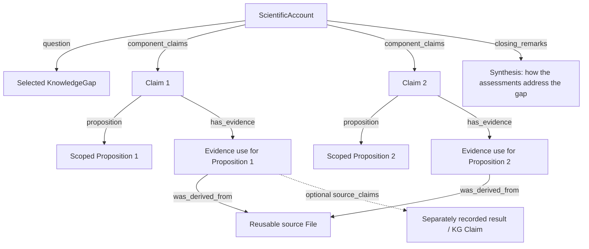

# How the agent constructs a ScientificAccount

**Working design, September 25, 2026.** This document defines the agent's scientific task and the account it should produce. Its companion, [PIGEAN/EAGGL claim templates](pigean-claim-model.md), defines four biological involvement propositions and how computational results become evidence for assessing them. Both use the current DAPPER classes. No graph-path object or provider-specific EvidenceItem extension is part of this design.

## 1. The organizing unit is the account

A **ScientificAccount** relates one or more assessed propositions to the exact KnowledgeGap selected by the user. Each **Claim** assesses exactly one **Proposition**. The account's final synthesis explains how those scoped assessments work together to address, partially answer, or propose an explanation for the gap.

The Proposition states the scientific content, for example “Gene G is involved in mechanism M relevant to trait T.” The Claim records the attributed assessment of that content. Its natural-language statement summarizes the evidence lines, their interpretation and the overall direction, including conflict or uncertainty. A loading or model score is an observation in that evidence. Several methods can produce Claims assessing the same biological Proposition when its meaning, entities and scope match.

The account can use one proposition that directly addresses the gap, several propositions that contribute different parts of the explanation, or competing propositions that expose unresolved alternatives. There is no requirement for a single overarching proposition or hypothesis.

A factor-centered account can assess several genes' involvement in the same mechanism and several gene sets' roles in describing or reading out its processes. The final synthesis explains how those assessed relationships fit together, including inhibition or amplification where supported. One PIGEAN/EAGGL response can therefore inform many Propositions and Claims.

**An EAGGL factor is a mechanism in this model.** Use its full source identity to resolve that mechanism and its best available label for display. `Factor1` is an interim name, not a different kind of object. The agent does not need to infer or prove a separate factor-to-mechanism relationship before assessing genes' or gene sets' involvement.



The diagram shows existing object relationships; it introduces no new schema fields. In particular, every evidence use also targets the Proposition of its owning Claim. Account membership or display order alone does not imply support, a causal chain or a logical conjunction.

## 2. Agent inputs

The [evidence-package design](evidence-package.md) defines the draft input envelope and source-backed examples. It groups observations by EAGGL mechanism and trait, alongside the selected DisMech gap, linked context, hydrated DAPPER inputs and exact source artifacts. The input observations become EvidenceItems only when interpreted against a target Proposition.

- The exact frozen KnowledgeGap, its missing-knowledge description, disease/context and linked DisMech mechanisms.
- The selected EAGGL mechanisms (called factors by CFDE) and bounded CFDE results, with full mechanism/source identities, available labels, trait/model identities, source artifacts, scores and retrieval limitations.
- Recorded source observations for the four evidence relationships in the companion document. Its small examples define one biological Proposition/Claim each and retain raw observations in EvidenceItems linked to source Files and exact row locators. Separate source Claims and their typed scores are optional when useful.
- Access to related DisMech knowledge gaps and their source context, and to the user-selected Proto-OKN graphs such as BiomarkerKG and ProKN.
- The current DAPPER schema/identity pin, allowed source identifiers, provenance records and output requirements.

Keep the original gap fixed throughout the investigation. Related gaps can help clarify unknowns and alternatives; they do not silently replace the selected question. A source's stated knowledge gap is an inquiry, not evidence that a proposed answer is true.

## 3. The five-step scientific workflow

### Step 1 — identify the specific unknown in the selected gap

Read the question and gap description together. Identify the entities, phenotype, population or experimental context, and the distinction the gap asks us to resolve. For example: an association versus a causal driver, an upstream change versus a downstream readout, or two competing explanations.

State in the account's context what the analysis can investigate with the supplied evidence. Do not rewrite or mint a replacement KnowledgeGap. Do not treat the user's mechanism selection or an embedding similarity as biological support.

### Step 2 — inspect the PIGEAN/EAGGL information

Read the gene–factor, gene-set–factor, gene–trait and gene-set–trait source results. Inspect consistent trait/model identities, the exact metric meanings, retained annotations and source provenance. Note coverage limits and missing data. Keep those source-specific quantities in the evidence while constructing biological involvement Propositions from the four templates.

Develop candidate explanations from the observed results, treating each EAGGL factor directly as the mechanism under investigation. Use the supplied descriptive mechanism name, or its trait-scoped factor label until better labels are available. Gene-set labels remain source annotations: explain which processes those sets describe or read out using their definition and provenance. Record alternative relationship interpretations when the results permit them.

For each relevant gene and gene set, consider a separate Proposition about its role in the shared mechanism. Several templates can be instantiated from the same result. Assess which processes the annotations describe or read out and which gene roles the evidence can distinguish. The factor provides a shared investigation context while the selected knowledge gap remains the account's question.

### Step 3 — interrogate related knowledge gaps and selected knowledge graphs

Inspect relevant DisMech gaps, their linked mechanisms and curated evidence to understand nearby unknowns, scope differences and alternatives. Preserve each source's identity. Separately interrogate the allowed knowledge graphs for relevant biological assertions, study context and conflicting evidence.

Retain returned assertions and their sources, not just matching names. Distinguish gene/protein identity, organism, tissue, disease and study population. Check whether a purportedly new source is repeating the same upstream assertion or publication.

This step includes both the user's request to examine other **knowledge gaps** and the existing selected-**knowledge-graph** integration. Neither changes the account's original framing.

### Step 4 — construct and assess a set of scoped propositions

Choose the distinct evidence-backed propositions needed to explain the findings and their relevance to the gap. Before drafting, map each candidate's exact sources, scope, uncertainty and contribution to the question. Do not stop at the first defensible assessment when other inspected observations support different useful findings. Split assertions that can differ in evidential support; combine observations that assess the same content instead of duplicating Claims.

Keep related Claims in one account and order them so the reader can follow their contribution to the question, including supported alternatives or conflicts. Explain their relationship in the context and assessments without turning display order into a causal chain. A single proposition is sufficient when it carries the whole supported answer. Several propositions are appropriate when results, biological interpretations or alternatives require separate assessments. There is no count target, no requirement to instantiate every template, and no reason to invent evidence or expand retrieval just to make the account larger.

For each proposition:

1. State its content and scope so it remains meaningful outside this account.
2. Classify its content: biological involvement uses `BIOLOGICAL_INTERPRETATION`, including when the evidence comes from a computational result. If a model-output observation warrants a separate source Claim, its Proposition uses `RESULT`; the small examples instead retain observations directly in EvidenceItems/source Files.
3. Create a Claim recording the assessment, its responsible agent and generating Activity.
4. Attach EvidenceItems identifying the source artifact/row or optional source Claims used and explaining how they support, dispute or contextualize this exact proposition. For direct artifact evidence, retain `was_derived_from`, an exact locator in `context`, and a verbatim source `snippet` where available.
5. Preserve assumptions, uncertainty and conflicting findings. Direction and any score belong to the particular assessment; they are not copied from an unrelated metric or another proposition.

Source result Claims can be included directly as account components when useful, and can also be used as evidence for other Claims. Interpreted Claims can in turn be used as sources for a further assessment, provided support is acyclic and the explanation makes that dependence explicit. Reusing a source does not create an additional independent observation.

Creating a separate source-result Claim is an agent modeling choice, not a mandatory step for every observed value. Each biological Claim can use artifact-based EvidenceItems directly. Introduce an extra source assessment when its separate identity, citation, assessment or typed scores serve a purpose. The small template examples each demonstrate one such assessment; they do not impose a one-Claim default on a complete account.

Write each Claim's statement as a summary of the assessment across its EvidenceItems. It can name the reported loading, score or effect and explain why the evidence bears on the biological Proposition. The source factor identifies the mechanism directly; resolve that identity consistently in Propositions and evidence, retaining model/version and fit details in source provenance. Do not merge distinct mechanism identities or biological scopes merely because their labels match.

### Step 5 — synthesize the account around the original gap

Write `closing_remarks` in **at most two short sentences**, giving the supported synthesis or recommendation for the selected gap and retaining the decisive uncertainty. This is the takeaway, not the full account summary or an inventory of every Claim. Do not evade the limit with long chains of clauses.

Exclude citations (author-date, numeric markers, PMID or DOI), native source or DAPPER IDs, factor values or other numerical evidence, pointers, source snippets, capture-ledger details and tool logs. Keep exact evidence and provenance in the structured Claims, EvidenceItems, Files and their links, and detailed scope/coverage qualifications in the account context and assessments. Brief prose still must be supported by those records; it cannot introduce an unassessed scientific conclusion.

For an association-only account, a suitable closing might be: “The observed associations identify candidates for follow-up, while the causal question remains unresolved. Prioritize measurements that distinguish the competing explanations.” This is an illustrative form, not a finding to copy when its recommendation is unsupported. If no further recommendation is justified, one sentence stating that the gap remains unresolved can suffice.

The separate paragraph-generation skill writes the fuller cited **Research Statement** from the accepted account's assessments and evidence. That paragraph can explain how Claims reinforce or conflict, the relevant biological scope, and what evidence remains missing; it is not subject to the closing remarks' two-sentence limit.

## 4. Evidence can inform multiple propositions

The same underlying result, publication or source Claim can bear on several propositions. Preserve and reuse that source evidence.

In **current DAPPER**, an `EvidenceItem` records an interpreted use of evidence against **one** `target_proposition`. Reuse the same source Claims/Files in separate EvidenceItems when assessing different propositions:

```text
Source results S1 + S2 → EvidenceItem E1 → Proposition P1, assessed by Claim C1
Source results S1 + S3 → EvidenceItem E2 → Proposition P2, assessed by Claim C2
```

S1 is shared. E1 and E2 may have different explanations or assessment directions because their targets differ. This lets the same evidence contribute to multiple propositions without duplicating source records or assuming the same support interpretation applies to every target.

A single EvidenceItem can be referenced by multiple Claims only when its target proposition and interpretation remain the same. Do not put a list into the current singular `target_proposition` field. No schema extension is required for the source-sharing pattern above.

## 5. Map the synthesis to current DAPPER

| Account field | Use in this workflow |
|---|---|
| `question` | Exact selected KnowledgeGap ID. |
| `context` | What was investigated, the approach, relevant scope and how it relates to the gap. |
| `component_claims` | Ordered references to all assessed claims included in this account; each has one Proposition. |
| `hypothesis` | Optional reference to a particular Proposition investigated as a candidate explanation. Omit when no single hypothesis frames the account. |
| `conclusion_claims` | Optional ordered subset of component Claims selected for expression in the closing. |
| `closing_remarks` | The account's final synthesis connecting its existing scoped assessments to the gap, including qualifications and unresolved aspects. |

REVEAL requires a nonempty final synthesis even though DAPPER makes `closing_remarks` optional. This is an application output requirement, not a schema change.

If the synthesis introduces a **new substantive scientific conclusion**, record that conclusion as a Proposition and Claim with its evidence, include the Claim in `component_claims`, and select it in `conclusion_claims` when appropriate. Connecting and qualifying already represented claims does not require inventing a single proposition for the whole account.

The current account profile requires at least one component Claim outside `conclusion_claims`. For a one-Claim account, leave `conclusion_claims` absent and use `closing_remarks` to explain that Claim's contribution to the gap. Do not manufacture another Claim merely to fill a section.

The account has no aggregate truth value or combined confidence score. Its scientific meaning comes from its constituent assessments and the authored explanation of how they fit together.

## 6. Worked factor-centered account

This is a **schematic example of the intended modeling**, not a claim about the captured CAD data. Assume the relevant evidence has been obtained and supports the assessments shown. A, B and C are genes; S1 and S2 are gene sets; X and Y are processes; M is the EAGGL mechanism identified as factor F in the source. M and F refer to the same object. Q is the actual selected KnowledgeGap. Each Proposition retains its applicable trait, population, biological and experimental scope even where the table abbreviates it.

### Several propositions from one factor result

| Claim | Proposition being assessed | Evidence needed for that assessment |
|---|---|---|
| C1 | Gene A is involved in mechanism M. | A's loading on M and its explanation as evidence of involvement, plus other relevant evidence where available. |
| C2 | Gene B is involved in M. | B's loading on M and its explanation as evidence of involvement. |
| C3 | Gene C is involved in M. | C's loading on M and its explanation as evidence of involvement. |
| C4 | Gene set S1 describes a gene program associated with process X within M. | S1's factor association plus its definition, source provenance and process interpretation. |
| C5 | Gene set S2 provides a readout of process Y within M. | S2's factor association and source evidence supporting the readout interpretation in the stated context. |
| C6 | Gene A amplifies M through process X. | Scoped functional/directional evidence for A's effect and the route through X, interpreted alongside C1/C4 where relevant. |
| C7 | Gene B inhibits M through process Y. | Scoped functional/directional evidence for B's effect and the route through Y, with appropriate process context. |
| C8 | Gene C inhibits M through process Y. | Scoped functional/directional evidence for C's effect and the route through Y, with appropriate process context. |

C1–C5 give individually inspectable involvement and annotation/readout assessments. C6–C8 express the more specific mechanistic relationships used in the synthesis. They can reuse relevant source results and interpreted Claims, while retaining an explanation for each new target Proposition. These are examples, not a required claim count; the agent generates the set appropriate to the evidence and Q.

A factor loading can motivate investigating C6–C8. The loading alone does not distinguish amplification from inhibition or establish the route through X/Y. Those relationships are scientific content in their own Propositions. Evidence supporting “B inhibits M” has assessment `direction: SUPPORTS`; inhibition is not an evidence-direction value.

### The final synthesis

When C1–C8 are supported in compatible scopes, the account's closing can say:

> The assessed opposing effects offer a partial explanation of the mechanism's regulation within the studied setting. Their combined behavior remains to be tested.

This two-sentence closing assumes the assessed regulatory effects are relevant to the selected gap and that combined behavior is unmeasured. The detailed gene, process and gene-set assessments remain in the component Claims and fuller cited Research Statement. If the account proposes an additional scientific conclusion about how the mechanism explains the gap, represent that conclusion as another assessed Proposition/Claim. An editorial connection among existing assessments does not require a new overarching Proposition.

This synthesis does not assert that A, B and C act simultaneously, synergistically or in a physical complex unless those are also assessed claims. Preserve differing directions, scopes and confidence rather than forcing every gene into one common role. If a role is proposed but uncertain, the closing should say so. If only involvement is supported, the account can still synthesize the participating genes and process annotations while leaving regulatory direction unresolved.

### Existing DAPPER fields

A pre-mint account fragment for this schematic example:

```yaml
scientific_accounts:
  - id: urn:example:factor-centered-account
    question: urn:example:selected-gap
    context: >-
      Investigate mechanism M, identified as factor F in the retained
      source, in relation to the exact unknown in Q. Record scope and evidence
      used to assess genes A, B and C and the roles of S1 and S2.
    component_claims:
      - urn:example:c1-gene-a-involvement
      - urn:example:c2-gene-b-involvement
      - urn:example:c3-gene-c-involvement
      - urn:example:c4-geneset-s1-process-description
      - urn:example:c5-geneset-s2-process-readout
      - urn:example:c6-gene-a-amplification
      - urn:example:c7-gene-b-inhibition
      - urn:example:c8-gene-c-inhibition
    conclusion_claims:
      - urn:example:c6-gene-a-amplification
      - urn:example:c7-gene-b-inhibition
      - urn:example:c8-gene-c-inhibition
    closing_remarks: >-
      The assessed opposing effects offer a partial explanation of the
      mechanism's regulation within the studied setting. Their combined
      behavior remains to be tested.
    was_generated_by: urn:example:account-assembly-activity
    was_attributed_to: [urn:example:responsible-agent]
```

This fragment assumes the separately recorded Claims assess their Propositions as supported. Its temporary references and symbolic content must be replaced with actual objects and authored synthesis before validation/minting. It uses current DAPPER fields and does not change the source KnowledgeGap.

The real CAD-in-T2D capture currently provides the gene/factor and gene-set/factor observations described in the companion document. It does not yet supply the particular process/readout or signed regulatory assessments in this schematic account. Those are the next evidence/interpretation tasks for a real worked example.

## 7. Output and review contract

The agent supplies a DAPPER document containing the authored Propositions, Claims, EvidenceItems and ScientificAccount, with references to authorized source records. The backend supplies trusted provenance, attribution and input objects, validates the complete document, and computes identities under the pinned DAPPER version.

Review must establish that:

- The account references the exact original gap and contains at least one Claim.
- Each Claim assesses exactly one resolvable Proposition; multiple Claims may assess the same Proposition.
- Biological targets follow the intended four template meanings, with source results faithfully retained as evidence with correct identities, metrics and locators.
- Each EAGGL factor is resolved directly as a mechanism; an interim label never creates an extra factor-to-mechanism inference requirement.
- Each Claim statement summarizes its evidence-based assessment; shared Propositions across methods have matching entities, meaning and biological scope.
- Distinct assessments remain separately inspectable within a coherent account; no compound Claim or connecting prose hides an unsupported assertion behind a supported one. Apply the same evidential standard to single- and multi-Claim accounts without a claim-count quota.
- Evidence targets match the owning Claim's Proposition; shared evidence retains its source identity and is not counted as independent corroboration.
- Every interpreted scientific assessment has its own evidential explanation. Claim ordering alone is not an argument.
- Closing remarks contain at most two short synthesis/recommendation sentences, retain decisive uncertainty and leave detailed evidence/provenance in structured account records.
- No new unsupported scientific content appears only in the synthesis. Conclusion Claims satisfy the existing membership constraints.
- Inhibition/amplification, routes through named processes and gene-set readout roles each resolve to appropriately scoped assessed Propositions; they are not inferred from loading signs or signature labels alone.
- Related gaps remain contextual inquiries; selected KG assertions retain their qualifiers and source provenance.
- A generated account does not automatically change the source gap's resolution status.

Preserve the agent instructions, model/harness, source manifest and recorded tool results through Activity/AgenticWorkspace and File provenance. The [draft account-generation skill](../services/backend/agent-skills/construct-scientific-account/SKILL.md) now applies these instructions to the [example evidence package](evidence-package.md). It remains a project design artifact; no agent execution or production dispatch is performed by this revision.
